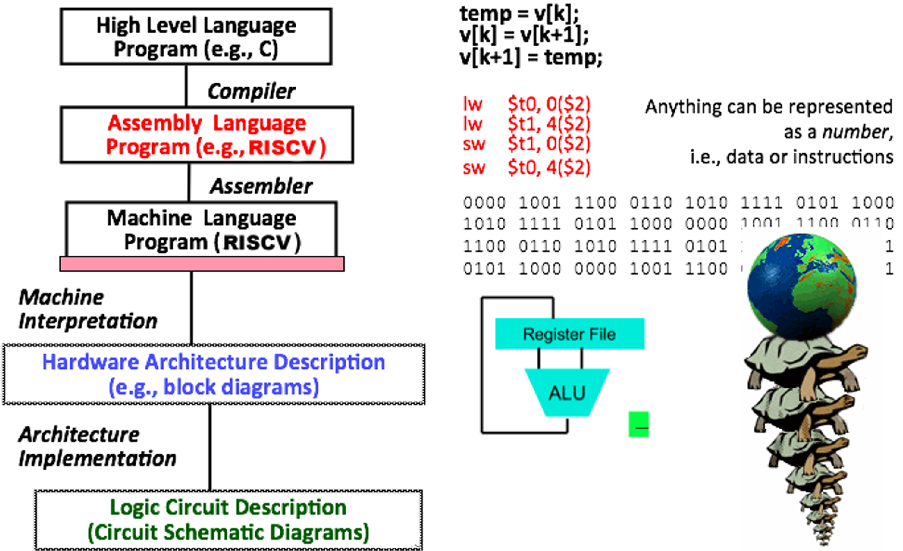

# 01.1-Course Overview


video address


## Course Goals

本节课我们的目的就是回答两个问题

1. How do computer **processors** and **memories** work, and how do they affect software design and performance?
2. Introduction to "computer systems" areas: architecture, compilers, security, embedded, operating systems, large-scale computing

> 知道处理器和内存怎么工作，更有助于软件设计；还要了解计算机系统

.从这门课程中，你可以根据你在61C中可能发现的一些兴趣，对你可能想要选择的不同操作人员有一个很好的了解。

## Hardware-Software Interface

下面这幅图很好的表示了本节课涉及的内容

* 软件层面的内容：compilers, assemblers, applications，this is our C programming portion of it.
* the assemblers是硬件层面的内容，包括RISC V
* 也会设计processor，以及数据处理器
* 当然还不止这些：还包括并行，数据依赖的概念，warehouse scale computing and other different computing applications

## CS61C For Software Development

即使是很好的软件开发师，也要学CS61C，以下是这门课程对于软件开发的好处

1. Know the tools of the trade – computers!
   * "Computers" come in all shapes and sizes
   * Computing achieved in many different ways nowadays

> 开发软件肯定需要了解使用的工具计算机，计算机有不一样的大小和形状，所以不同的编程方式可能对于一个是最佳的，对于另一个电脑就不一定了，据此来调整程序。
>
> 同时现在的计算机的构成各不相同，所以知道这些计算机是怎么工作的也能帮助你写更好的程序。

2. Know when performance matters
   * Ex: taking advantage of parallelism

> you'll know some of the advantages of different concepts in parallelism and why you might restructure your code so you have more efficient accesses.

3. Understand the differences between programming languages under the hood

> It's important to know that **C is actually ran on the bare metal hardware** as opposed to like Java, which is actually run through a JVM, which is essentially a **byte code interpreter** which is **not actually physically ran on the CPU**. Instead, the JVM is physically ran on the CPU.(Java不是直接跑在CPU上面的，也因此其效率比较低)

4. Design large systems – abstraction in hardware
5. Security

> You might be able to program in C. But If you don't understand some of the security implementations of some of your programming, you might cause memory leaks or other issues that someone could exploit and possibly steal sensitive data from you.

6. Design methodology(方法论) – limitations and tradeoffs

> We teach you actually how to design a RISC V CPU. And you'll be able to see some limitations and trade-offs between different things
>
> We might be able to do something that will be faster, or we might be able to do something that's more efficient. But the problem is that some of these might take up more space, and it will be up to you to determine which thing is more worth it to do.

## Course Learning Objectives

可成学习的目标，从知识和技能的角度

### knowledge

After taking this class students should be able to:

1. **Identify and explain** the various layers of abstraction that allow computer users to perform complex software tasks without understanding what the computer hardware is actually doing
2. Judge the effect of changing computer components (e.g. processor, RAM, HDD(hard disk drives), cache) on the performance of a computer program

> Changing some of these parameters will actually affect how fast your program will run.
>
> And theoretically, after this course is complete, you should be able to figure out **what changes might actually help or hurt your program**.

3. Explain how the memory hierarchy creates the illusion(错觉) of being almost as fast as the fastest type of memory and almost as large as the biggest memory

> So this is another very important concept of how we actually separate and abstract different portions of memory so that we can have even more memory available to us.
>
> Because some of our programs, they need to take up a lot of memory, some them can be very small.

4. Construct a working CPU from logic gates for a specified instruction set architecture

> 比如后面的RISC-V，这是一种汇编语言，以及指令集ISA that actually specifies how you should interpret different instructions a different set of bits, essentially.
>
> 后面还会有项目教怎么构建CPU

5. Identify the different types of parallelism and predict their effects on different types of applications

> This kind of goes back to the point about judging how different components might change the performance of your program.
>
> It's very similar because parallelism, there's different concepts like cache blocking or using locality of different sorts that will allow your applications to perform much better than they would be if you were just doing some of the naive implementations.

最后还会做一个大项目

> And hopefully, our project four, you guys will like it. You guys will actually be building in C a Python library that is called NumC.
>
> Yes, it's a riff(即兴演奏) on NumPy, but you actually build it and C.
>
> And it's really cool because it's so much more efficient than if it was written directly in Python.

### Skills

In addition, this class will also require students to work on the following skills.

1. Creating and modifying designs to meet a given set of specifications

> We need these things to be done with some relative performance requirements.
>
> And you should be able to figure out how to actually implement that.

2. Identifying unexpected or problematic situations using **debugging tools**, and **creating test cases** to ensure proper behavior

> That's a very important point because you might have some problem that you have no idea what it is. 
>
> E.g C, when it actually crashes, you don't get any nice error messages that tell you, oh, this is the line that's wrong.(有的语言很难判断错误，例如C语言，发生错误后也不会告诉你很好的错误消息) This is what happened. You just get a nice, fun message **segmentation fault, core dump**.
>
> Or you might get a **bus error**, but that's another story. 
>
> 这里分为两类，一类是Debug，一类是Test。Test也是程序员非常重要的技能之一，这样可以让你很快的找到哪些地方出了问题。

3. Defending(保卫) design choices based on tradeoffs and limitations

> Also, you should be able to defend different design choices that you'll make and some of the trade-offs and limitations of those choices.
>
> It's very important to think through, if I do this maybe I want to add 64 registries instead of 32.
>
> Yes, I might have many more storage spaces that are fast, but the problem is now, it's going to be slightly slower, and it's going to take up more space.
>
> So you've got to look at all of the different issues that you might have for a choice in your design.
>
> It's not necessarily that one is better than the other.
>
> It's really up to you and what you think the system is going to be useful.
>
> 总之，要能够辨别出不同的choice在tradeoff和limitation中的优缺点，根据自己的需求作取舍。

## Six Great Ideas in Computer Architecture

下面四个是计组中非常重要的思想

1) Abstraction

> I want to black box whatever my code is, but I promise that if you do certain inputs, I will give you certain outputs.
>
> 黑盒子，不需要知道内部是什么

2. Technology Trends

> what things actually change in technology and why.
>
> 技术趋势，指的是在技术领域中正在发展或即将出现的重要方向和变化。

3. Principle of Locality/Memory Hierarchy

> 在计算机科学中，局部性通常指的是访问模式在时间和空间上的局部特性。
>
> The third thing is principles of location and memory hierarchy or the principles of locality and memory hierarchy.
>
> So this deals with performant programming and also just the different levels of memory and how we abstract between the different ones.

4. Parallelism

> how use **MapReduce**, this thing called OMP, which is the method of actually splitting up threads so you can have multiple threads in a program, which is really nice because now you can have more performant programs.
>
> This is useful in general because a lot of our CPUs are not really getting too much faster anymore due to, like, limitations of physics and sadness of the speed of light is too slow with computer science.
>
> You'll learn this in 16A and B if you ever take it.
>
> But you'll be able to learn how to actually do multi-threaded applications, which can help greatly improve the performance of your programs.
>
> And you'll also be able to learn some of the limitations of certain design choices that you might make with them.

5. Performance Measurement & Improvement

> 作为程序员，测量性能也是很关键的。
>
> So we might have added a whole bunch of like multi-threading and parallelism to our program.
>
> But how do we actually measure that?
>
> It's very important that you actually sit down and figure out how to do those measurements and how you can actually improve some of the performance stuff that you've just done with your parallelism.

6. Dependability via Redundancy

> 通过冗余实现可靠性。
>
> So this is the concept where I want to make sure that I have like a key value store of data. Like, I have a server that's running that I want to make sure is always up because it needs to give you all those nice new memes.
>
> And I want to make sure that it's always there. So one technique is I have multiple servers that all mirror the same data that they have on it so then if one goes down or crashes or burns in a fire because of all the raids that have been going on lately, the other ones should still be there to actually serve the data.

## Abstraction: Levels of Representation/Interpretation

And this in general is the actual levels of representation and interpretation that we will cover in the very **beginning** of this course.

下面是本课程的内容结构

1. 首先是高级语言，例如C，本课程仅仅讲述一些C语言的基础
2. 然后是汇编语言，RISCV，汇编语言也是人可读的语言，但是更底层一些了。汇编语言是直接对应一个CPU的操作了。这种语言可以被编译成为机器语言，也就是01
3. 机器语言是01序列，告诉CPU做什么
4. machine interpretation(机器解释)比如说blocks，register files，ALU等等，这种真正的工作的期间

> So this is where we actually have like blocks, like register files, ALUs, that kind of stuff which will actually perform operations on data wires based off some control signals.

5. 最底层的就是最基础的器件。

