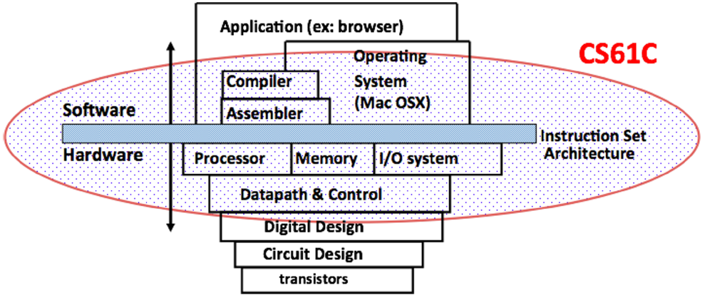

# 01.1-Course Overview


video address


## Course Goals

本节课我们的目的就是回答两个问题

1. How do computer **processors** and **memories** work, and how do they affect software design and performance?
2. Introduction to "computer systems" areas: architecture, compilers, security, embedded, operating systems, large-scale computing

> 知道处理器和内存怎么工作，更有助于软件设计；还要了解计算机系统

.从这门课程中，你可以根据你在61C中可能发现的一些兴趣，对你可能想要选择的不同操作人员有一个很好的了解。

## Hardware-Software Interface

下面这幅图很好的表示了本节课涉及的内容

* 软件层面的内容：compilers, assemblers, applications，this is our C programming portion of it.
* the assemblers是硬件层面的内容，包括RISC V
* 也会设计processor，以及数据处理器
* 当然还不止这些：还包括并行，数据依赖的概念，warehouse scale computing and other different computing applications

## CS61C For Software Development

即使是很好的软件开发师，也要学CS61C，以下是这门课程对于软件开发的好处

1. Know the tools of the trade – computers!
   * "Computers" come in all shapes and sizes
   * Computing achieved in many different ways nowadays

> 开发软件肯定需要了解使用的工具计算机，计算机有不一样的大小和形状，所以不同的编程方式可能对于一个是最佳的，对于另一个电脑就不一定了，据此来调整程序。
>
> 同时现在的计算机的构成各不相同，所以知道这些计算机是怎么工作的也能帮助你写更好的程序。

2. Know when performance matters
   * Ex: taking advantage of parallelism

> you'll know some of the advantages of different concepts in parallelism and why you might restructure your code so you have more efficient accesses.

3. Understand the differences between programming languages under the hood

> It's important to know that **C is actually ran on the bare metal hardware** as opposed to like Java, which is actually run through a JVM, which is essentially a **byte code interpreter** which is **not actually physically ran on the CPU**. Instead, the JVM is physically ran on the CPU.(Java不是直接跑在CPU上面的，也因此其效率比较低)

4. Design large systems – abstraction in hardware
5. Security

> You might be able to program in C. But If you don't understand some of the security implementations of some of your programming, you might cause memory leaks or other issues that someone could exploit and possibly steal sensitive data from you.

6. Design methodology(方法论) – limitations and tradeoffs

> We teach you actually how to design a RISC V CPU. And you'll be able to see some limitations and trade-offs between different things
>
> We might be able to do something that will be faster, or we might be able to do something that's more efficient. But the problem is that some of these might take up more space, and it will be up to you to determine which thing is more worth it to do.

## Course Learning Objectives

After taking this class students should be able to:

1. **Identify and explain** the various layers of abstraction that allow computer users to perform complex software tasks without understanding what the computer hardware is actually doing
2. Judge the effect of changing computer components (e.g. processor, RAM, HDD(hard disk drives), cache) on the performance of a computer program

Changing some of these parameters will actually affect how fast your program will run.

And theoretically, after this course is complete, you should be able to figure out **what changes might actually help or hurt your program**.

3. Explain how the memory hierarchy creates the illusion(错觉) of being almost as fast as the fastest type of memory and almost as large as the biggest memory

So this is another very important concept of how we actually separate and abstract different portions of memory so that we can have even more memory available to us.

Because some of our programs, they need to take up a lot of memory, some them can be very small.

4. Construct a working CPU from logic gates for a specified instruction set architecture

比如后面的RISC-V，这是一种汇编语言，以及指令集ISA that actually specifies how you should interpret different instructions a different set of bits, essentially.

后面还会有项目教怎么构建CPU

5. Identify the different types of parallelism and predict their effects on different types of applications

This kind of goes back to the point

about judging how different components might

change the performance of your program.

It's very similar because parallelism,

there's different concepts like cache blocking or using

locality of different sorts that will allow your applications

to perform much better than they would

be if you were just doing some of the naive implementations.

And hopefully, our project four, you guys will like it.

You guys will actually be building in C a Python library

that is called NumC.

Yes, it's a riff on NumPy, but you actually build it and C.

And it's really cool because it's so much more

efficient than if it was written directly in Python.

In addition, this class will also

require students to work on the following skills.

You should be able to create and modify designs

to meet a given set of specifications.

This is a very important thing with computer science

where we will give you-- we need these things to be done.

We don't care how it's \[INAUDIBLE]..

We need these things to be done with some relative performance

requirements.

And you should be able to figure out

how to actually implement that.

You should also be able to identify

unexpected or problematic situations

using debugging tools and creating test cases to ensure

proper behavior.

That's a very important point because you

might have some problem that you have no idea what it is.

I mean, C, when it actually crashes,

you don't get any nice error messages that tell you, oh,

this is the line that's wrong.

This is what happened.

You just get a nice, fun message--

segmentation fault, core dump.

Or you might get a bus error, but that's another story.

Hopefully, you don't get a bus error.

Those kind of are much less common.

So you'll have to get good at actually using debugging tools

to actually figure out how to do this.

But we will teach you in our labs how to actually use them,

and we recommend that if you talk of issues in your projects

that you actually spend the time to use those debugging tools

and learn how to use them because you'll be using these

in \[? operative ?] courses.

Also, you should be able to defend--

before I continue, actually, the other thing is

is writing test cases is also a very important skill.

You might write software that is deployed,

and you might accidentally deploy a new set of software

that you think-- or you might add another like feature

to that software, and you think, oh, this feature, it's great.

It's perfect.

I've already tested it.

But you never actually brand a suite of test

that you've been running on everything else.

So when you deploy it, you might find

that you've actually broken something that you didn't even

realize it.

And now a whole bunch of users have broken code that they

cannot operate with because it is now no longer functioning

as they thought it should or as it was intended to function.

So it's important to write test cases because you're

able to quickly see which things break

and which things are still working.

Actually, a little side note to that--

the tool that you guys will be using,

Venus, I actually had done the same thing

except for I had written a whole bunch of test cases.

I just had forgotten to write one extra test case that

was the cause of that issue.

But I quickly fixed it.

But in general, you should definitely

try to make sure you have a full test case suite.

Also, you should be able to defend different design choices

that you'll make and some of the trade-offs and limitations

of those choices.

It's very important to think through, if I do this--

maybe I want to add 64 registries instead of 32.

Yes, I might have many more storage spaces that are fast,

but the problem is now, it's going to be slightly slower,

and it's going to take up more space.

So you've got to look at all of the different issues

that you might have for a choice in your design.

It's not necessarily that one is better than the other.

It's really up to you and what you think the system

is going to be useful.

So the next thing is the six great ideas

in computer architecture.

Once again, the first thing, most important thing

that you've probably heard many times before in your computer

science career, is abstraction.

Once again, it is the concept of saying

that I want to black box whatever my code is,

but I promise that if you do certain inputs,

I will give you certain outputs.

Another thing is technology trends-- so

what things actually change in technology and why.

The third thing is principles of location and memory hierarchy

or the principles of locality and memory hierarchy.

So this deals with performant programming and also

just the different levels of memory

and how we abstract between the different ones.

Once again first idea, abstraction--

how we obstruct \[? between ?] the different ones

get different sized memories and faster performant memories

as well.

Another concept is parallelism, where we actually teach you

how use MapReduce, this thing called

OMP, which is the method of actually splitting up threads

so you can have multiple threads in a program, which

is really nice because now you can have more performant

programs.

This is useful in general because a lot of our CPUs

are not really getting too much faster anymore due to,

like, limitations of physics and sadness of the speed of light

is too slow with computer science.

You'll learn this in 16A and B if you ever take it.

But you'll be able to learn how to actually do

multi-threaded applications, which

can help greatly improve the performance of your programs.

And you'll also be able to learn some

of the limitations of certain design choices

that you might make with them.

The fifth great idea of computer architecture

is performance measurements and improvements.

So we might have added a whole bunch of like multi-threading

and parallelism to our program.

But how do we actually measure that?

It's very important that you actually

sit down and figure out how to do those measurements

and how you can actually improve some of the performance stuff

that you've just done with your parallelism.

The sixth great idea of computer architecture

is dependability via redundancy.

So this is the concept where I want

to make sure that I have like a key value store of data.

Like, I have a server that's running

that I want to make sure is always up because it needs

to give you all those nice new memes.

And I want to make sure that it's always there.

So one technique is I have multiple servers

that all mirror the same data that they have on it so then

if one goes down or crashes or burns in a fire

because of all the raids that have been going on lately,

the other ones should still be there to actually serve

the data.

Only until enough of those different servers

have gone down might I see issues with the ability for me

to service some of that data to you.

So once again, the first rate idea of computer science

is abstraction.

And this in general is the actual levels

of representation and interpretation

that we will cover in the very beginning of this course.

And by very beginning, I mean like the first half

of this course, maybe more than first half.

But the first thing we will cover

is a high level language C. We're not necessarily

going to teach you how to program in C,

but we're going to teach you some basics of C.

The second thing is assembly language.

So this actually kind of goes hand-in-hand with the rest

of this.

We're going to teach you this language called \[INAUDIBLE],,

which is an ISA and an assembly language.

Essentially, the assembly language

is like human-readable code that is much, much lower level

than like C programming so that it is more so directly mapping

this instruction.

Like, this is a load \[INAUDIBLE]..

This instruction is literally mapping to an operation

that your CPU will do.

These instructions actually compile into machine language,

which is direct binary, which is just ones and zeros, that

tells your CPU exactly what I want to do.

Like, this sequence of bits might tell it,

I want to do some load operation.

This sequence of bits tells it, this

is something that I want to use with this load operation.

This sequence of bits might say, I

want to add this value together with that.

And so that's essentially what the machine language is.

The next portion of it is the machine interpretation.

So this is where we actually have like blocks, like register

files, ALUs, that kind of stuff which will actually

perform operations on data wires based off some control signals.

And finally, we have some architecture implementation

where we combine different architectural design

blocks like this ALU and REG file together

to create a data path which we can control and using bits here

and which will then turn control signals into different values

so that we can perform different operations.

So this is a very, very important concept abstraction.

And you'll see us reference it over and over

again about how useful it is and how important it

is to actually keep up with your abstraction \[INAUDIBLE]..
