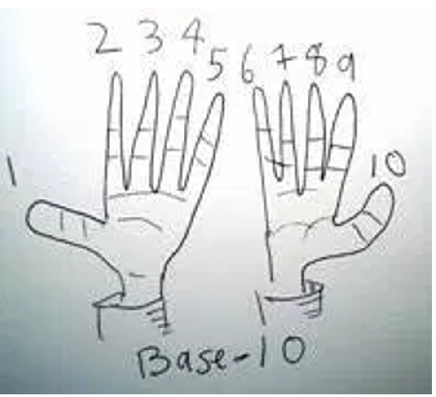
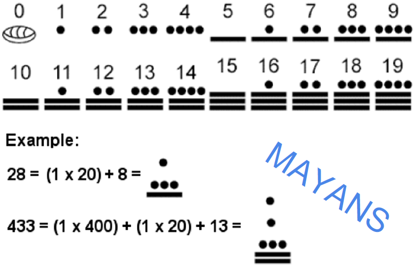
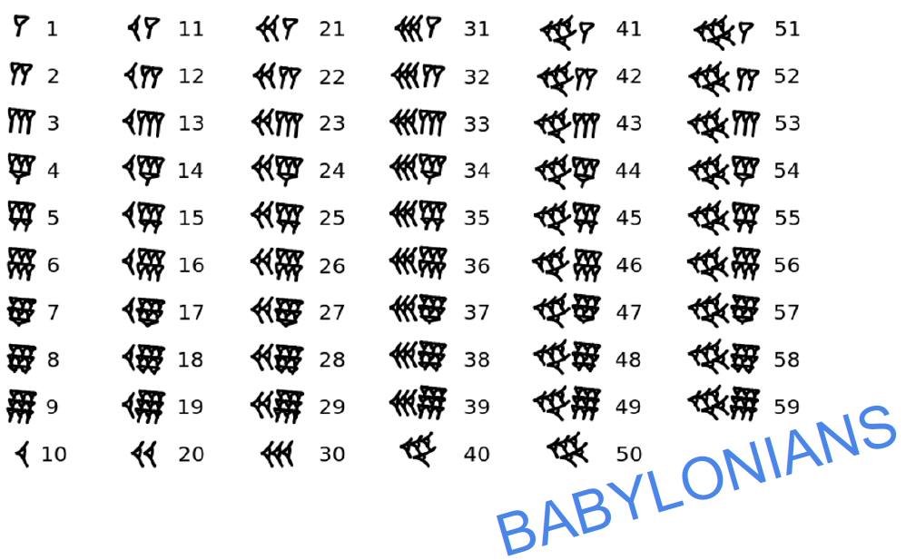
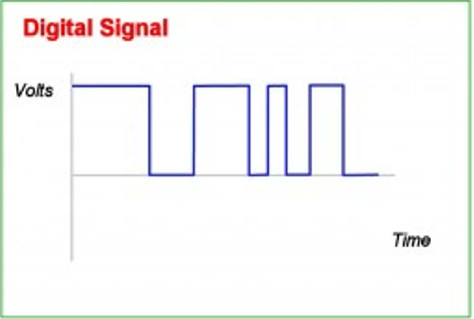
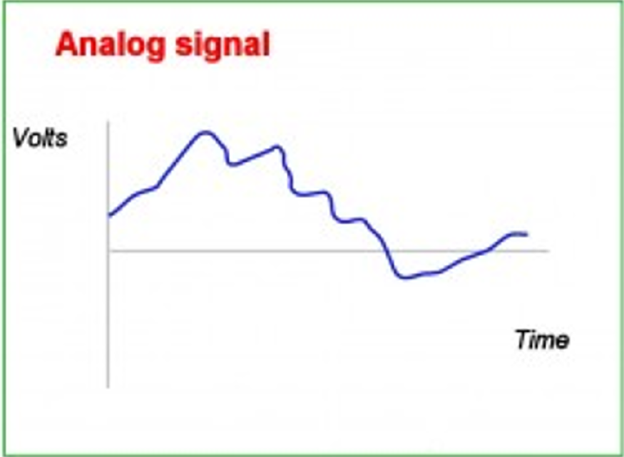
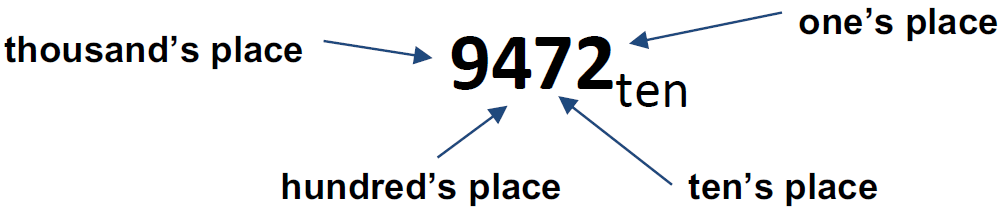
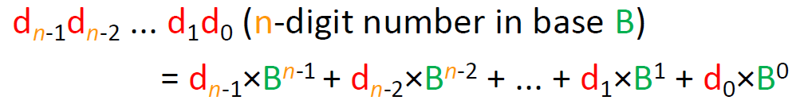
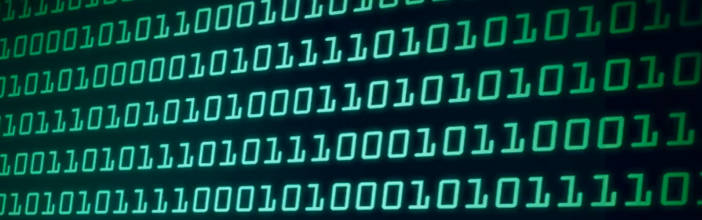
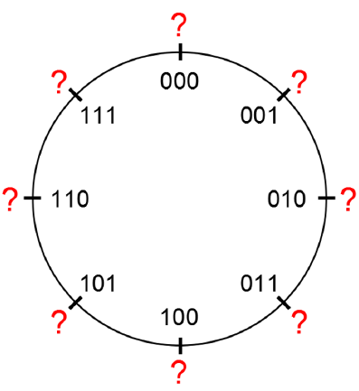
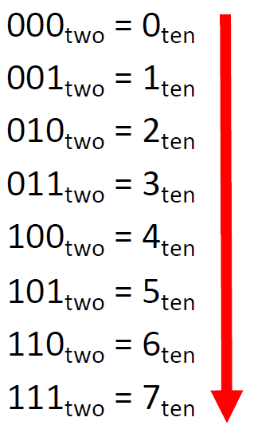

# 01.3-Number Rep Intro & Bases


video address


## Number Representation

### Number base

自古以来数字有很多种表现形式，我们最常见的就是base10，因为我们的手指总共10根

| base 10                                                      | base 20                                                      | base 60                                                      | base 12                                                      |
| ------------------------------------------------------------ | ------------------------------------------------------------ | ------------------------------------------------------------ | ------------------------------------------------------------ |
|  |  |  |  |

### Computers: Base 2

在计算机中使用Base2来表示

当然，信号可以为任意的值，如果我们定义从1-10之间的范围，那么电压源会有所波动的，这样会导致得到不正确的value

比如说此时电压值为89%，那么怎么辨别是9还是10呢？

| base 2                                                       | base 10                                                      |
| ------------------------------------------------------------ | ------------------------------------------------------------ |
|  |  |

但如果是binary的话，我们只要知道0和非0即可，这样就可以减少冲突的可能性。

### Number Base Examples

我们如何解释不通base的数字呢？

看下面的例子，9472，我们能够知道每个数字的位置，2在1的位置，7在10的位置等等

可以将这个式子逐步分解为下面的部分

可以拆解为如下的部分

$\begin{align}9472_{ten} &= 9000 + 400 + 70 + 2 \\
&=  9×1000 + 4×100 + 7×10 + 2×1 \\
&= 9×10^3 + 4×10^2 + 7×10^1 + 2×10^0\end{align}$

并且由此可以得到一个通用的式子，用于任意的Base

- d表示digit，每一位数字
- B表示Base

要求：==**a digit d can take on values from 0 to B - 1**==

> 这里注意最右边的下标是0，这样就可以对上了

### Commonly Used Number Bases

进一步注意——“数字”这个术语现在并不完全准确，因为它的词根意为“手指”，这暗示了十进制。然而，我们现在并不一定使用十进制，因为我们正在使用的是b进制。

因此，在这门课中，我们主要使用十进制，因为这是我们习惯的进制；还会使用二进制，因为这是计算机使用的进制；以及十六进制，简称为hex。

这里我们重点要记住不通的base的前缀是什么，这样写是很简单的。

| 进制        | base | Symbols                                        | 每一位的叫法 | Notation                   |
| ----------- | ---- | ---------------------------------------------- | ------------ | -------------------------- |
| Decimal     | 10   | 0, 1, 2, 3, 4, 5, 6, 7, 8, 9                   | digit        | 9472~ten~ = 9472           |
| Binary      | 2    | 0, 1                                           | bit          | 101011~two~ = **0b**101011 |
| Hexadecimal | 16   | 0, 1, 2, 3, 4, 5, 6, 7, 8, 9, A, B, C, D, E, F | nibble       | 2A5D~hex~ = **0x**2A5D     |

Binary用**0b**符号表示，Hex用**0x**表示。

> 并且要能够做到在不同进制之间转换

例如Convert **0b11110** to decimal

结果为 ==1\*2^4^ + 1\*2^3^ + 1\*2^2^ + 1\*2^1^ + 0\*2^0^==

## Bits in Computer

上面我们讲了数字一般怎么表示，下面来介绍一下计算机中的01表示的是什么

---

计算机的内存中全部都是01，那么这个能表示什么？

这看起来是一个很长的数字？或者是一个字符串？

### Bits Can Represent ANYTHING

要明白，bits可以表示任何事物，这取决于我们怎么去解释，例如 

1. 可以表示Characters:
    - 26 letters require 5 bits (2^5^ = 32 > 26)
    - upper/lower case + punctuation(标点符号) → 7 bits(这就是ASCII)
2. 可以表示逻辑值：0 → False, 1 → True
3. 可以表示人数，比如有330人：2^9 = 512 > 330 → 9 bits
4. 也可以表示颜色，比如只有红绿蓝三种颜色，那么只要2位就能表示了

总之只有一个限制：==n digits (base B) ⇒ <= B^n^ things==，也就是n个digits可以最多表示B^n^个事物

- Each of the n digits is one of B possible symbols
- Have more things? Add more digits!

### How do we assign values to the Binary numerals available to us?

我们已经知道了01可以表示任何事物，那么我们如何使用01来表示我们希望的值呢？

假如有3位，那么能得到8种情况

我们可以按照自己的需求任意赋值，比如000是"hello world"，001是pi，010是unicorn，011是2,100是负无穷等等

==然后我们在构建硬件和软件的时候能够让其按照我们的需求去解释==

### Unsigned Integers

我们可以选择将这些位模式解释为前若干个自然数的二进制表示。这实际上会给我们一种称为无符号整数的表示法，而这正是我们确实在使用的东西。

==请记住，仅仅因为我们研究某些经典的方法来给二进制串赋值，并不意味着这些是我们唯一可用的选项==。这实际上意味着最大的无符号整数不一定是可表示的最大数（你可以将任意的序列定义为最大的整数）。

让我们继续使用三位无符号整数的例子。在我们的三位例子中，如果我们将其解释为无符号值，这里是  你实际得到的数字。

在这种情况下，一些特殊的数字如下：

- Zero?：0…0~two~ = 0~ten~
- 最大的负数：0…0~two~ = 0~ten~
- 最大的正数：1…1~two~ = (2^n^-1)~ten~（我们让最小位的下标是0，那么最高位就是n-1了）

当无符号 整数+1的时候，得到的是往往是最大的数字，除非让1+"all 1"，就会越界，溢出

无符号整数是无法表示负数的。
