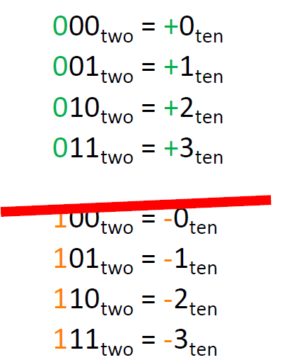
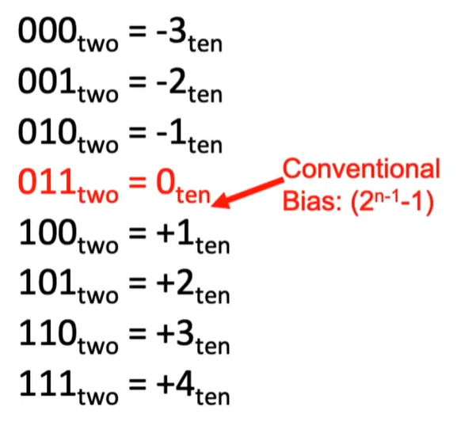
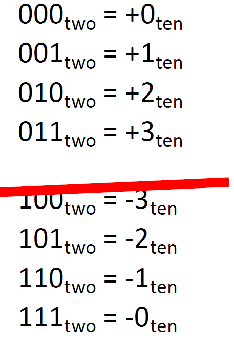
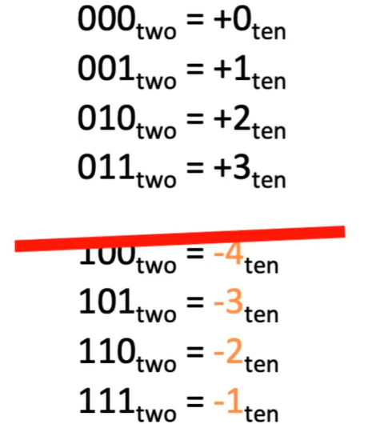
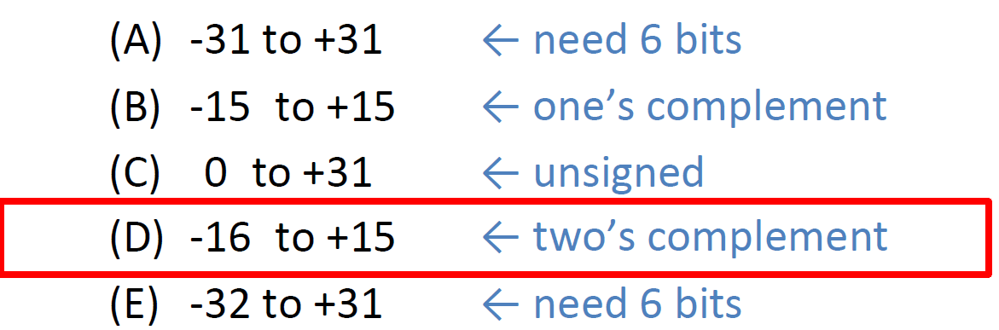

# 01.4-Signed Representations


video address


之前，我们使用n bits表示了2^n^个事物，那么我们为何不将其一分为二，一半是负数，另一半是正数

Let the **first bit** be interpreted as a sign!

## Sign-Magnitude(原码表示)

"first" bit gives sign, rest treated as unsigned (magnitude):

> Magnitude表示量，Sign-Magnitude就是第一位是Sign，后面的事Magnitude

表示如下

下面讨论一些特殊的地方

- Zero?: 0…0~two~ and 10…0~two~ = ±0~ten~，0有两个序列都可以表示，这并不是非常理想的
- 最大的正数：符号位是0，后面的Magnitude全是1，01…1~two~ = (2(n-1)-1)~ten~
- 最大的负数：符号位是0，后面的Magnitude全是1，11…1~two~ = -(2(n-1)-1)~ten~
- 但如果是increment呢？

如果是increment 正数的话，那么是正常的，但是如果+1到011呢？这里就有点奇怪了，如果按照无符号数的话，那么就是100，但是实际上就变成0了，所以不对

同时，如果我们希望将两个负数相加呢，会得到更小的数字，而不是更大的负数。

所以这不是很理想的。

---

总结：原码表示有问题

1. 0有2种表示方式
2. 进行加法的时候很奇怪，得到错误的结果

## Biased Notation(移码)

> 正如之前所说，怎么解释bits有我们自己决定，因此固定长度的bits表示哪些数据也可以有我们自己定义。所以在计算机中的数字不仅仅有一种表现方式

基本原理是，对于固定长度的bits，我们将其视为是unsigned value，然后在此基础上加上一些bia

在不同的文档中，有的时候需要+bias，有的时候需要-bias，有的时候bias是正的，有的时候是负的。在看文档的时候需要注意这些。

> 也就是说如果是+bias，那么bias就是负数，如果是-bias，那么bias就是正数。但是bias的绝对值还是统一的。

这里我们+bias，所以bias就是负数

在习惯上，我们将bias定位01...1，假设总共有n位，那么bias = (2^n-1^ - 1)

Like unsigned, but “shifted” so zero is (roughly) in the middle:

计算值的时候，==value = "unsigned value" - bias==

举个例子：如上111~two~，其unsigned value是7，bias是3，那么真实表示的value就是7-3=4

---

下面介绍一些特殊的值：

- Zero: 就是Bias，也就是01...0~two~ = 0~ten~
- 最大的正数：1...1~two~ = 2^(n-1)^~ten~
- 最小的负数：0...0~two~ = -bias = -(2^(n-1)^ - 1)

那么如何进行increment或者加法呢？

加法有点类似于无符号(pro)，但是有一些问题，就是可能会添加Bias两次，比如0+0，本来应该还是0，但是在bits中，可能就是011+011，这样就会出问题

这里还有个特点就是最大最小的数的表示就是在无符号整数中最大最小的数，但是0不再是全0了，因为0是最常见的数字了，所以这严格来说并不是很好。

---

总结，有以下优缺点

| PRO(优点)                                                  | CON(缺点)                                      |
| ---------------------------------------------------------- | ---------------------------------------------- |
| 加法和无符号数很像                                         | 但是有问题，可能会加两次Bias                   |
| 最大最小的表示和无符号数一样，也是bits能够表示的最大最小值 | 0作为最常见的数，其表示不是全0，这样不是很好。 |

## 1's Complement(反码)

> Complement有补充，相辅相成，相补的意思

在这种表示中，我们从通过将正数反转来得到负数（这里仅仅是反转bit）

> 反码和One's Complement有两种理解:
>
> 1. 反码就相当于将bit反过来了
> 2. 1's Complement(补码)就显得更好了，可以看到，上下的数值正好是相反数，也就是彼此是互补的。

> 如何计算value，如果第一位是0，那么就当做unsigned value，如果第一位是1，那么就是反过来，计算其反码的value，也就是补码。

下面继续讨论一些特殊的值：

1. Zero: 0…0~two~ and 1…1~two~ = ±0~ten~(这里还是两个)
2. 最小的负数：10…0~two~ = -(2^(n-1)^-1)~ten~(可以看到这里是最大的整数的反码，二者是互补的)
3. 最大的正数：01…1~two~ = (2^(n-1)^-1)~ten~

> 正数和负数都是相补的，0也有相补的

那么如果是增加呢？

仍然像unsigned 一样，这是好事，除了在边缘情况，如果最高有效位溢出或有进位，我们实际上会将其绕回并加到数字的开头。

> 这里注意，我们讨论的加法就是指bits的加法

---

下面总结：

1. 缺点：就是0有2种表示方式，这并不是很理想
2. 优点：加法和unsigned是一样的，而且如果溢出之后会自动绕回去

## 2's Complement(补码)

> 2's就是第二种的意思

这个借鉴了One's Complement的想法

我们在进行Complement，也就是进行negate的时候要添加一个twist，这个twist特指1

> negate可以称作Complement，因为求负的过程也就是求补的过程

所以，如果我们要得到一个负数，我们只需要将对应的正数反转+1

在这种情况下，most significant bit(MSB, 最高有效位)表示该位的负值。

看下面的

 正数的话很好解释

如果是负数的话，如果是100，那么该位的负值就是-2^2^，就是-4，如果是101，该位的负值是-4，那么表示的就是1-4 = -4 + 1 = -3

其他也是一样的

---

下面介绍一下特殊的地方

1. Zero: 0…0~two~ = 0~ten~，只有一个表示
2. ==**最小的负数：就是最大有效位10..0~two~ = -2^(n-1)^~ten~（这里可以直接计算）**==
3. 最大的正数：01...1~two~ = (2^(n-1)^ - 1)~ten~

如何进行加法呢？

和unsigned 一样，这是非常棒的。并且很好第一点，就是最高位可以表示符号

---

下面是一个总结

### 2's Complement Summary

1. Used by all modern hardware(现在的硬件都在使用这个)
2. Roughly evenly split between positive and negative: One more negative # because positive side has 0
3. Can still use MSB as sign bit
4. To negate: Flip the bits and add one
    - Example: +7 = 0b 0000 0111, -7 = 0b 1111 1001

---

下面是一个例题

Suppose we had 5 bits. What range of integers can be represented in two’s complement?

- A. -31 to + 31
- -15 to +15
- 0 to + 31
- -16 to + 15
- -32 to + 32

答案如下

最大的正数就是01111，最大的负数就是10000(直接表示-15 - 1，可以这么计算)

## Summary

1. 数字的表示和加法是不一样的
    - 加法是要按照统一的规则在bits的基础上进行加法的
    - 而表示是在设计硬件的时候为怎么解释bits定的规则
    - 例如在补码，正负数可以按照不同的规则进行解释，但是加法的时候方式要统一

