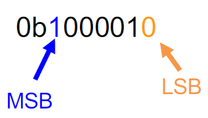
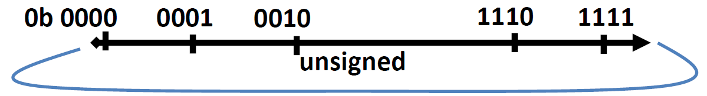

# 01.5-Numbers in a Computer: Overflow


video address


## Numbers in a Computer

> 这里介绍一下计算机中的数字

溢出是由于计算机中数字的表示方式而产生的。

通常，数字有无限数量的位数，但是在硬件中，我们只能存储有限数量的位数。所以通常，我们只忽略前导零。

1. Usually ignore leading zeros（也就是00010的时候，我们会忽略前面的000，其值为10，但是10001的时候，就不会忽略前导0了）
2. Leftmost is most significant bit (MSB)
3. Rightmost is least significant bit (LSB)

## Overflow

Overflow is when the result of an arithmetic operation can’t be represented by the (FINITE) hardware bits, i.e. the result is mathematically incorrect

例如：

- Unsigned: $$0b1…1 + 1_{10} = 0b0…0 = 0$$?
- 2's: $$0b01…1 + 1_{10} = 0b10…0 = -2^{n-1}_{ten}$$?

可以看到，结果会绕回来

> 这并不是我们理想中希望得到的（这里要注意，其他的表示方式是没有这种效果的，比如移码，反码等）

### Solution

唯一的解决方式就是添加更多的位数，指导用完所有的空间。
