# 01.7-Conversions


video address


本节我们会讲关于数字的各种转换

## Recommendation

首先是一些推荐的内容

### Hex → Decimal

如果要将Hex转换为Decimal或者反过来，遵从下面的顺序：

- Hex ↔ binary ↔ Decimal

也就是先将Hex转换为binary

尽管从十进制到十六进制或者从十六进制到十进制也是可能的，但是不建议这样做（不要直接转换），因为事情会变得复杂。

将binary作为中间值是比较容易的

### Power of 2

记住Power of 2的各种值

| 2^0  | 2^1  | 2^2  | 2^3  | 2^4  | 2^5  | 2^6  | 2^7  | 2^8  | 2^9  | 2^10 |
| ---- | ---- | ---- | ---- | ---- | ---- | ---- | ---- | ---- | ---- | ---- |
| 1    | 2    | 4    | 8    | 16   | 32   | 64   | 128  | 256  | 512  | 1024 |

### unit of bits

记住一些特殊的单位

| 2^10 | 2^20 | 2^30 | 2^40 | 2^50 | 2^60 | 2^70 | 2^80 |
| ---- | ---- | ---- | ---- | ---- | ---- | ---- | ---- |
| Kibi | Mibi | Gibi | Tebi | Pebi | Exbi | Zebi | Yobi |
| Kb   | Mb   | Gb   | Tb   | Pb   | Eb   | Zb   | Yb   |

当然，从Pb以后的单位后面不一定会使用

记住这些单位之后，就能很快的进转换了，将其中一种方式转换为另一种表现 方式

| Source | middle     | Result |
| ------ | ---------- | ------ |
| 2^12   | 2^2 * 2^10 | 4Kb    |
| 8Gb    | 2^3 * 2^30 | 2^33   |

## Base Convert

下面我们在不同进制之间转换

### Binary ↔ Decimal

【Binary → Decimal】

将0b1001转换为10进制

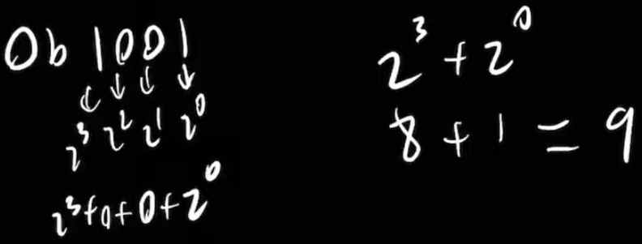

---

【Decimal → Binary】

将14转换为2进制

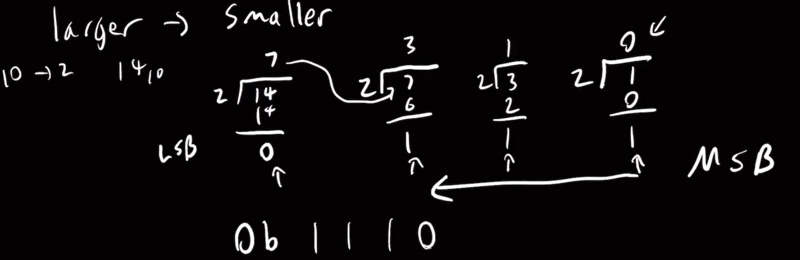

使用辗转相除法，最先得到的是LSB

---

当然还有**更简单的方法**

记得上面在recommendation中建议记住Power of 2，找到距离14比较接近的，是16，然后用16-2

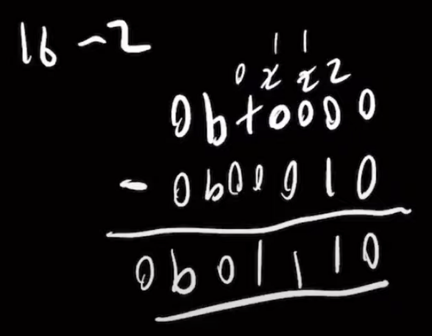

这里直接使用的是二进制的减法，当然可以将-2转换为补码然后相加，这里是偷懒了

将31转换为binary

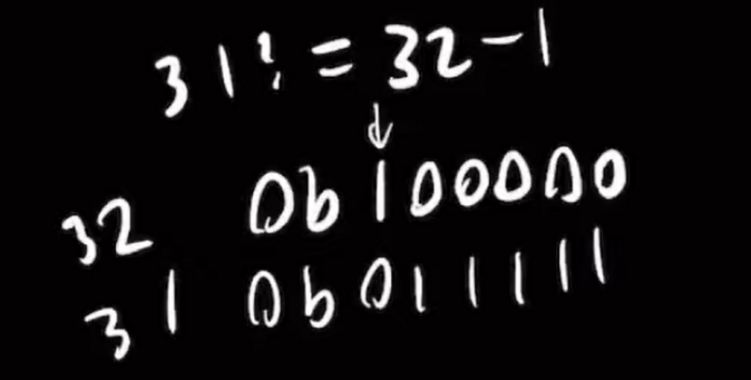

将33转换为binary

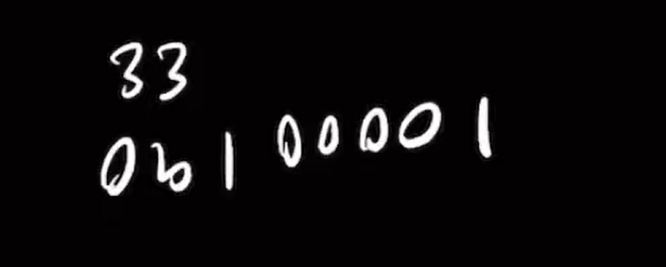

> 所以上面让记住Power of 2的主要作用就是在binary ↔ Decimal的时候能够很快的实现

---

还有一种简便的方法：转换11101~2~为Decimal：

- 111~2~ = 7
- 11100 = 7 * 4 = 28
- 11101 = 7 * 4 + 1 = 29

### Binary ↔ Hex

【Binary → Hex】

将0b1001100011110000转换为hex

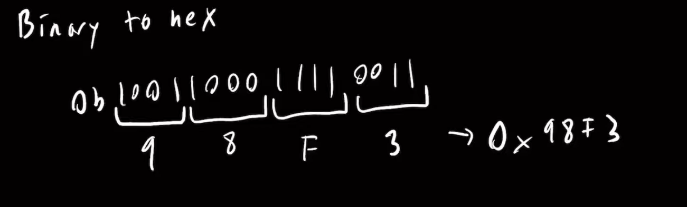

在Hex中，一个nibble是4个bit，因此将binary四个四个为一组划分

---

【Hex → Binary】

将0x213转换为binary

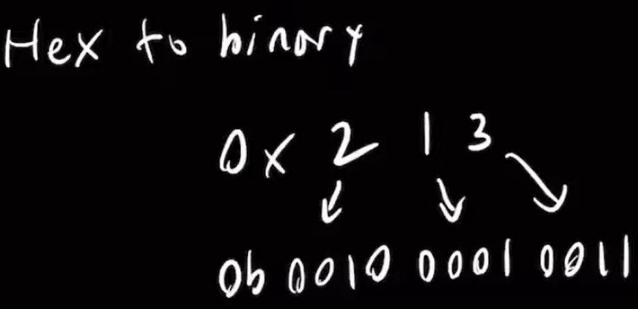

同样的，一个nibble可以转换为4个bits

### Binary → base 4

将0b1111001001转换为四进制

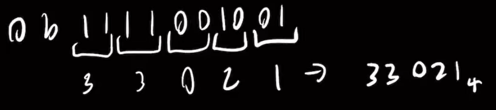

四进制中，一个数字表示2位

### Binary → Octal(base 8)

将0b1111001001转换为base 8

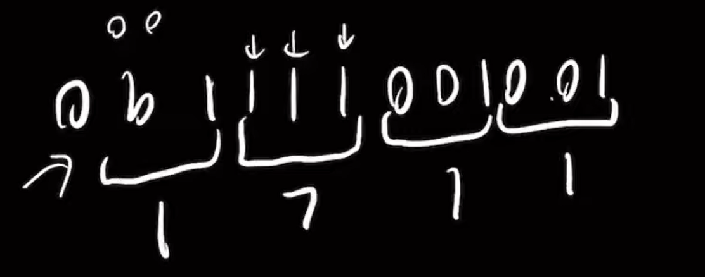

同样，三组三组划分，最前面不够的补0

> 这里注意，我们不是要进行sign extension，这里总共有10位，我们仅仅希望将其值转换成Octal，而不是将其扩展。
>
> Sign extension的目的是为了防止Overflow。这里仅仅是翻译value，一般在解释01的时候，如果遇到负数，可能将其解释为负号和一个value，然后将这个value转换成八进制

## Interpret bits

本节将怎么将计算机中的bits根据表示方式的不同解释为不同的value

> unsigned bits是计算机中真实存在的形式，往往是将其映射到其他的value上

### Bias notation

公式为：

$$unsigned\space value + bias = "actual"\space value$$

> 这里有的说法是-，如果是-，表示bias是正数，如果是+表示bias是负数。
>
> 这里我们说是+，因为一般bias定义都是负数

下面我们来获取0b101的Actual value

1. unsigned value是5
2. 这里假设bias是-5

> bias的值不是固定的，可以任意给的，取决于最终希望将范围定在哪里。
>
> 不论bias是多少，但是范围的大小是不会变的

3. actual value = 5 - 5 = 0

> 这里也要注意，unsigned bits的解释也是非常重要的，因为这是在硬件中真实表示的形式，然后才需要将unsigned bits映射到其他的value。

这里我们实现映射的方法就是偏移，没有任何额外的技巧

### 2's complement

这里只讲解负数的解释，正数和unsigned 一样

有2种方式可以解释2's Complement，这里我们来解释0b1110，只有4位

【方法1】

MSB是负数，其他的都是整数，所以结果是-2^3 + 2^2 + 2^1 = -2

> 这就是二进制补码的整个概念。唯一不同的位是最高有效位，这也是为什么我们可以将其用作符号位的原因。因为如果该位被置位，那么我们知道这个数一定是负数（后面的位不论是多大都不可能超过做高位的大小的）

---

【窍门】

另一个窍门是，我们知道当最高有效位被置位时，值不能为正或零。因为，正如我之前所说，如果该位被置位，这意味着其后的所有位的值相加，最多得到1减去该值。

这实际上是一个非常有用的小技巧。因为这告诉我们，如果在任任意长度的bits的actual value得到负1，这意味着所有位都被置位。

> 如果看到-1，那么其补码表示必定是1...1

例如，我在这里给出的四位数，每个位都置位但0位除外，这样得到的是负2。如果包括那个0位，那么实际得到的是负1。所以这真的是一个非常好的技巧，因为它允许你通过一个操作就将所有位都置位，并将值设置为负1。

也就是说，我们有0b1110，这样再+1就得到0b1111，也就是-1了，然后不是，所以要-1位0b1110，也就是-2

> 也就是说，给出一个负数的补码，那么看其与1...1的差距，也就是actual value与-1的差距

这实际上在做数学计算或者C编程时候的位操作时有很大帮助

---

【方法3】

将负数的补码转化为源码，然后解释

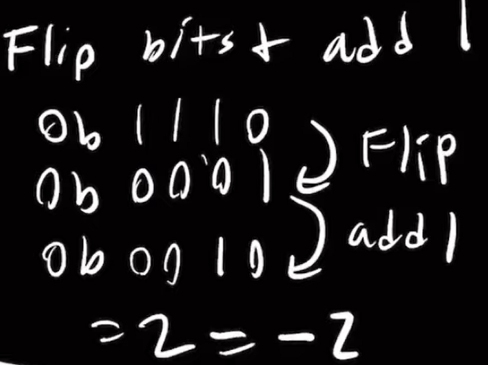

补码转化为原码，同样的也是flip然后+1

得到的原码是正值，最终需要加负号的

---

提到这一点的原因是你可能会注意到在不同的C程序中，有时它们会翻转位，例如取反操作--使用波浪号（~）。这是一种位操作，你翻转位。你会在后面的课程中，特别是某个实验中学到更多。这些操作可能会先翻转位然后加1。实际上，这样做是在对那个值**取反**。所以这只是另一种实现方法。

## Unsigned & 2's complement addition & Overflow?

本节主要讲述怎么进行加法，以及讨论是否Overflow

> 在现代的计算机中，一般只有unsigned和2's Complement两种表示数字的方式，所以这里只讨论这两种

### Addition

所以从技术上讲，对于补码和无符号数进行**加法运算**实际上是完全一样的。不同的是你如何解释这些值。

> 在计算机中，bits的相加总是一样的，区别就在于怎么解释加后的结果

现在我们计算`0b11011`和`0b01011`

那么按照计算结果是

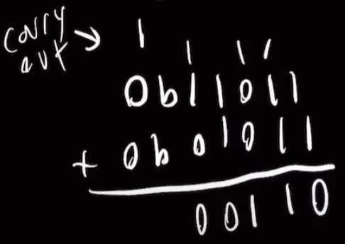

可以看到，得到的结果是0b00110，除此之外还多出一位1，我们称作carry out(就是进位)，但是这是否意味着溢出了呢？

### Overflow?

是否溢出要区别对待：

如果是无符号数，那么只要carry out是1，那么就肯定溢出了。

比如这里，0b11011是27,0b01011是11，那么结果是38，而计算的结果是6

---

如果是2's complement，那么carry out就不一定了

在这里是一个正数和一个负数进行相加，所以并不是溢出

- 0b11011的actual value是-16 + 8 + 2 + 1 = -5
- 0b01011的actual value是8 + 2 + 1 = 11

结果是6

正确

---

==**对于2's complement，如果是异号相加，那么不会溢出，如果是同号相加，那么就可能溢出了**==

## Summary

以上讲述了在进行各种转换时候的方法和技巧，需要做作业去熟练，尽量用手做而不是计算机做，==**用手做的越快，那么思考的就越快，也会让我们的生活更简单，而不是为了应付考试**==

如果真的开始已使用C语言编程的话，可能会用到很多的运算，可能要做很多的check a number

例如有一个hex value，需要很快地转换来看哪些位是1。或者可能使用数字来做设置字段，需要很快的看哪个位被设置了。

所以如果你很好地掌握这些技巧，你将能够非常快速地做很多这些转换。
