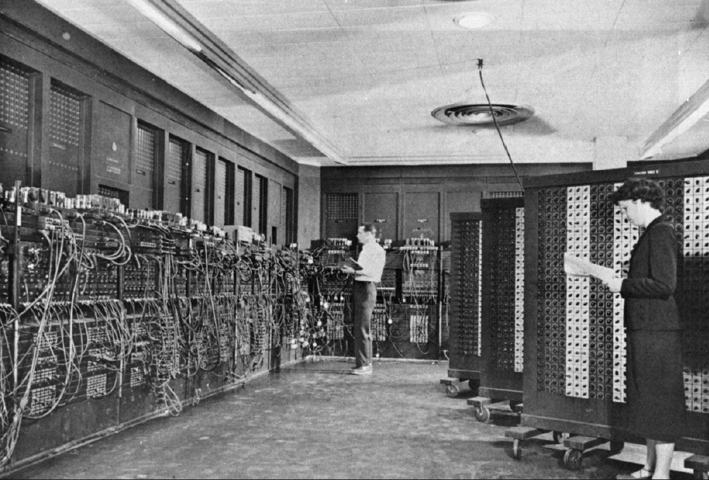
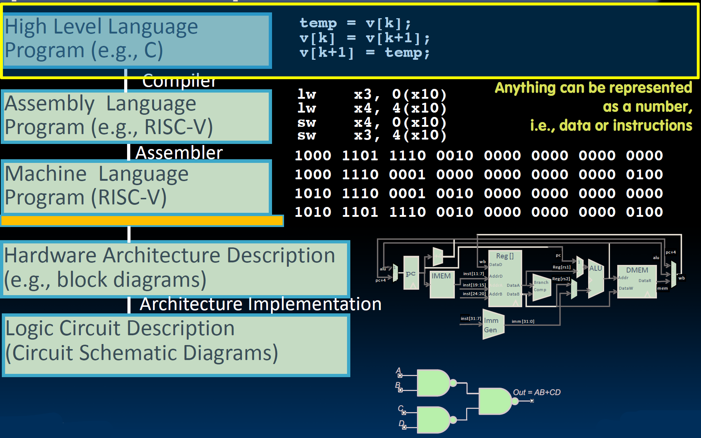
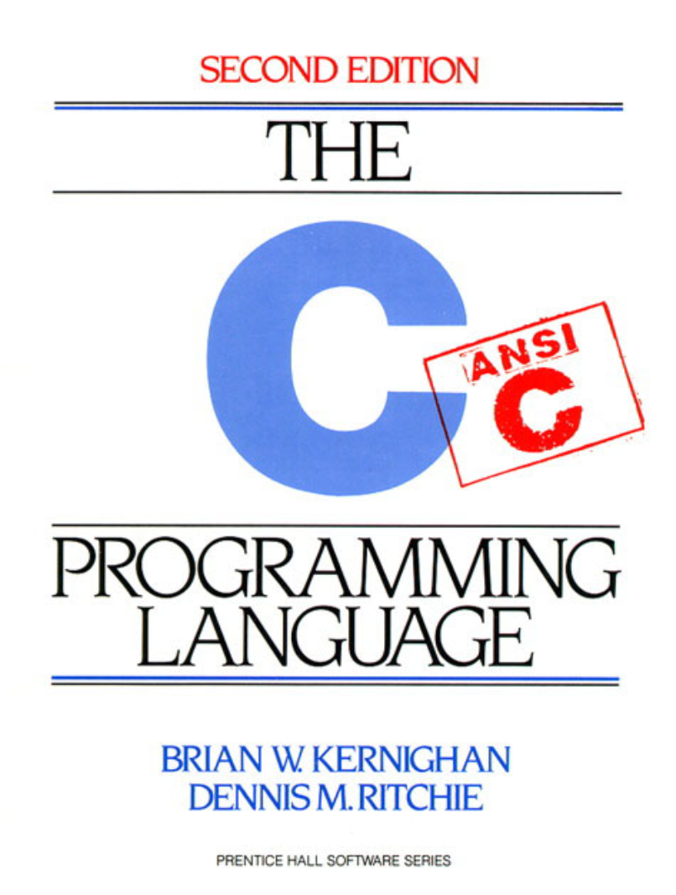

# 03.1-Intro and Background


Video Address


## History

这门课程以前叫做“机器结构”。所以让我们至少后退一步。现在它被称为“计算机架构中的伟大思想”。让我们后退一步，了解一些计算机组织的基本知识。

### ENIAC(U Penn, 1946)

其中一台最早的计算机——在这之前也有其他计算机，但这是最早的大规模新闻报道的计算机。ENIAC，宾夕法尼亚大学，1946年。那时——让我们回到那个时候——我们刚刚结束了第二次世界大战。战争结束了，这现在成了所有新闻头条。那是一个令人激动的时代。

- 这是第一台**电子通用计算机**——当时非常快。

- 它的计算量非常大，速度也很快。

    - 它可以在2.8毫秒内完成一次乘法运算。
    - 可以进行10位十进制数乘以10位十进制数的运算。

- 但问题是编程需要两到三天的时间。你在图片中看到的所有接线，就是编程的方式。要编写接线代码，阅读原理图，然后连接接线。也许你还会转动一些开关和旋钮。这是非常了不起的。

    > 在那个时间或者说更早以前，计算机大多数指的进行计算的人

- 真空管经常坏掉，但他们能够做到这一点是非常了不起的。

> 第一台电子通用计算机，计算在当时是非常快的，但是每次需要重新编程，而且仪器经常会坏掉

当时他们运行的程序主要是大量的弹道轨迹，计算这种风的角度，调整角度和推力。我不知道他们有什么控制，但基本上是计算它会落在哪里，以及对于海拔变化如何进行调整。这在现在看来是简单的事情，但那时手工完成这些计算是非常困难的。实际上，当时很多这样的模拟都是在那个系统上完成的——非常艰难。

我还想提到你在图片中看到的人物。右边的那个年轻女性，许多早期的程序员是“计算机”。我说“计算机”是什么意思？那些进行手工计算的人。如果你看过电影《隐藏人物》，你会知道“计算机”是指那些手工进行计算的人。所以早期的程序员通常是宾夕法尼亚大学团队的一部分女性。她们作为早期程序员没有得到足够的认可，但我认为她们最近受到了表彰。所以我很高兴看到这一点，但这是很重要的承认。

### EDSAC (Cambridge, 1949)

- First General Stored Program Computer(第一台可以存储程序的计算机)
- Programs held as **numbers in memory**
    - This is the revolution: It isn't just programmable, but the program is just the same type of data that the computer computes on
    - Bits are not just the numbers being manipulated, but the instructions on how to manipulate the numbers!

> 这里是非常有革新意义的，不仅仅表示可以编程了，而且程序的类型和数据是一样的
>
> bits不仅仅是数字，还可以表示操控数字的指令

- 35-bit binary Twos complement words（当时使用了35位的二进制补码，可能有一些技术原因，但历史上为什么他们使用这种而不是某种2^n宽度字已经无从考证。）

## High Level Language

如上图，这是一个非常棒的Abstraction，在图中，C是高级语言。

有些程序员可能认为C不是高级语言，python是更高级的，而C是相对低级的语言

但是我们可以称其为高级语言，是因为其并不会直接操控bits（后面当然可以实现，但是并不是通过写代码，那才是低级语言）

所以C是高级语言，尽管有其他语言比C更高级

## Introduction of C

C经历了很多次变化和升级，在大多数的时候，我们学习但是ANSI C。

这里推荐一本书

> C is not a “very high-level” language, nor a “big” one, and is not specialized to any particular area of application. But its absence of restrictions and its generality make it more convenient and effective for many tasks than supposedly more powerful languages
>
> —— Kernighan and Ritchie（C语言的缔造者）

- Enabled first operating system not written in assembly language —— UNIX - A **portable** OS!

> UNIX就是C语言写的，之前的操作系统都是汇编语言写的。
>
> 为什么称是portable，就是说这个代码可以移植到其他的机器上，但如果是用汇编语言写的话，需要根据机器来自定义汇编语言，就没有可移植性，如果换了一台机器，就需要重写。如果我有另一台机器，不同的汇编语言，我就得在那台机器上重写代码。但如果我能在这里编写代码，然后将其编译成汇编语言，那么我就在这里编写代码。这样，我就能很容易地将它移植到不同的语言、非常不同的机器和架构上。这么说有道理吗？如果你是在机器的实际语言中编写代码，你就无法真正地移植它。但是，如果你能在这之上编写代码——再次强调，这是一个抽象层次——抽象是这门课中最重要的概念。这非常强大。

## Why C

CS61系列从来不是教语言，这们课的目的是教C，教CS，我们只是恰好发现语言学的多是很好的

- We can write programs that allow us to exploit underlying features of the architecture: **memory management, special instructions, parallelism**

> C是足够底层，接近于硅层，也就是真实的机器，我们可以探索bits，理解事务的宽度并且有更多的事务控制能力
>
> 抽象等级越高的语言，其对程序的控制能力是越低的

- C and derivatives (C++/Obj-C/C#) still one of the most popular programming languages after >40 years

> Java也是学习的C，并且在相同的family的，后面会看到很多Java与C的联系

- If you are starting a new **project where performance matters** use either Go or Rust(如果你正在启动一个对性能有要求的新项目，使用Go或Rust。)

    - Rust, “C-but-safe”: By the time your C is (theoretically) correct w/all necessary checks it should be no faster than Rust

        > 如果想要有C的能力，C的低等级，但是更安全的话（在后面会看到C有很多的苦难，比如指针，内存泄漏等等），Rust是更简单的

    - Go, “Concurrency”: Practical concurrent programming to take advantage of modern multi-core microprocessors

## Disclaimer

C语言不能只看，要多练，多去做项目和作业

You will not learn how to fully code in C in these lectures! You’ll still need your C reference

- K&R is a must-have
- Useful Reference: “JAVA in a Nutshell,” O’Reilly
    - Chapter 2, “How Java Differs from C”
- Brian Harvey’s helpful transition notes: http://inst.eecs.berkeley.edu/~cs61c/resources/HarveyNotesC1-3.pdf

Key C concepts: Pointers, Arrays, Implications for Memory management

Key security concept: All of the above are unsafe : If your program contains an error in these areas it might not crash immediately but instead leave the program in an inconsistent (and often exploitable) state
