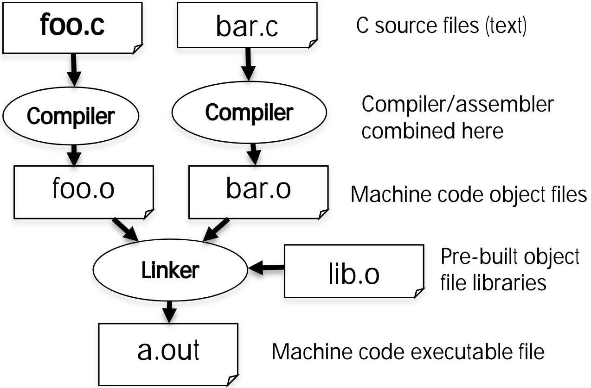

# 03.2-Compile vs. Interpret


Video Address


本节要讲述程序是如何在计算机上运行的

There's two main ways, compilation or interpretation.

## Compilation: Overveiew

> Compilation is the way C works. And the idea of that is you've got raw C code.

**C compilers** **map** C programs directly into architecture-specific machine code (string of 1s and 0s)

> A compiler is a program that drinks in a C program and outputs something that's architecture-specific.
>
> 从高层次来看，这是与特定体系结构有关的东西。在过去，体系结构是Mac与PC的对立。但即便如此，苹果也决定改变他们使用的底层CPU和底层指令集架构，实际上变成了和英特尔一样，而实际上这些差异并不大。
>
> 苹果正在改变他们的架构，将其改为ARM处理器。所以实际上，实际上它将是一种不同的指令集架构。他们将会制造自己的芯片。
>
> 由此导致的结果是，你将会再次看到PC和Mac采用不同的体系结构。所以我们从不同到相同，再到不同。

- Unlike Java, which converts to **architecture-independent bytecode** that may then be compiled by a just-in-time compiler (JIT)

> Java是先进行编译，Javac是一个compiler，c就是compile的意思，Javac将Javac编译成**architecture-independent bytecode**，也就是与机器是无关的。
>
> 这与C是区别很大的，因为C是与特定的体系结构锁定的，是不能直接拿着可执行文件在其他机器上运行的。
>
> 但是Java是可以的，Java编译后得到的bytecode是portable的，可以拿到其他机器上执行（实际上执行的是一个解释器JVM），所以Java是有compiler和interpreter的允许我们拥有与机器独立的代码

- Unlike Python environments, which converts to a byte code at **runtime**

> Python在运行的过程中进行字节转码，但其是解释型语言。

These differ mainly in exactly when your program is converted to low-level machine instructions (“levels of interpretation”)

For C, generally a **two part** process of compiling .c files to .o files, then linking the .o files into executables;

- Assembling is also done (but is hidden, i.e., done automatically, by default); we’ll talk about that later

如下是编译的过程（后面会详细介绍的）

1. 首先将.c文件编译为.o文件，.o文件就是汇编语言了
2. 然后将这些文件与库连接起来（这个时间叫做linking time），形成可执行文件（也就是01代码）

这些步骤是隐藏的，因此我们只需要输入gcc就能直接执行这些过程了

如果我们修改了foo.c，那么我们不需要重新编译bar.c，因为之前已经编译过且未改变，这也是makefile的思想。也就是说，如果我们修改了一个文件，是需要重新link的，但是其他的程序都是不需要重新编译的。

##  Compilation: Advantages

- Reasonable compilation time: enhancements in compilation procedure (Makefiles) allow only modified files to be recompiled

> 在makefile下，每次编译只会重新编译修改过后的文件，这个是很合理的。
>
> 这也是我们要将代码分段到不同的文件当中的原因之一，编译型语言不要一股脑的将代码塞到一个文件当中，反之每次编译都只重新编译修改后的那一小块。
>
> 有很多的小文件编译起来是比一个大的整体的文件快的。
>
> 这样也有利于管理，当项目越来越大到时候，这也是为什么Java要有那么多的class了(java也是有编译的)
>
> 总之只要担心修改的那一个小文件即可

- Excellent run-time performance: generally much faster than Scheme or Java for comparable code (because it optimizes for a given architecture)

> 几乎不会有语言比c更快了，汇编语言和C语言是一样的，C编译后成为raw assembler
>
> 一般来说，编译型语言的速度是最快的，因为没有重新阅读源码的阶段，也不需要在运行时重新解释。
>
> 我们只需要运行编译后得到的machine Code即可，则是硅级别的

But these days, a lot of performance is in libraries: Plenty of people do scientific computation in Python!?!

-  they have good libraries for accessing GPU-specific resources（有很多库已经为了专门的硬件优化了）
- Also, many times python allows the ability to drive many other machines very easily … wait for Spark™ lecture
- Also, Python can call low-level C code to do work: Cython

> 所以说Python作为解释型语言是不快的，但是由于其有很多库是专门为硬件优化的，而且Spark也是Python的功能可以控制很多机器，同时Python也可以调用低等级的c语言

##  Compilation: Disadvantages

- Compiled files, including the executable, are architecture-specific, depending on processor type (e.g., MIPS vs. x86 vs. RISC-V) and the operating system (e.g., Windows vs. Linux vs. MacOS)

> 可移植性差，.o file或者可执行文件只能针对于某种特定的架构，也就是说如果要移动到另一个系统。即使是像Windows和Mac，使用的都是×86，相同的CPU，但二者的library也可能不一样的

- Executable must be rebuilt on each new system.
    - I.e., “porting your code” to a new architecture

> 要进行移植的话，就需要port the code，重新编译，但是这也是有问题的，比如说int的大小是多少，当输入configure，可以看到不同的机器是有很多不同的。甚至不同的系统有不同的库，或者不同版本的OS

- “Change → Compile → Run [repeat]” iteration cycle can be slow during development
    - but make only rebuilds changed pieces, and can compile in parallel: `make -j`
    - linker is sequential though → Amdahl’s Law

> 编译进行的过程，touch a file, compile, link, run, find the error, back等等这些过程，这些是比直接解释(Read-Evaluate-Print Loop, REPL)的要慢的，对于开发过程是不利的
