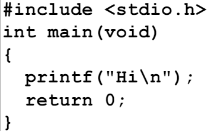
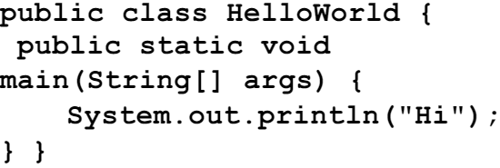
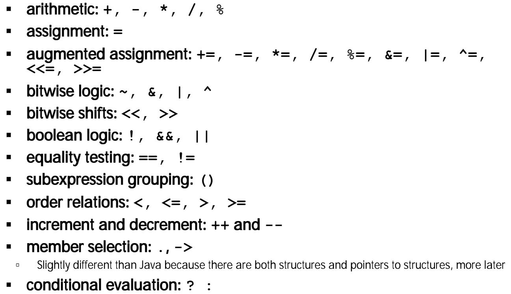

# 03.3-C vs. Java and C Versions


Video Address


## C vs. Java

|                  | C                                                              | Java                                                                  | desc                                                                                                                            |
| ---------------- | -------------------------------------------------------------- | --------------------------------------------------------------------- | ------------------------------------------------------------------------------------------------------------------------------- |
| Type of Language | Function Oriented                                              | Object Oriented                                                       |                                                                                                                                 |
| Programming Unit | Function                                                       | Class = Abstract Data Type                                            |                                                                                                                                 |
| Compilation      | `gcc hello.c` creates machine language code                    | `javac Hello.java` creates Java virtual machine language bytecode     | 
Javac输出的是machine independent code;gcc输出是machine dependent <code>gcc -o hello hello.c</code>可以指定输出的名字，有时不希望输出总是.out的后缀
 |
| Execution        | `a.out` loads and executes program                             | `java Hello` interprets bytecodes                                     | 
Java后面的Hello不需要.java了，因为Java解释的是编译后的文件，而不是.java文件 a.out会加载到内存然后执行程序
                                                   |
| hello, world     |  |         | c中的main返回一个数字，用0表示成功，0在UNIX中表示成功，但是失败有很多种可能，用其他数字表示                                                                             |
| Storage          | **Manual** (malloc, free)                                      | New allocates & initializes, **Automatic** (garbage collection) frees | 这一点可以理解为抽象，我们先学习了Java，不需要管理内存，然后再学习C。这也是为什么先教Java                                                                               |

> 不建议Java作为第一个学习的语言，因为Java里面有太多的细节了，C也是有很多东西，比如说库，IO等

|                                         | C                                        | Java                            |
| --------------------------------------- | ---------------------------------------- | ------------------------------- |
| Comments (C99 same as Java)             | `/* … */` (ANSI C是没有单行注释的)               | `/* … */` or `// …` end of line |
| Constants                               | #define, const                           | final                           |
| Preprocessor                            | Yes（CPP）                                 | No                              |
| Variable declaration (C99 same as Java) | At beginning of a block（在老版本，只能在一开始声明变量） | Before you use it               |
| Variable naming conventions             | sum\_of\_squares                         | sumOfSquares                    |
| Accessing a library                     | `#include <stdio.h>`                     | `import java.io.File`;          |

除此之外，Java和C的操作是非常接近的，下面是C的一些操作

## C Versions

> 优点类似于jdk8,jdk11等等，C也有很多版本

### ANSI C(C89/C90)

> 下面的内容是ChatGPT生成的

ANSI C，指的是美国国家标准协会（American National Standards Institute, ANSI）标准化的C编程语言。它是C语言的一个标准版本，通常也称为C89或C90，具体取决于该标准的发布年份。ANSI C的定义和规范由ANSI的X3J11委员会于1989年首次完成，并在1990年被国际标准化组织（ISO）采纳，成为ISO/IEC 9899:1990标准。

### C99/C9x

Has there been an update to ANSI C? Yes! It’s called the “C99” or “C9x” std

* To be safe: `gcc -std=c99` to compile

> C的版本直接体现在应用中就是编译器的方式，代码是自己写呢，怎么编译就是版本决定了

* `printf(“%ld\n", __STDC_VERSION__);` → 199901

> `printf(“%ld\n", __STDC_VERSION__);`可以打印编译器的版本

Highlights（下面是这个版本的特点）

* Declarations in for loops, like Java（可以在任何地方定义变量了，只要在使用之前即可）
* Java-like `//` comments (to end of line)
* Variable-length non-global arrays（在这个版本也可以有动态长度的array了，在老版本的C中，只能用hardcode来指定array的长度）
* `<inttypes.h>`: explicit integer types（可以显示声明int的长度类系列）
* `<stdbool.h>`: for boolean logic def's

### C11(C18)

Has there been an update to C99? Yes! It’s called the “C11” (C18 修复了一些bug，最新版本叫做C18)

* You need `gcc -std=c11` (or c17) to compile
* `printf(“%ld\n", __STDC_VERSION__);` → 201112L
* `printf(“%ld\n", __STDC_VERSION__);` → 201710L

Highlights

* Multi-threading support(这个版本的C支持多线程了，这个很棒)
* Unicode strings and constants
* Removal of `gets()`(C11将gets删除了，不安全)
* Type-generic Macros (dispatch based on type)
* Support for complex values
* Static assertions, Exclusive create-and-open, …

## C Syntax: main

> 这一部分按内容来说属于下一节，因此移到了[下一节](03.4-c-syntax.md)了
