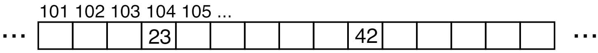
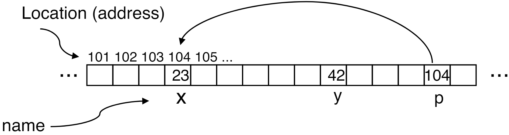
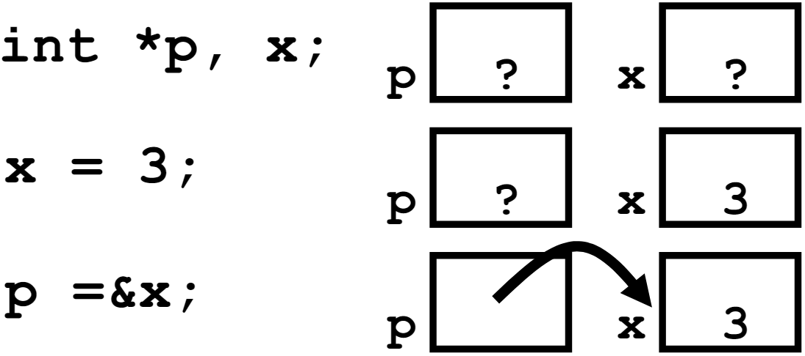
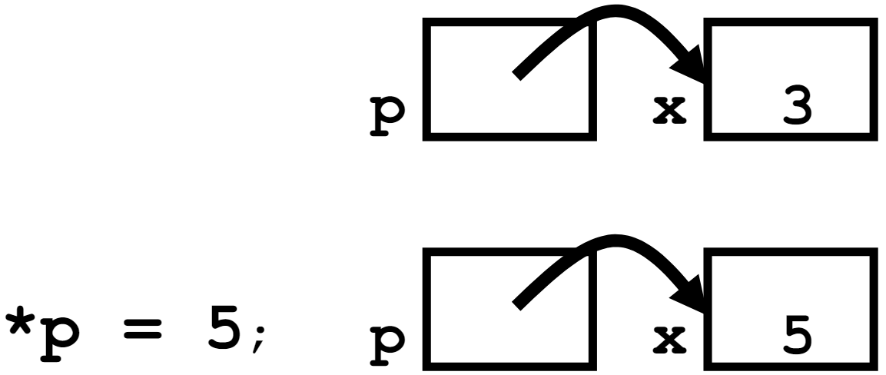

# 04.1-Pointers and Bugs



## Variable Declarations

Similar to Java, but with a few minor(小的) but important differences

- All variable declarations must appear before they are used
- All must be at the beginning of a block.(ANSI C)
- A variable may be initialized in its declaration; if not, it holds garbage!(可以在声明的时候初始化)

> Java在声明变量的时候会默认初始化其为0，让其有意义，但是C不一样，没有显示初始化就可能是任意的值（原先的内存有的01序列），这样可能会造成很多问题。

Examples of declarations:

- Correct: {` int a = 0, b = 10;`
- Incorrect in ANSI C: for (`int i=0;`
- Correct in C99 (and beyond): `for (int i=0;`

> 这里我们说的都是ANSI C，在任意地方进行初始化都是C99及以后的了

## Undefined Behavior

A lot of C has “Undefined Behavior”, This means it is often unpredictable behavior:

-  It will run one way on one computer
- But some other way on another
- Or even just be different each time the program is executed!

Often characterized as “Heisenbugs”

> Heisenbugs是海森堡虫（指调试时难以重现的计算机程序错误）

- Bugs that seem random/hard to reproduce, and seem to disappear or change when debugging
- Cf. “Bohrbugs” which are repeatable

## Address vs. Value

Consider memory to be a single huge array:

> 这也可以是一种抽象的体现，将memory当做一个array，但是memory具体怎么存储的并不需要知道

- Each cell of the array has an address associated with it.
- Each cell also stores some value
- Do you think they use signed or unsigned numbers? Negative address?!

> 就将内存比作array，address就是index，value就是对应的内容, mem[add] = value

Don’t confuse the address referring to a memory location with the value stored in that location.

For now, the abstraction lets us think we have access to ∞ memory, numbered from 0



## Pointers & Syntax

- **An address** refers to a particular memory location. In other words, it points to a memory location
- **Pointer**: A variable that contains the address of a variable.



---

下面是一些Pointer的语法

- `int *p;`: Tells compiler that **variable p is address of an int**
- `p = &y;`: Tells compiler to assign address of y to p
    - `&` called the “**address operator**” in this context
- `z = *p;`: Tells compiler to **assign value at address in p to z**
    - `*` called the “**dereference operator**” in this context

**【如何创建一个pointers】**

& operator: get address of a variable



**【如何得到pointer指向的value】**

`*` "dereference operator": get value pointed to

```c
printf("p points to %d\n",*p);
```

---

Note the `*` gets used 2 different ways in this example. 

- In the **declaration** to **indicate that p is going to be a pointer**
- in the **printf** to **get the value pointed to by p.**

【如何改变pointer的值】

Use dereference * operator on left of =



## Pointers and Parameter Passing 

> 本节讲述怎么通过指针来给函数传递值

Java and C pass parameters "**by value**"

procedure/function/method gets a **copy** of the parameter, so **changing the copy cannot change the original**

> 在CS61B中曾说过，Java传递的时候就是值传递，特别是=赋值操作就是将01序列给赋值（这是一个黄金法则），所以Java在传递引用的时候就是将引用的value，也就是地址传过去了

```c
void addOne (int x) {
    x = x + 1;
}
int y = 3;
addOne(y);

// y is still = 3
```

【How to get a function to change a value?】

如何让function来改变值呢？

```c
void addOne (int *p) {
    *p = *p + 1;
}
int y = 3;
addOne(&y);

// y is now = 4
```

## More C Pointer Dangers

C的指针也是有风险的

> 之前说了，不像Java，在C中声明一个变量却不初始化的话，是不会赋予默认的值的，而是采用原先内存的这个变量

1. Declaring a pointer just allocates space to **hold the pointer** – it does not allocate something to be pointed to!
2. Local variables in C are not initialized, they may contain anything.（也就是说可能指向任意的地方）

> 如果仅仅定义指针的话，那么只是为指针变量分配空间，但是指针指向哪里并没有说，如果这个时候对指针指向的地方赋值，那么会出很大的问题

What does the following code do?

```c
void f()
{
    int *ptr;
    *ptr = 5;
}
```

> 这里可能会报错，因为ptr指向的地方可能没有权限去写

## Pointers in C … The Good, Bad, and the Ugly

### Why pointers

Why use pointers?

1. If we want to pass a large struct or array, it's easier / faster / etc. to pass a pointer than the whole thing(Otherwise we’d need to copy **a huge amount of data**)

> C中的结构体和Java中的对象不同，Java中控制的是对象的引用，值传递的时候也是值传递，但是C如果传递结构体，就是将结构体的内容都赋值
>
> 如果传递指针的话，就会非常容易了

2. In general, pointers allow cleaner, more compact code

### Drawbacks

Pointers are probably the single **largest source of bugs in C**, so be careful anytime you deal with them

- Most problematic with dynamic memory management—coming up next time
- Dangling references(悬空引用) and memory leaks

