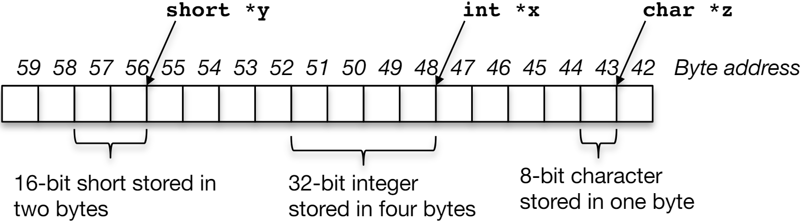

# 04.2-Using Pointers Effectively



## The Type of Pointers

Pointers are used to point to **any data type** (int, char, a struct, etc.).

Normally a pointer can only point to one type (int, char, a struct, etc.)

- `void*` is a type that can point to **anything** (generic pointer)

> 如果显示指定了pointer的类型，那么只能指定那一种类型，但是如果声明的pointer的类型是void*，那么这个pointer可以指向任何内容

- **Use sparingly**(谨慎地) to help avoid program bugs… and security issues… and a lot of other bad things!

---

**【Pointers可以指向一个函数】**

You can even have pointers to functions

```c
int (*fn) (void *, void *) = &foo
```

> `fn` is a function that accepts two `void *` pointers and returns an `int` and is initially pointing to the **function** `foo`.

```c
(*fn)(x, y) // will then call the function foo
```

> 程序和数据一样都是01存储的，所以指针也可以指向一个函数

再写一个自己的例子

```c
void foo() {
    printf("abc");
}

int main(void) {
    void (*fn) (void) = &foo;
    (*fn)();
}
```

- `void (*fn) (void)`中`*fn`表明fn是一个指针
- `void (*fn) (void)`中第一个void表示返回值是void，第二个(void)表示参数是void

再来一个例子

```c
void foo(int a, int b) {
    printf("%d", a + b);
}

int main(void) {
    void (*fn) (int, int) = &foo;
    (*fn)(1, 3);
}
```

---

### Function as arg

再来一个例子，这个就和Python很像的应用了

```c
int add(int a, int b) {
    return a + b;
}

int mul(int a, int b) {
    return a * b;
}

int operate(int a, int b, int (*fn) (int, int)) {
    return (*fn)(a, b);
}

int main(void) {
    int res_add = operate(1, 3, &add);
    int res_mul = operate(1, 3, &mul);
    printf("%d, %d", res_add, res_mul);  // 4, 3
}
```

## Pointers and Structures

定义结构体

```c
typedef struct {
    int x;
    int y;
} Point;
```

定义指针

```c
Point p1;
Point p2;
Point *paddr;
```

结构体变量访问成员（dot notation）

```c
int h = p1.x;
p2.y = p1.y;
```

结构体指针访问成员（arrow notation）

```c
int h = paddr->x;
int h = (*paddr).x;
```

> int h = (*paddr).x; 中必须要为\*paddr加括号，因为dot notation的优先级是高于\*的

---

p1 = p2; 也是会工作的，这样是直接将内容所有的值都赋予，而不是赋予引用

## NULL pointers

The pointer of all 0s is special: The "NULL" pointer, like in Java, python, etc...

If you write to or read a null pointer, your program should crash

> 这也算是保护了程序，防止野指针赋值给其他地方

Since "0 is false", its very easy to do tests for null:

```c
if(!p) { /* P is a null pointer */ }
if(q) { /* Q is not a null pointer */ }
```

## Pointing to Different Size Objects

Modern machines are `byte-addressable`: ==Hardware’s memory composed of 8-bit storage cells, each has a unique address==

> 两个相邻的地址之间隔着8bits，再更老的时候使用的是word-addressable

A C pointer is just abstracted memory address（pointer也是使用了抽象内存地址 ，**其并不会直接指向某一个bit**，除非是地址对应的byte的第一个bit）

Type **declaration**(也就是pointer的类型) tells compiler **how many bytes to fetch** on each access through pointer: E.g., **32-bit integer stored in 4 consecutive 8-bit bytes**

But we actually want "`word alignment`"

- Some processors will not allow you to address 32b values without being on 4 byte boundaries
- Others will just be very slow if you try to access “unaligned” memory.



### Word alignment(ChatGPT)

在计算机科学中，内存地址中的**word alignment（字对齐）**指的是将数据存储在特定的内存地址上，这些地址必须是数据大小的整数倍。例如，对于32位系统中的32位（**4字节**）数据，字对齐要求数据存储在能够被4整除的内存地址上（如0x00, 0x04, 0x08, 0x0C, 0x10等）。

> 一个字的长度就是系统的位数，32位系统中一个word就是32位
>
> 上面说过，以前的计算机是word-addressable的，这样估计能使得效率更快，但是精细控制度不高，无法指向一个word内部的byte。
>
> 但是现在的计算机是byte-addressable的，更精细了，但是为了提高效率，所以仍然建议是字对齐

字对齐的主要目的是提高内存访问的效率。未对齐的内存访问可能会导致额外的CPU周期开销，因为内存子系统可能需要进行多次访问以读取或写入一个完整的数据单元。

通过确保数据对齐，CPU可以在一次内存访问中完成读取或写入，从而提高性能。

下面是一些关于字对齐的重要点：

1. **对齐要求**：不同的数据类型有不同的对齐要求。例如，在32位系统中，32位的整数通常需要4字节对齐，64位的浮点数需要8字节对齐。

2. **填充字节（Padding）**：为了满足对齐要求，编译器可能会在数据结构中插入额外的字节。这个过程称为填充。例如，如果一个结构体中包含一个4字节的整数和一个1字节的字符，为了使下一个成员对齐，编译器可能会在字符后插入3个字节的填充（插入3个字节也就是防止其他的地方分配这块内存？）。

3. **性能影响**：未对齐的访问可能会导致性能下降，特别是在需要进行多个内存访问和组合操作的情况下。某些架构甚至不支持未对齐的访问，导致程序崩溃或异常。

4. **对齐边界**：对齐边界是指内存地址必须满足的条件。例如，对于4字节对齐，内存地址必须是4的倍数。

以下是一个例子，说明结构体中的对齐和填充：

```c
#include <stdio.h>

struct Example {
    char c;      // 1字节
    int i;       // 4字节
};

int main() {
    printf("Size of struct Example: %d\n", sizeof(struct Example));  // 8
    return 0;
}
```

在这个例子中，`struct Example`中的`char c`占用1字节，而`int i`占用4字节。为了使`int i`对齐到4字节，编译器通常会在`char c`之后插入3个字节的填充。因此，这个结构体的总大小会是8字节（1 + 3 + 4）。

通过正确的对齐，可以确保内存访问的高效性，避免不必要的性能损失。

## sizeof() operator

`sizeof(type)` returns number of bytes in object. Includes any padding needed for alignment

> 这一点上面说过了

By Standard c99, `sizeof (char) == 1`

> 因为char应该会有填充的，但是这里专门为了char设置为1

Can take `sizeof(arg)` , or `sizeof(structtype)`(返回某种类型的byte长度是多少)

We'll see more of `sizeof` when we look at dynamic memory management

