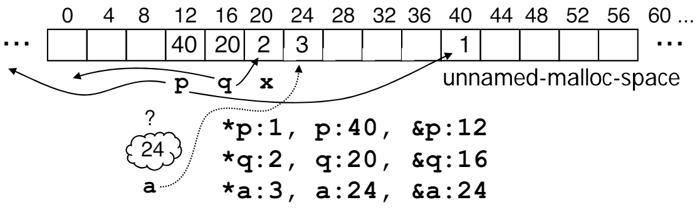

# 05.1-Dynamic Memory Allocation



## Dynamic Memory Allocation

这是C与Java和Python的不同之处，C可以控制内存，决定想要多少内存，如何去释放内存

### sizeof()

C has operator `sizeof()` which gives size **in bytes** (of type or variable)

Assume size of objects can be misleading and is bad style(因为随着系统位数的不同，类型的大小是无法确定的), so use sizeof(type)

- Many years ago an int was 16 bits, and programs were written with this assumption. 
- What is the size of integers now?

**=="sizeof" knows the size of arrays:==**

```c
int ar[3]; // Or: int ar[] = {54, 47, 99}
sizeof(ar) // 12
```

as well for arrays whose size is determined at run-time:

> sizeof()在运行时也可以知道size

```c
int n = 3;
int ar[n]; // Or: int ar[fun_that_returns_3()];
sizeof(ar) // 12
```

### malloc()

> malloc是Memory allocate的意思

To allocate room for something new to point to, use `malloc()` (with the help of a **typecast** and **sizeof**)

```c
ptr = (int *) malloc (sizeof(int));
```

- Now, `ptr` points to a space somewhere in memory of size `(sizeof(int))` in bytes.
- `(int *)` simply tells the compiler what will go into that space (called a typecast)

> malloc分配的空间是不会初始化的(C语言就不会初始化)，并且返回值是`void *`，因为malloc是不知道返回的空间是做什么的，所以需要`(int *)`来转义

---

malloc is almost never used for 1 var(malloc不会为了一个变量使用，而是为了许多变量)

```c
ptr = (int *) malloc (n*sizeof(int));
```

This allocates an array of n integers

---

Once `malloc()` is called, the memory location contains garbage, so don’t use it until you’ve set its value.

> C语言不会自动初始化为默认值，所以malloc()分配的内容可能是原来的garbage，所以不要直接使用

### free()

free是与malloc相反的函数

After dynamically allocating space, we must dynamically free it: 

```c
free(ptr);
```

Use this command(free) to clean up

- Even though the program frees all memory on exit (or when main returns), don't be lazy!
- You never know when your main will get transformed into a subroutine!

free之后的指针不能再使用了

### bugs

The following two things will cause your program to crash or behave strangely later on, and cause VERY VERY hard to figure out bugs:

1. free()**ing** the same piece of memory twice

如下，会报错

```c
int main(void) {
    int ARRAY_SIZE = 10, *ptr = (int *) malloc(ARRAY_SIZE * sizeof(int));

    for (int i = 0; i < ARRAY_SIZE; i++) {
        printf("%d ", ptr[i]);
    }

    free(ptr);
    free(ptr);
}
```

2. calling free() on something you didn't get back from malloc()

```c
int main(void) {
    int *ptr;
    free(ptr);
}
```

> 即便是指针移动过，也不可以free，只能free malloc返回的那个地址，其他的不可以，如下

```c
int main(void) {
    int *ptr = (int *) malloc(5 * sizeof(int));
    ptr++;
    free(ptr);
}
```

3. malloc之后不free（前面说过的问题）

---

The runtime does not check for these mistakes

- Memory allocation is so performance-critical that there just isn't time to do this 
- The usual result is that you corrupt the memory allocator’s internal structure
- You won't find out until much later on, in a totally unrelated part of your code!

### realloc(p, size)

malloc有时候是不能满足需求的，比如内存不够，不足以满足需求的时候，此时malloc就会出错，返回的就是0，也就是NULL了

**==所以在malloc后面都需要判断返回的pointer是不是0==**

> 为了防止协程 ptr = 0这样错误的符号判断(这样是赋值)，常常会将常数放在前面，也就是0 == ptr而不是ptr == 0

---

- **Resize** a previously allocated block at p to a new size
- ==If p is NULL==, then realloc behaves like `malloc`
- ==If size is 0==, then realloc behaves like `free`, deallocating the block from the heap
- Returns **new address** of the memory block; NOTE: it is likely to have moved!

```c
int *ip;
ip = (int *) malloc(10*sizeof(int));
/* always check for ip == NULL */
...;

ip = (int *) realloc(ip,20*sizeof(int));
/* always check NULL, contents of first 10 elements retained */

realloc(ip,0); /* identical to free(ip) */
```

> realloc的好处是可以自动移动数据，就是原来有的数据，可以复制到新的地方
>
> 但是realloc的第一个参数只能是指针，不能是array name

如下面的例子

```c
int main(void) {
    int INITIAL_SIZE = 5, *arr = (int *) malloc (INITIAL_SIZE * sizeof(int));
    if (NULL == arr) {
        exit(1);
    }

    for (int i = 0; i < INITIAL_SIZE; i++) {
        arr[i] = i;
    }

    for (int i = 0; i < INITIAL_SIZE; i++) {
        printf("%d ", arr[i]);
    }

    printf("\n");

    int ARRAY_SIZE = 10, *ptr = (int *) realloc(arr, ARRAY_SIZE * sizeof(int));
    if (NULL == ptr) {
        exit(1);
    }
    // free(arr);

    for (int i = 0; i < INITIAL_SIZE; i++) {
        printf("%d ", ptr[i]);  // 0 1 2 3 4
    }
    printf("\n");

    // free(arr);
    // free(ptr);

    // printf("%u, %u", arr, ptr);
}
```

> 但是不知道为什么后面的free(arr)和free(ptr)会出错，两个的地址也不一样
>
> ---
>
> 错误的原因是realloc之后会自动free(arr)，所以之后再手动free(arr)就会出错了

## Example

下面是实现了一个数组

```c
#include<stdio.h>
#include<stdlib.h>

void foo();

int main(void) {
    foo();
    return 0;
}

void foo() {
    int *p, *q, x;  // 未初始化，内容都是garbage
    int a[4];
    p = (int *) malloc (sizeof(int));
    q = &x;
    *p = 1; // p[0] would also work here
    printf("*p:%u, p:%u, &p:%u\n", *p, p, &p);  // *p:1, p:7036656, &p:6421992
    *q = 2; // q[0] would also work here
    printf("*q:%u, q:%u, &q:%u\n", *q, q, &q);  // *q:2, q:6421980, &q:6421984
    *a = 3; // a[0] would also work here
    printf("*a:%u, a:%u, &a:%u\n", *a, a, &a);  // *a:3, a:6421952, &a:6421952
}
```

> %u是无符号整数的意思。



> 这里有3个值，以p为例，&p是p的地址是12，p是其指向的地址是40，*p是其指向的地址的value，是1
>
> 也注意，上面结果的右边两列都是4的倍数

### address of array

如上a == &a，这很奇怪，如果&a是24，那么*a就是24地址的数字3，那么到底在那里存储这个24呢？原因是：

K&R: “An array name is not a variable”

这些会在汇编语言中学到

## Summary

- Pointers and arrays are virtually(几乎) same
- C knows how to increment pointers
- C is an efficient language, with little(没有) protection 
    - Array bounds not checked
    - Variables not automatically initialized

> C不会初始化和进行检查，这些需要手动实现，但也因此实现了高效率

- Use handles to change pointers
- Dynamically allocated heap memory must be manually deallocated in C.
    - Use malloc() and free() to allocate and deallocate memory from heap.
- (Beware) The cost of efficiency is **more overhead(开销) for the programmer**.
    - C gives you a lot of extra rope, don't hang yourself with it!

## The Three Pointer Rules(Extra)



1. the basic structure is that you have a pointer and it points over to a point e but the pointer and point e are separate and the common error is to set up a pointer but to forget to give it a point e number
2. pointer dereferencing starts at the pointer and follows its Arrow over to access its Point e as we all know this only works if there is a point e which kind of gets back to rule number one number
3. pointer assignment takes one pointer and Chang es it to point to the same point e as another pointer so after the assignment the two pointers will point to the same point e sometimes that's called sharing.

下面的用法是错误的

```c
int main(void) {
    int arr[] = {1, 2, 3};  // no problem

    int *p = (int *) malloc(3 * sizeof(int));
    *p = {1, 2, 3};  // 不能直接给指针赋值数组

    int *q = 1; // 没有分配空间，指针还不知道指向哪里
}
```

