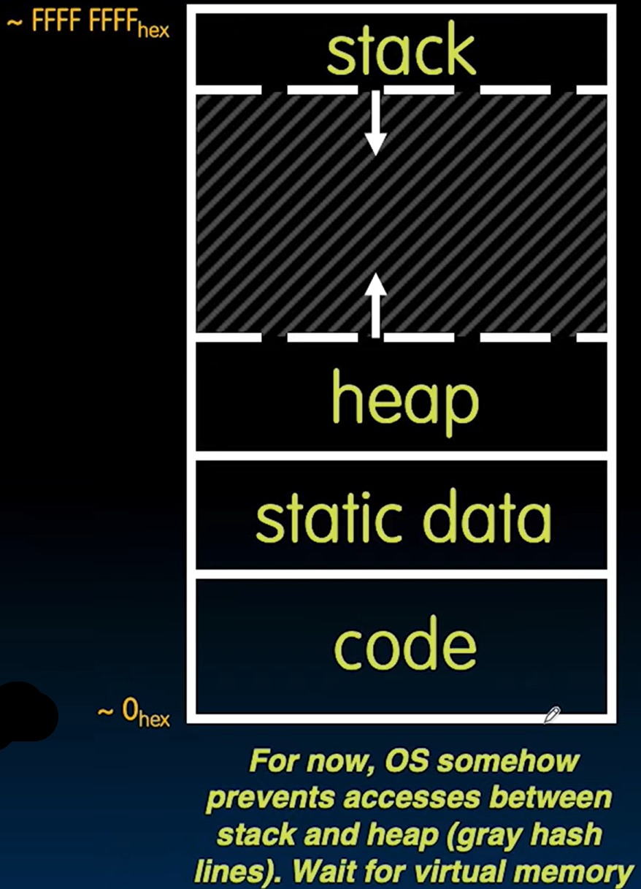
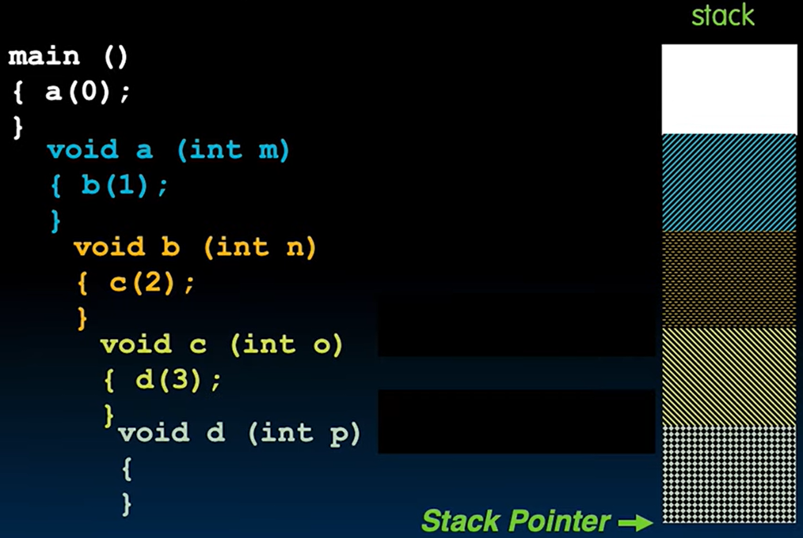

# 05.3-Memory Locations & Stack



本节课我们就会揭开语言的abstraction，看到内存相关的内容

## local, gloabl, dynamic allocation

> 总共有三种存储的类型

What is stored?

- Structure **declaration** **does not** allocate memory

- Variable **declaration** **does** allocate memory

> 结构体的声明不会分配空间，但是变量的声明会分配空间的

```c
typedef struct LinkedNode
{
    char field1;
    int field2;
};  // do not allocate memeory.

int main(void) {
    int a; // do allocate memory.
    struct LinkedNode b;  // do allocate memory, b is a variable;
}
```

---

So far we have talked about **several different ways** to allocate memory for data:

1. Declaration of a local variable（局部变量）
    - `int i; `
    - `struct Node list; `
    - `char *string; `
    - `int ar[n]`
2. "**Dynamic**" allocation at **runtime** by calling allocation function (alloc).
    - `ptr = (struct Node *) malloc (sizeof(struct Node)*n);`
3. global variable
    - Data declared outside of any procedure (i.e., before main).
    - Similar to #1 above, but has "global" scope.

```c
int myGlobal;
int main(void) {
	//...
}
```

> main也是一个函数，其里面的变量就是局部变量，是其他的subroutine不能接触的，但是global variable是所有的Function都可以接触的
>
> 所以如果想要一个所有方法都能接触的变量（特别是常数）的话，可以使用global variable，但是不要用太多(CS61B中曾说过尽量避免通用的变量，而是通过参数传递)

### The Location of the variable

上述将的三种分配内存的方法分别在三种地方

C has 3 pools of memory

1. Static storage: global variable storage, basically permanent, entire program run

> static并不是说不能改变了，而是说不能改变size了，所以全局变量肯定是可以修改的（常数除外）

2. The Stack: local variable storage, parameters, return address (location of "activation records" in Java or "stack frame" in C)

3. The Heap (dynamic malloc storage): data lives until deallocated by programmer

| allocation      | Memory         |
| --------------- | -------------- |
| global variable | static storage |
| local variable  | stack          |
| malloc/realloc  | heap           |

C requires knowing **where objects are in memory**, otherwise things don’t work as expected

Java hides location of objects

## The segment of memory

本节介绍Memory分成哪些段

A program’s address space contains 4 regions:

- stack: local variables, grows **downward**
- heap: space requested for pointers via malloc() ; resizes dynamically, grows **upward**

> 二者的方向也是内存地址增减的方向，Stack的内存是-的，Heap的内存地址是+的，二者在中间相遇视为满了

- static data: variables declared outside main, does not grow or shrink
- code: loaded when program starts, does not change



Code装着代码，如果要运行一个程序的话，这个程序的代码就会加载到这一块

---

### Stack & Heap

这个模型是很有趣的，Stack和Heap都在占用着中间的那个区域，考虑下面两个情况：

1. Stack占了大部分，Heap占了少部分：一个非常深的递归，比如说阶乘。Function的调用会增加Stack的空间
2. Heap占了大部分，Stack占了少部分：没有函数调用，所有的变量都在main里面，而且有大量的malloc

---

什么程序可以允许用户几乎能够直接控制内存呢？

Photoshop是一种，比如说在做图的时候，创建一个Document，指定是1,000,000pixel by 1,000,000 pixels，这个Document的空间实际上就是从Heap中拿出来的，如果空间越大，占用的内存也就越大。

---

Stack和Heap还有一个区别。考虑下面两个情况

```c
int main(void) {
    int arr[] = {1, 2, 3, 4, 5, ... , ∞};
    int *ptr = (int *) malloc(∞ * sizeof(int));
}
```

1. `arr[] = {1, 2, 3, 4, 5, ... , ∞};`是local variable，数据是存储在Stack的，这样的结果是会报错的，以为内存溢出了
2. `*ptr = (int *) malloc(∞ * sizeof(int));`是malloc分配的，数据 存储在Heap中，这样不会报错，而是返回NULL

第二种的代码对应内存的问题是更有弹性的，malloc能够告诉你不能够满足request，这也是为什么使用malloc而不是直接使用数组的原因之一。 

> 至于怎么组织Stack和Heap能够交叉，这是操作系统的工作。

### Where are variables allocated?

> 这里说的事variable，没有malloc的事

- If declared outside a procedure (**global**), allocated in "static" storage 
- If declared inside procedure (**local**), allocated on the "**stack**" and freed when procedure returns.

NB: `main()` is a procedure

```c
int myGlobal;
main() {
    int myTemp;
}
```

## The Stack(Memory)

> 下面来介绍一下Stack这个内存结构


Stack frame includes:

- Return "instruction" address
- Parameters
- Space for other local variables

> 回忆在CS61A时候的environment diagram的frame，一个Function的环境就叫做一个frame

Stack frames contiguous blocks of memory; （这个和Heap不一样，Heap的空间总是不连续的）

stack pointer(SP) tells where top stack frame is

When procedure **ends**, stack frame is tossed off the stack; frees memory for future stack frames

---

### Stack structure

Stack是Last In, First Out (LIFO) data structure

看下面的代码

```c
main () { 
    a(0);
} 

void a (int m){ 
    b(1);
}

void b (int n){ 
    c(2);
}

void c (int o){ 
    d(3);
}

void d (int p){
}
```


1. 在调用a(0)的时候，a那个frame中要保存a(0)下面的那个位置，以此来返回

| 执行位置 | 图示                                                         |
| -------- | ------------------------------------------------------------ |
| main     |  |
| a(0)     |  |
| b(1)     |  |
| c(3)     |  |
| d(3)     |  |

> 由上图可以看出，growth SP是非常快的，只要在原来的基础上+一段即可
>
> 返回的时候就不一定了，因为涉及很多寄存器

然后要返回了


这里注意，函数返回的时候是不需要擦除原先frame的数据的，这样也能提高效率(这些frame的空间也被当成空闲内存使用了)


