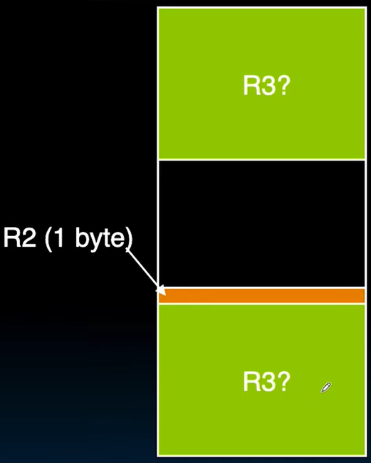

# 05.4-Heap & Implementation Of Malloc&Free



## The Heap (Dynamic memory)

Heap is large pool of memory, not allocated in contiguous order(尽管每一次请求的内存都是连续的区域)

- back-to-back requests for heap memory could result blocks very far apart
- where Java **new command** allocates memory

In C, specify number of bytes of memory explicitly to allocate item

```c
int *ptr;
ptr = (int *) malloc(sizeof(int));
/* malloc returns type (void *), so need to cast to right type */
```

- `malloc()`: Allocates raw, uninitialized memory from heap

## Memory Management

如何管理内存？

根据四个地方来划分

| Location             |        | desc                                                         |
| -------------------- | ------ | ------------------------------------------------------------ |
| Code, Static storage | easy   | they never grow or shrink                                    |
| Stack                | easy   | stack frames are created and destroyed in last-in, first-out (LIFO) order |
| heap                 | tricky | memory can be allocated / deallocated at any time            |

> 前三个都是系统帮助管理的（当然在写汇编语言的时候可以控制这些，但是在C编程的时候，这些在abstraction layer以下）
>
> 只有Heap需要程序员管理，虽然不用做很多的内存管理，包括如何移动内容等等，这些是OS做的，但是程序员仍然需要思考要多大的内存，如何用这些内存等等。

## Heap Management

### Requirements

下面是管理heap时的需求

> 在上一节中说过，Stack的管理是非常快的，增加frame的时候只需要移动SP即可，甚至回退的时候也不需要清除用过的地方

1. Want malloc() and free() to run quickly
2. Want minimal memory overhead(负担)
3. Want to avoid fragmentation(碎片化,分散)* – when most of our free memory is in many small chunks（这也是最核心的问题）
    - In this case, we might have many free bytes but not be able to satisfy a large request since the free bytes are not contiguous in memory.

This is technically called external fragmention

---

> External Fragmention(ChatGPT)
>
> 外部碎片（external fragmentation）是指在动态内存分配中，内存空闲块分布在不同的地方，导致尽管总的空闲内存量足够，但由于这些空闲内存块不连续，无法分配给较大的内存请求。这种碎片化现象会导致内存使用效率降低。
>
> 外部碎片的一个典型例子是，当一个程序反复申请和释放不同大小的内存块时，内存空闲区会逐渐分散成多个小块。这些小块单独来看可能无法满足一个大的内存申请，但它们总和起来的内存量是足够的。这种情况会导致系统无法有效地使用这些零散的空闲内存块。
>
> ### 解决外部碎片的方法
>
> 1. **内存紧凑（Memory Compaction）：** 将所有的空闲内存块移到一起形成一个连续的内存块。这种方法的缺点是需要额外的时间和系统开销。
>
> 2. **最佳适应（Best Fit）策略：** 选择能够满足请求的最小空闲块，这样可以减少剩余的小碎片块的产生。
>
> 3. **伙伴系统（Buddy System）：** 将内存划分为块大小为2的幂的内存单元。分配和释放内存时，尽量保持内存块合并成更大的块，减少碎片化。
>
> 4. **分区分配（Partition Allocation）：** 将内存划分为若干固定大小的分区，每个分区只分配给特定大小的内存请求。这种方法可以减少外部碎片，但可能会增加内部碎片。
>
> 外部碎片问题在操作系统和内存管理中是一个重要的问题，设计有效的内存分配算法来减少外部碎片是提高系统性能的关键。

### Example: External Fragmention

下面是External Fragmention的例子

1. Request R1 for 100 bytes
2. Request R2 for 1 byte
3. Memory from R1 is freed
4. Request R3 for 50 bytes

| 前两步                                                       | 后两步                                                       |
| ------------------------------------------------------------ | ------------------------------------------------------------ |
|  |  |

> 可以看到，R2只有1byte，但是却挡在了R3的中间，使其无法分配

## K&R Malloc/Free Implementation

下面是根据K&R的书的一章来讲解如何实现malloc和free的

From Section 8.7 of K&R

> Code in the book uses some C language features we haven’t discussed and is written in a very terse style, don’t worry if you can’t decipher the code

### Idea

Each block of memory is preceded by a header that has two fields:

- size of the block
- a pointer to the next block

> 就是说每一块block都需要有一个header包含block的大小和下一个block的开始，想一个Linked List

All free blocks are kept in a **circular** linked list(循环链表), the pointer field is unused in an allocated block

### implementation

`malloc()` searches the free list for a block that is big enough. If none is found, more memory is requested from the operating system. If what it gets can’t satisfy the request, it fails.

> 这里是说先向OS请求空间，如果得到的还不能满足需求，就失败，返回NULL 

`free()` checks if the blocks adjacent to the freed block are also free

- If so, adjacent free blocks are merged (coalesced) into a single, larger free block
- Otherwise, freed block is just added to the free list

---

于是你突然意识到，malloc不再是——malloc是一个函数调用，对吧？你在调用malloc函数。所以malloc并不是即时返回的。

请求一个1百万大小的**数组**，ar[1million]，那个数组请求非常快。下一行几乎是瞬间——基本上一个时钟周期。

但malloc可能需要很长时间。首先，我们有函数调用的开销，这是我们还没有讨论的。但这有一定的开销。至少你知道堆栈必须增长，对吧？这是一个函数调用。每次函数调用都会增长堆栈。所以malloc作为一个函数——仅仅是调用malloc，堆栈就会增长。很有趣的是堆栈和malloc都——malloc会影响堆，但你必须增长堆栈才能调用一个函数，而malloc是一个函数。但malloc随后必须遍历它的空闲链表。它必须查找它的表格并执行其操作，并执行其内部机制来遍历其循环链表以查找你所需要的内容。也许有很多碎片。哇，你可以想象malloc需要很长时间才能返回null。这真是疯狂。

> 总的来说，请求数组的时候已经在一个frame里面了，不需要管Stack了，而且也不是malloc所以也不需要管Heap了，所以请求数组，不论多大都是很快的功夫
>
> 但是malloc不一样，malloc不仅仅是一个函数，需要管Stack，而且还要管Heap，遍历空闲链表等操作

---

If there are multiple free blocks of memory that are big enough for some request, how do we choose which one to use?

> 因为前面说了malloc可能是需要很大的开销的，所以就需要在==快速选取block==和==充分利用block==之间做取舍

| method    | desc                                                         |
| --------- | ------------------------------------------------------------ |
| best-fit  | choose the **smallest** block that is big enough for the request |
| first-fit | choose the first block we see that is big enough             |
| next-fit  | like first-fit but remember where we finished searching and resume searching from there |

> first-fit每次都是从一个固定的beginning开始的，但是next-fit是在上一次search之后开始的

## Summary

C has 3 pools of memory

- Static storage: global variable storage, basically permanent, entire program run
- The Stack: local variable storage, parameters, return address
- The Heap (dynamic storage): malloc() grabs space from here, free() returns it.

`malloc()` handles free space with freelist

Three ways to find free space when given a request:

- First fit (find first one that’s free)
- Next fit (same as first, but remembers where left off
- Best fit (finds most “snug” free space)
