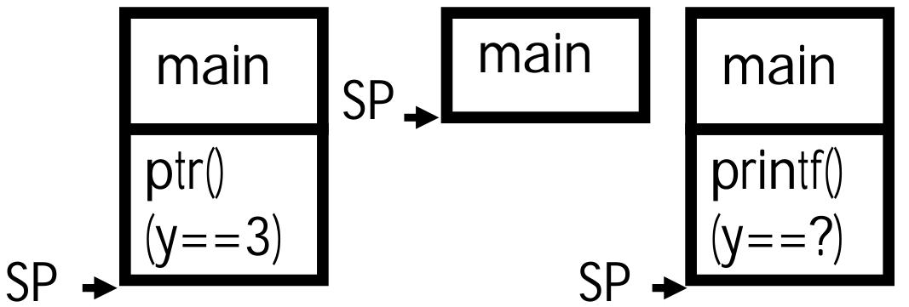

# 05.5-When Memory Goes Bad



## Pointers in C(review)

回顾一下之前的内容

Why use pointers?

- If we want to pass a huge struct or array, it’s easier / faster / etc to pass a pointer than the whole thing
- In general, pointers allow cleaner, more compact code.

> 使用指针的原因就这么简单，但是这样的用处也是非常大的

So what are the drawbacks?

- Pointers are probably the single largest source of bugs in software, so be careful anytime you deal with them.
- **Dangling(悬空) reference** (use ptr before malloc)（相当于野指针）
- **Memory leaks** (tardy(迟到的，缓慢的) free, lose the ptr)

## Writing off the end of arrays...

下标越界是错误之一

```c
int *foo = (int *) malloc(sizeof(int) * 100);
int i;
....;
for(i = 0; i <= 100; ++i) {
    foo[i] = 0;
}
```

Corrupts other parts of the program...

- Including internal C data

May cause crashes later

## Returning Pointers into the Stack

Pointers in C allow access to `deallocated memory（没有分配的内存）`, leading to hard-to-find bugs !

如下

```c
int *ptr() {
    int y;
    y = 3;
    return &y;
};

int main(void) {
    int *stackAddr, content;
    stackAddr = ptr();
    
    content = *stackAddr;
    printf("%d", content); /* 3 */
    
    content = *stackAddr;
    printf("%d", content); /*13451514 */
};
```



下面解释一下出现上面输出的原因：

1. `stackAddr = ptr();`正常执行，`ptr()`内部将y所在的地方设置为3，并且`ptr()`返回的时候是不会擦除原先的内容的，所以y的地方仍然保留为3
2. 第一次`printf("%d", content)`之后，输出的就是y所在地方的内容3，但是在这个的过程中，printf()本身就是一个函数调用，因此会使得SP下移，**很有可能**会覆盖掉原先y所在地方的3（我们不知道printf里面的内容是什么）
3. 因此第二次输出`printf("%d", content)`的时候就是garbage了

> 并不是说函数不能返回指针，而是说不能返回Stack里面的地址，也就是说不能返回局部变量的地址的
>
> 如果要返回，必须返回使用malloc请求得来的内存地址，这一部分是Heap里面的

## Use After Free

就是在free之后仍然使用

When you keep using a pointer..

```c
struct foo *f;
....;
f = malloc(sizeof(struct foo));
....;
free(f);
....;
bar(f->a);  // corrupt
```

**Reads** after the free may be corrupted

- As something else takes over that memory. Your program will probably get wrong info!

> 读的时候也仅仅是可能，如果这一块地方没有被重写，那么仍然可能按照结构体的规则解析bits得到a是多少

**Writes** corrupt other data! Your program crashes later!

> 写的时候可能与其他的数据冲突

## Forgetting realloc Can Move Data

When you realloc it can copy data...

```c
struct foo *f = malloc(sizeof(struct foo) * 10);
...;
struct foo *g = f;
....;
f = realloc(sizeof(struct foo) * 20);
```

Result is g may now point to invalid memory

- So reads may be corrupted and writes may corrupt other pieces of memory

> realloc会自动free第一个参数

## Freeing the Wrong Stuff...

If you free() something never malloc'ed()

> free了没有malloc的指针，如下f++之后就不再是malloc返回的指针了

```c
struct foo *f = malloc(sizeof(struct foo) * 10)
...;
f++;
...;
free(f)
```

malloc or free may get confused..

- Corrupt its internal storage or erase other data...

> 这里回忆一下malloc和free的底层，free了一个不是malloc的block，那么怎么删除？

## Double-Free

```c
struct foo *f = (struct foo *)
malloc(sizeof(struct foo) * 10);
...;
free(f);
...;
free(f);
```

May cause either a use after `free` (because something else called `malloc()` and got that data) or corrupt malloc’s data (because you are no longer freeing a pointer called by `malloc`)

## Losing the initial pointer! (Memory Leak)

```c
int *plk = NULL;
void genPLK() {
    plk = malloc(2 * sizeof(int));
    ...;
    plk++;
}
```

This MAY be a <mark style="background-color:green;">**memory leak**</mark> if we don't keep somewhere else a copy of the original malloc'ed pointer

## Valgrind to the rescue…

> Valgrind是一个软件能够检测这些问题

Valgrind slows down your program by an order of magnitude, but...

- It adds a tons of checks designed to catch most (but not all) memory errors
    - Memory leaks, Misuse of free, Writing over the end of arrays

Tools like Valgrind are absolutely essential for debugging C code

## Summary

C has three main memory segments in which to allocate data:

- Static Data: Variables outside functions
- Stack: Variables local to function
- Heap: Objects explicitly malloc-ed/free-d

Heap data is biggest source of bugs in C code
