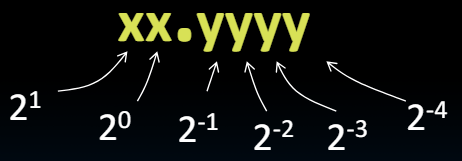
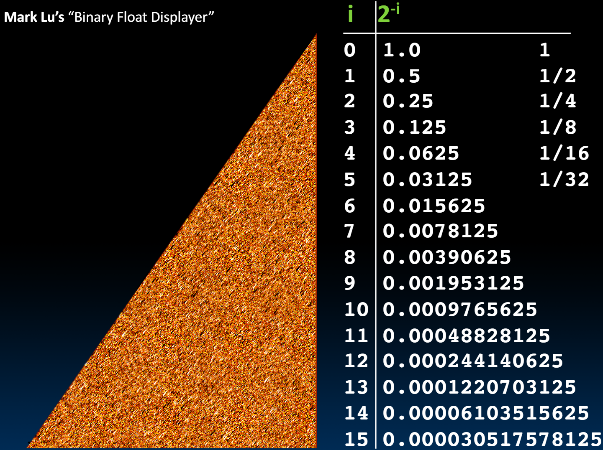
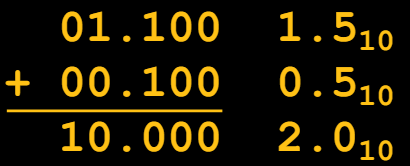
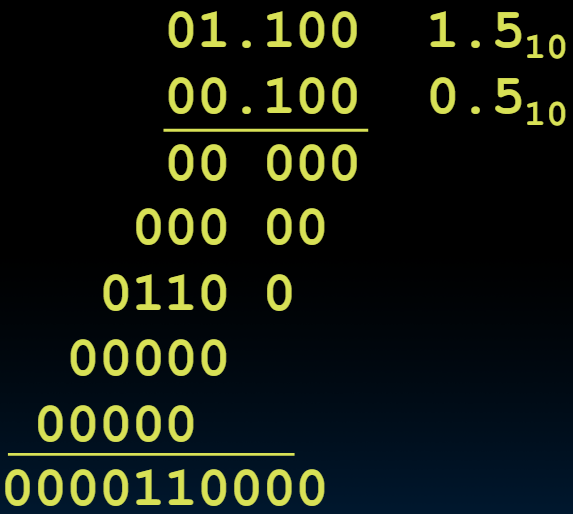

# 06.1-Basics & Fixed Point


lecture video address


## Quote of the day

"95% of the folks out there are completely clueless about floating-point." —— James Gosling, 1998-02-28(Sun Fellow, Java Inventor)

> 外面有95%的人完全不了解浮点数。

本节先讲述定点数，然后再讲浮点数

## Review of Numbers

Computers made to process numbers

What can we represent in N bits?

2^N^ things, and no more! They could be…

- Unsigned integers:
    -  0 to 2^N^ - 1
    -  (for N=32, 2^N^ - 1 = 4,294,967,295)
- Signed Integers (Two’s Complement)
    - -2^(N-1)^ to 2^(N-1)^ - 1
    -  (for N=32, 2^(N-1)^ - 1 = 2,147,483,647)

## What about other numbers?

但是还有一些数字，是没法用上面的整数表示的

1. Very large numbers (sec/millennium)：31,556,926,00010 (3.155692610 x 10^10^）
2. Very small numbers? (Bohr radius): (0.000000000052917710m (5.2917710 x 10-^11^))
3. \#s with both integer & fractional parts?: 1.5

首先考虑第3点，这对于理解12点有帮助

## Representation of Fractions

"**Binary Point**" like **decimal point** signifies boundary betw. integer and fractional parts:

Example 6-bit representation:

> 小数点左边一位序号为0，向左增加，向右减少

10.1010~2~ = 1x2^1^ + 1x2^-1^ + 1x2^-3^ = 2.625~10~ 

If we assume "fixed binary point", range of 6-bit representations with this format: 

- 0 to 3.9375 (almost 4)

> - 最小值：00.0000
> - 最大值：11.1111~2~，.1111的值就是1. - 0.0001，11.1111~2~也就是100. - 0.0001,0.0001是2^-4^

这个范围是可以表示1.5的 

## Fractional Powers of 2

下面是关于2的分数的Powers

## Addition & Multiplication Operation

What about addition and multiplication?

**Addition** is straightforward

Multiplication a bit more complex:

答案是0.11~2~，这样是没问题的

Need to remember where point is…

## Summary

Fixed Point

1. 可以表示一定的范围，但是表示的范围可能比较小，以6bit为例：00.0000 ~ 11.1111
2. 可以进行加法和乘法，结果来说是没问题的

但真正的问题是，我们如何更聪明地处理这个问题，以便处理非常大的数字和非常小的数字？我们有点固定住了。我给你6位。我们有一个关于二进制点位置的约定。或者我可以有一个单独的变量，这里是二进制的原始值。这里有一个单独的变量表示二进制点的位置。这可能是一个大想法。与其总是将其锁定在从左边开始的两个位置，不如我说如果我也在这里存储二进制点的位置呢。这可能是一个会变化的数字。这可能会为我们如何处理浮点数提供一些见解。因此，与其锁定它，我们实际上可能会根据另一个输入来变化，这就是二进制点的位置。这意味着它可能会滑动。我们会在接下来的视频中看到这一点。再见。
