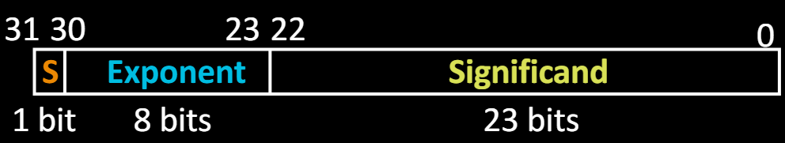

# 06.2-Floating Point


lecture video address


## Why floating point representation?

So far, in our examples we used a "fixed" binary point what we really want is to "float" the binary point. Why? 

> 浮点数的float就是小数点可以浮动float

Floating binary point most ==**effective use of our limited bits**== (and thus more accuracy in our number representation):

E.g., put **0.1640625** into binary. Represent as in 5-bits choosing where to put the binary point.

… 000000.00**10101**00000…（我们称这个10101为energy）

**Store these bits** (10101) and keep track of the **binary point** **2 places to the left of the MSB**.

> 我们要保存**0.1640625**，实际上只有10101这几个有效位，所以我们只需要保留这5位，这是一部分。另一部分就是要记录小数点在哪里，这里是10101的MSB的左边的2位，所以需要有一个-2，这个-2的部分叫做exponent

- Any other solution would lose accuracy!

With floating ==point representation==, each numeral carries an **exponent field recording the whereabouts of its binary point**.

> exponent的作用就是记录小数点在哪里，不要简单的看做指数

The binary point can be outside the stored bits, so **very large and small numbers** can be represented.

## Scientific Notation

通过上面的例子

### in Decimal

Normalized form: no leadings 0s (exactly one digit to left of decimal point)

> Normalized form意味着只有一个digit在小数点的左边

Alternatives to representing 1/1,000,000,000

- Normalized: 1.0 x 10^-9^
- Not normalized: 0.1 x 10^-8^, 10.0 x 10^-10^（这两个都不符合要求）

### in Binary

我们下面来类比二进制的科学计数法

Computer arithmetic that supports it called ==**floating point**==, because it represents numbers where the binary point is not fixed, as it is for integers

Declare such variable in C as `float`

> 计算机就是以这样的格式来解释小数的，接下来就是讨论怎么用二进制来记录这些部分了

## Floating Point Bits Representation

> 
>
> 在上图中，需要记录的部分有1. 小数点以后的那几位，2. exponent；
>
> 小数点前面的1在科学计数法的要求下，必定位1，除非是0；在计算机中，radix也必定是2，所以这两个是不用记录的

### model

Normal format: +1.xxx…x~two~ * 2^yyy…y^ ~two~

Multiple of Word Size (32 bits)

| part        | representation |
| ----------- | -------------- |
| S           | Sign           |
| Exponent    | y's            |
| Significand | x's            |

Represent numbers as small as 1.2 x 10^-38^ to as large as 3.4 x 10^38^

> S是表示符号的一位，这个model也就很类似于Sign-Magnitude model，前面是符号，后面是量

在这个model中，LSB，也就是最后一位表示2^-23^

### Overflow & Underflow

What if result too large?

- (> 3.4x10^38^ , < -3.4x10^38^ )
- **Overflow**! → Exponent larger than represented in 8-bit Exponent field

What if result too small?

- (>0 and < 1.2x10^-38^ , <0 and > -1.2x10^-38^ )
- **Underflow**!→Negative exponent larger than represented in 8-bit Exponent field

> 所以说，Overflow和Underflow关键是看exponent的范围呢，如果大于其最大值，就是Overflow，如果小于其最小的负值，就是Underflow，和Significand无关

What would help reduce chances of overflow and/or underflow?

## IEEE 754 Floating Point Standard

如果单单考虑浮点数，Exponent和Significand的位数都是可以任意定的，这会影响表示的范围，进而影响Overflow和Underflow的可能性，因此制定了规范

> 这个规范也就是现代几乎所有的计算机使用的规范

### segments

Single Precision (单精度，双精度double也类似):

> 一个Sign，8个Exponent，23个Significand

- Sign bit: 1 means negative, 0 means positive

- Significand:
    - To pack more bits, leading 1 implicit for normalized numbers

    - 1 + 23 bits single(单精度), 1 + 52 bits double(双精度)

        > 这里的1就是小数点前面的1，双精度就是为了提高精度，减少Overflow和Underflow的可能性

    - always true: **0 < Significand < 1** (for normalized numbers)

---

Note: **0 has no leading 1,** so reserve exponent value 0 just for number 0

> 如果是0的话，那么Exponent和Significand都是0
>
> 因为Significand=0，那么Exponent无论怎么样结果都是±1，所以可以预留出来保存特殊的值(这一点下一节会详细讲)，这里预留Exponent为全0表示0

### biased exponent

下面讨论怎么表示exponent（这里的exponent指的是IEEE 754这个标准里面怎么保存Exponent）

EEE 754 uses "biased exponent" representation

> 浮点数和 1,2's Component不一样，浮点数如果仅仅增长的话那么到达最大值后是会循环回到最小值的

- Designers wanted FP numbers to be used even if no FP hardware; e.g., sort records with FP numbers using **integer compares**

> 设计Exponent的初衷之一就是希望能在没有浮点数硬件的时候也能够工作（尽管现在我们有这些硬件），例如使用Integer compares来比较浮点数

> 这里的比较是不仅仅是Exponent，而是整个浮点数，也就是(Signed + Exponent + Significand)一块进行比较，按照从左往右的顺序和整数一样比较

- Wanted bigger (integer) exponent field to represent bigger numbers.

> 需求：
>
> 1. 我们希望当exponent为全0时最小，并且希望在以01模式增加的时候，exponent也会增大，而不会在中间的时候反过来（比如Sign-Manitude，1/2's Complment，这些有符号位，当MSB为1的时候变为负数又返回来了）。
> 2. 并且我们希望最小的，也就是0..000的时候是负数
>
> 使用biased notation就可以满足这样的条件
>
> 这样的话，在比较exponent的时候，就可以直接从MSB开始比起，在机器上和比较integer一样的规则了

- 2's complement poses a problem (because negative numbers look bigger)

> 这里要区分计算与解释的区别，硬件进行比较的时候 仅仅只是单纯的比较01序列，所有的01序列都是一样的规则，而解释是按照我们自定义的规则。所以进行比较的时候，exponent的比较规则和整数的比较规则一样

---

### Compare Rules

We’re going to see that the numbers are ordered EXACTLY as in **sign-magnitude**

> 所以说，最终的比较规则和使用sign-magnitude表示整数是一样的，在这里，第一位还是sign，但是Magnitude就成为了(Exponent + Significand了)，这也是为什么Exponent要放在前面了
>
> 在比较的时候，先比较符号位，然后将(Exponent+Significand)看做Magnitude，然后从MSB到LSB开始比较。将Exponent放在前面就是为了先比较Exponent的大小

I.e., counting from binary odometer 00…00 up to 11…11 goes from 0 to +MAX to -0 to -MAX to 0

> 0 → +MAX → -0 → -MAX → 0

---

Called Biased Notation, where bias is number subtracted to get real number

- IEEE 754 uses bias of 127 for single prec.
- Subtract 127 from Exponent field to get exponent value 

> 一般bias是0111..1，这里是8位，也就是2^7^ - 1 = 127，这也是IEEE 754的标准

### Summary

Summary (single precision, or fp32):

- (-1)^S^ x (1 + Significand) x 2^(Exponent-127)^

Double precision identical, except exponent bias of  1023 (half, quad similar)

## "Father" of the Floating point standard

IEEE Standard 754 for Binary Floating-Point Arithmetic.

1989 ACM Turing Award Winner!

这里是介绍其的[文章](https://people.eecs.berkeley.edu/~wkahan/ieee754status/754story.html)

