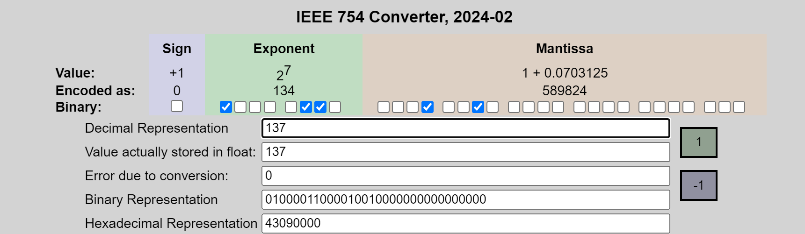

# 06.3-Special Numbers


lecture video address


前面我们已经讨论过了怎么使用IEEE 754来保存一个浮点数

- (-1)^S^ x (1 + Significand) x 2^(Exponent-127)^

但是这个规则有些问题：

1. 怎么表示0呢？
2. 表示1的方式太多，只要Significand是0，那么结构都是±1

下面讨论一下在这个标准中怎么表示特殊的数字

## Representation for ± ∞

> infinity有很多用处，它比所有的数字都大，而且+任何数都是infinity；当你想要找到一个array的MAX的时候可以使用-infinity为开始(当然可以以第一个元素为开始)

In FP, divide by 0 should produce ± ∞, not overflow.

Why?

- OK to do further computations with ∞
- E.g., X/0 > Y may be a valid comparison
- Ask math majors

---

那么如何表示∞呢？

How does IEEE 754 represent **± ∞**

- Most positive exponent reserved for ∞
- Significands all zeroes

> 要表示±1，只要Significand是0即可，exponent是多少事无关的，因此可以预留exponent的值来表示其他特殊的值
>
> 我们仍然希望可以通过比较Exponent来判断float Point的大小，因此就设置exponent最大的情况，也就是1...1来表示∞
>
> 但是Significand仍然为全0

那么此时按照Sign-Magnitude的规则呢？

此时最大的表示精确的数字是

`0 1111110 11..11`，如果再+1，就成为了`0 11111111 00..00`，也就是+∞了

> 所以从最大的精确值到最大值中间是跳了一下的
>
> 现在的问题是 0 11111111 11..11 难道不是更大吗？

## Representation for 0

Represent 0?

- exponent all zeroe
- significand al l zeroe
- What about sign? Both cases valid.

所以0就有两种表示方式了

### Meaning

这样做的意义，以正数为例

本来0 00000000 000..000表示的是1，现在将Exponent为全0专门为0预留出来

那么下一个最小的正数应该是0 00000001 00...000

## Current Summary

What have we defined so far? (Single Precision)

现在可以表示的数值有这些了

| Exponent    | Significand | Object        |
| ----------- | ----------- | ------------- |
| 0           | 0           | 0             |
| 0           | nonzero     | **???**       |
| 1~254       | anything    | +/- fl. pt. # |
| 255(11..11) | 0           | +/- ∞         |
| 255(11..11) | nonzero     | **???**       |

> 这里要注意，当Exponent是111的时候，Significand为nonzero的时候，不能为全0，否则就违反Sign-Magnitude的比较顺序

现在，当Exponent是00.00或者11.11，并且Significand不是全0的时候，该表示什么？

> Professor Kahan had clever ideas: "Waste not, want not"

Wanted to use Exp=0,255 & Sig!=0

## Representation for Not a Number

What do I get if I calculate `sqrt(- 4.0)` or `0/0`?

- If ∞ not an error, these shouldn’t be either
- Called Not a Number (NaN)

我们使用==**Exponent = 255, Significand nonzero**==来表示NaN

Why is this useful?

- Hope NaNs help with debugging?
- They contaminate(弄脏): op(NaN, X) = NaN

> 有了NaN，不论怎么对其操作，结果都是NaN，不可能从NaN的运算中脱离出NaN

- Can use the significand to identify which!

> 当我们的代码在非常底层的地方出错了，比如sqrt(-4)，创建了一个NaN，但是我们察觉不到
>
> 这样解释NaN的话，当代码从底层网上走的时候，与别的数据进行计算的时候仍然是NaN，并且到了我们可见的层次的时候仍然保持为NaN，这样我们就知道哪里有NaN了，从而能够顺着往下走进行Debug
>
> 否则，即使在底层出现了NaN，在往上走的时候与别的数值进行计算得到了一个real number，那么就不好Debug了

---

但是现在的问题，当Exponent为255的时候，Significand从0..001 ~ 1..111这样2^23^ - 1种可能性来表示NaN了，这大概是800万种

所以你几乎可以把这些位看作是，如果有某种协议，特定的硬件可以通过某些位来表示是什么类型的错误。好吧，这是一个负数的平方根。这是一个0除以0。这是一个……某种双曲线的东西。无论你想做的数学操作会引起什么样的错误，你都会有这些错误。你可能会有一个代码来表示这些错误。

你也可能在这些位中实际包含发生错误的行号，或者包含其他任何调试信息。因此，你可以利用这800万种可能的位模式来实际编码错误发生的位置。如果我在深处知道这个错误发生在第17行，为什么不返回一个NaN，其中我的有效位部分表示这是哪种NaN，而这些位表示打印F，这样你就可以有某种编码来表示是哪一行、是什么、来自哪个程序、来自哪个文件。你可以在那里编码任何东西。

所以，他们使用了800万位，具有让人们可以以一种聪明且标准化的方式使用的潜力，这真的非常巧妙且聪明。你可以以调试的方式传递上来是什么NaN，是什么原因导致了NaN，甚至可能如何解决它。这是一些关于如何修复它的位。这真的很酷。这就是NaN的理念。

> 总而言之，设计NaN的非常重要的作用就是帮助Debug，其里面有无限多可能的情况来帮助进行Debug，也给了人们未来开发的可能性

## Representation for Denorms(非正规数)

现在还剩下Exponent=0，Significand=nonzero的情况了，这表示什么？

Problem: There’s a gap among representable FP numbers around 0

> 这是问题所在。存在一个间隙。大约在 0 附近有一个间隙。顺便说一下，无论你想要什么编码，如果这里有一个 0，那么下一个数，下一个数应该是等步长的。它应该像一个尺子，0 和第一个数之间的距离，和第一个数与第二个数之间的距离是相同的。好的，它应该是这样的。但浮点数并不是这样。0是通过特殊规则 Exponent和Significand全0来表示的，所以中间的过度不是很丝滑

- Smallest representable pos num: a = 1.0… ~2~ * 2^-126^ = 2^-126^

> 最小的正数应该是0 00000001 00..00，Exponent有一个1，指数就是1-127 = -126

- Second smallest representable pos num:

> 这里Exponent是00000001，然后Significand不能是全0了，必须有一个1了

---

- a - 0 = 2^-126^
- b - a = 2^-149^

可以看到0→a，a→b之间的距离是不一样的，并且从a往右，每一个可读都是2^-149^，以为Exponent就不变了，Significand开始逐个递加了

0~a之间的gap相对来说也太大了，这里有800w倍的gap

问题在哪里？问题就在于Normalization的那个隐含的小数点前面的1

Solution:

- We still haven’t used Exponent = 0, Significand nonzero

> 我们用着800万种可能来修补这个巨大的gap

- DEnormalized number: no (implied) leading 1, implicit exponent = -126

> 在这个阶段，不要前面的1了，并且exponent默认是-126

- Smallest representable pos num: a = 2^-149^（也就是2^-23^ × 2^-126^）(==同时这个也就是0~1之间的刻度了，这一块的值就是Significand × 这个刻度==)
- Second smallest representable pos num:b = 2^-148^

这样表示的范围就成为了

也就是可以表示所有的内容了

> 这里要明白，从0→∞的step，也就是刻度不是变化的，最小的是2^-149^，每当Exponent + 1的时候，这个刻度就×2，最大的时候是当Exponent为11111110的时候
>
> 可以将Exponent当做一个门槛，每当跨国这个门槛，步伐就会加倍。但是每一个门槛都要经过2^23^步，也就是接近800w个数值

## Summary

| Exponent | Significand | Object        |
| -------- | ----------- | ------------- |
| 0        | 0           | 0             |
| 0        | nonzero     | Denorm        |
| 1~254    | anything    | +/- fl. pt. # |
| 255      | 0           | +/- ∞         |
| 255      | nonzero     | NaN           |

以上，便是整个浮点数增加的过程了，浮点数按照Sign-Magnitude的规则比较，实际上是比较Magnitude，然后将Sign作为符号加到结果上去

在这里，我们仅仅以比较Magnitude为例，讲解一下Floating Point的增加的顺序

| Exponent            | Significand     | Object        | desc                                                         |
| ------------------- | --------------- | ------------- | ------------------------------------------------------------ |
| 00000000            | 00..00          | 0             | 最小的非负数 0                                               |
| 00000000            | 00..01 ~ 11..11 | Denorm        | 填补0~**2^-126^**之间的数值，规定Exponent是2^-126^，间隔为2^-149^(2^-23^×2^-126^)，逐渐到达1 |
| 00000000 ~ 11111110 | 00..00 ~ 11..11 | +/- fl. pt. # | 正常的表示浮点数，每跨国一个Exponent，step×2，并且每一个阶段都有2^23^也就是800万种数字 |
| 11111111            | 0               | +∞            | 到达极限了，也就是正无穷                                     |
| 255                 | nonzero         | NaN           | NaN了                                                        |

用语言描述，一开始先为0，然后从0过度到2^-126^，然后从2^-126^过度到最大的正整数，最后一步达到+∞，然后再跨一步，成为了NaN

> 这样的比较顺序既充分利用了所有的位数，而且非常符合整数的比较顺序，未曾打乱，【真神啊】！

## Extra: Converting Tools

这里有一个转化工具：https://www.h-schmidt.net/FloatConverter/IEEE754.html

### Key Representation

下面列举一下特殊的值

> 千万不要任务 0 00000001 00..00是1，因为exponent是biased notation，因此00000001是负的指数 -126，此时是最小的正规数2^-126^

| desc                                                      | diagram                                                      |
| --------------------------------------------------------- | ------------------------------------------------------------ |
| 0                                                         |  |
| 最小的非正规数Denorm，2^-149^                             |  |
| 第二小的非正规数，2 × 2^-149^                             |  |
| 最大的非正规数 1 - 2^-149^                                |  |
| 最小的正规数 1 × 2^-126^，（==注意，最小的正规数不是1==） |  |
| 第二小的正规数 2^-126^ + 2^-149^                          |  |
| 2^125^ - 2^-149^，最大的以2^-149^为step的数字             |  |
| 2^-125^，这个数字以后，以2^-148^为step(2^-125^×2^-23^)    |  |
| 2^-125^ + 2^-148^                                         |  |
| **1**                                                     |  |
| 1 + 2^-23^                                                |  |
| 2之前最小的数                                             |  |
| 2（==2是radix，所以1以后每一个exponent就表示×2了==）      |  |
| 3((1 + 0.5) × 2^1^)                                       |  |

> 理解的关键的就是Exponent是biased notation，要弄清楚什么时候exponent是真正的0和1

在2以后，如果要到达4，那么重金又有2^23^，也就是800w个值了，依次网上，每一个Power都是800w个值

那么什么时候，这个step是1呢？那就是2^-23+Exponent_true_value^是2^0^了，也就是Exponent的实际值是23的时候，也就是Exponent - 127 = 23，也就是Exponent的01序列=150的时候

> 【提醒】2^23^ = 8388608！太神了，当Exponent+1的时候，表示的值×2，并且中间有8388608种可能，正好评价下来这个间距就是1。在8388608以后，Significand每次添加1，那么真正的value就+1

---

从这个数字以后，step就成为2了

| desc                         | diagram                                                      |
| ---------------------------- | ------------------------------------------------------------ |
| 可以存储的真实的最大的浮点数 |  |
| +∞                           |  |
| NaN                          |  |

### Some Integer

哪些整数可以用浮点数精确表示呢？我们下面演示一下除了2的Power以外的情况

| integer | diagram                                                      | desc                         |
| ------- | ------------------------------------------------------------ | ---------------------------- |
| 3       |  | 3 = 2^1^ × (1 + 0.5)         |
| 5       |  | 5 = 2 × (1 + 0.25)           |
| 7       |  | 7 = 2^2^ × (1 + 0.75)        |
| 137     |  | 137 = 2^7^ × (1 + 0.0703125) |

来分析一下整数怎么表示

1. 按照科学计数法，1.xx × 2^y^ = integer，那么1.xx = integer / 2^yy^的范围是[1, 2)，也就是先找到最接近integer的Power of 2，出去后得到Mantissa
2. 然后Mantissa - 1得到了Significand，最后表示的就是Significand了，那是不是所有的整数都能表示呢？

其实仔细想一想，在相邻的powers之间的距离为2^n+1^ - 2^n^ = 2^n^，有8388608 = 2^23^种可能，这些可能的值的间隔都是相等的，所以我们需要的就是要能够恰好将2^23^平均分为2^n^个区间，所以说，当n <= 23的时候，所有的整数都能满足，在2^23^ ~ 2^24^的时候，间隔又为1，再次以后，间隔为2

所以最终的结果是：在0~2^24^ = 8388608 * 2 =16,777,216的这个范围内，所有的整数都可以浮点数表示，在以后的间隔就会增大了
