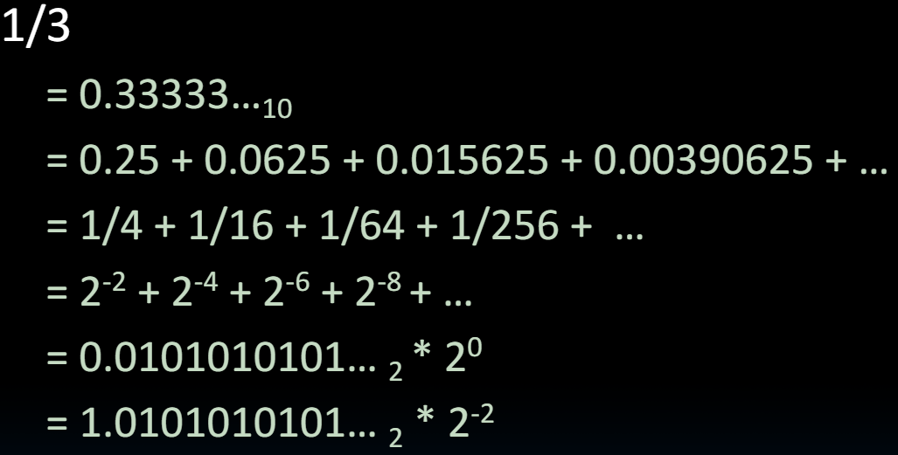

# 06.4-Examples, Discussion


lecture video address


## Example 1: bits → Decimal

What is the decimal equivalent of:

$\begin{align}&(-1)^S\times(1+Significand)\times 2^{Exponent - 127}\\ &= (-1)^1 \times (1 + .111)_2 \times 2^{129 - 127} \\ &= -1 \times (1.111)_2 \times 2^2 \\ &= -111.1_2 \\ &= -7.5_{10}
\end{align}$

1. 首先先不要急着转成十进制，最后再转
2. Exponent是biased notation，除了使用Exponent -127这个方法，还可以观察在0111 1111基础上的变化，这里是+2，所以得到的指数是+2
3. Significand中的MSB是0.1~2~，第二位是0.01~2~，所以可以直接与1相加，(1 + 0.111)~2~
4. 在(1.111)~2~× 2^2^的时候，Exponent是小数点移动的位数，所以这里右移2位，得到111.1~2~
5. 最终的结果是2 ^0^ + 2^1^ + 2^2^ + 2^-1^ = 7.5

## Example2: 1/3

| Sign | Exponent                  | Significand |
| ---- | ------------------------- | ----------- |
| 0    | -2 + 127 = 125 = 01111101 | 0101010101… |

## Example: 1/2

### Method1: Fractions

先来看十进制的方法

In decimal: 0.3401~10~ → 340~10~/1000~10~ → 34~10~/100~10~

同理

In binary: 0.110~2~ → 110~2~/1000~2~ = 6~10~/8~10~ → 11~2~/100~2~ = 3~10~/4~10~

Advantage: less purely numerical, more thought oriented; this method usually helps people understand the meaning of the significand better

### Method2: Place Values

Convert from scientific notation

- n decimal: 1.6732 = (1x10^0^) + (6x10^-1^) + (7x10^-2^) + (3x10^-3^) + (2x10^-4^)
- In binary: 1.1001 = (1x2^0^) + (1x2^-1^) + (0x2^-2^) + (0x2^-3^) + (1x2^-4^)

Interpretation of value in each position extends beyond the decimal/binary point

Advantage: good for quickly calculating significand value; use this method for translating FP numbers

