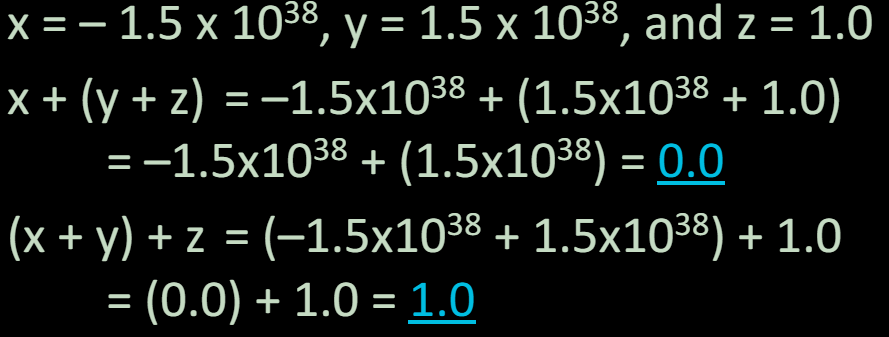
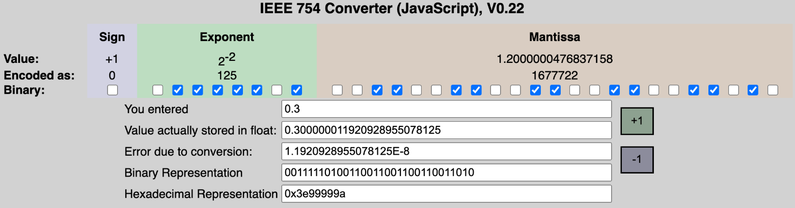

# 06.5-Floating Point Discussion


lecture video address


本节我们讨论有关浮点数的一些问题

## Floating Point Fallacy

浮点数谬论

FP add associative?（加法结合律）



> (1.5 × 10^38^ + 1.0) = (1.5 × 10^38^)，之前说过，当浮点数超过一定范围的时候，有些整数就无法表示了，step可能是powers of 2

Therefore, Floating Point add is not associative!（不具备加法结合律）

- Why? FP result approximates real result
- This example: 1.5 x 10^38^ is so much larger than 1.0 that 1.5 x 10^38^ + 1.0 in floating point representation is still 1.5 x 10^38^

## Precision and Accuracy

> 不要混淆了两个概念

**Precision** is a count of the number bits in used to represent a value.

**Accuracy** is the difference between the actual value of a # and its computer representation.

> Precision是bits的数量，Accuracy是bits表示的数值与真实表示的数值的差距
>
> 比如相对于float，double的位数更多，所以precision是更高的

==**High precision permits high accuracy but doesn’t guarantee it.**== 

It is possible to have high precision but low accuracy. （比如下面的pi）

Example: float pi = 3.14;

pi will be represented using all 24 bits of the significant (highly precise), but is only an approximation (not accurate). 

## Rounding

When we perform math on real numbers, we have to worry about rounding to fit the result in the significant field.

The FP hardware carries two extra bits of precision, and then round to get the proper value

Rounding also occurs when converting: 

- double to a single precision value
- floating point number to an integer

### IEEE FP Rounding Modes

> Examples in decimal (but, of course, IEEE754 in binary)

**Round towards** + ∞: ALWAYS round “up”: 2.001 → 3, -2.001 → -2

**Round towards** - ∞: ALWAYS round “down”: 1.999 → 1, -1.999 → -2

**Truncate(截断)**: Just drop the last bits (round towards 0，趋零取整)

**Unbiased** (default mode). Midway? Round to even（也叫作舍入到最近）

> - 这是默认的舍入模式，也是最常用的。将数值舍入到最接近的整数，如果有两个同样近的整数，则舍入到偶数。
> - 例如，4.5舍入为4，5.5舍入为6。(4.5的舍入到最近的偶数4,5.5舍入到最近的偶数5)

- Normal rounding, almost: 2.4 → 2, 2.6 → 3, 2.5 → 2, 3.5 → 4
- Except if the value is right on the borderline, in which case we round to the nearest EVEN number
- Ensures fairness on calculation
- This way, half the time we round up on tie, the other half time we round down. Tends to balance out inaccuracies

## Now you know why you see these errors…


Saturday Morning Breakfast Comics

http://www.smbc-comics.com/comic/2013-06-05

> 这是一个很有趣的例子，证明是不是机器人，然后机器人输入的最后有个4

因为0.3这样的十进制小数是很难表示的，我们采用上上节提到的模拟器来转化



## FP Addition

> 本小节仅仅简单介绍一下浮点数的加法的规则

More difficult than with integers. Can’t just add significands

How do we do it?

- De-normalize to match exponents
- Add significands to get resulting one
- Keep the same exponent
- Normalize (possibly changing exponent)

Note: If signs differ, just perform a subtract instead.

## Casting floats to ints and vice versa

`(int) floating_point_expression`: Coerces (强制) and converts it to the nearest integer (C uses truncation)

e.g. `i = (int) (3.14159 * f);`

---

`(float) integer_expression`: converts integer to nearest floating point

`f = f + (float) i;`

### int → float → int

```c
if (i == (int)((float) i)) {
    printf("true");
}
```

Will not always print “true”

==**Most large values of integers don’t have exact floating point representations!**==

> 之前讨论过了，对于float，当integer > 2^24^，相当于1600多万的时候，此时的step是2，很多integer就没有浮点表示了

What about double?

### float → int → float

```c
if (f == (float)((int) f)) {
    printf("true");
}
```

Will not always print “true”

Small floating point numbers (<1) don’t have integer representations

For other numbers, rounding errors
