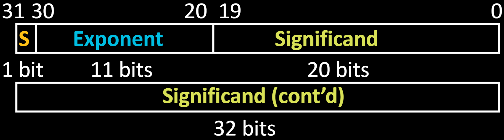
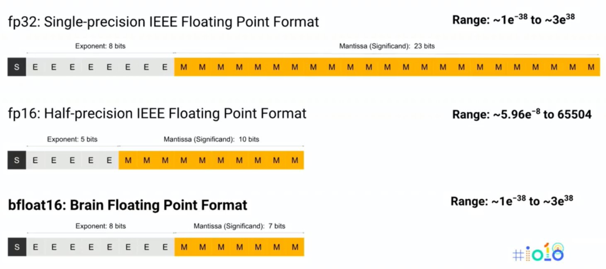
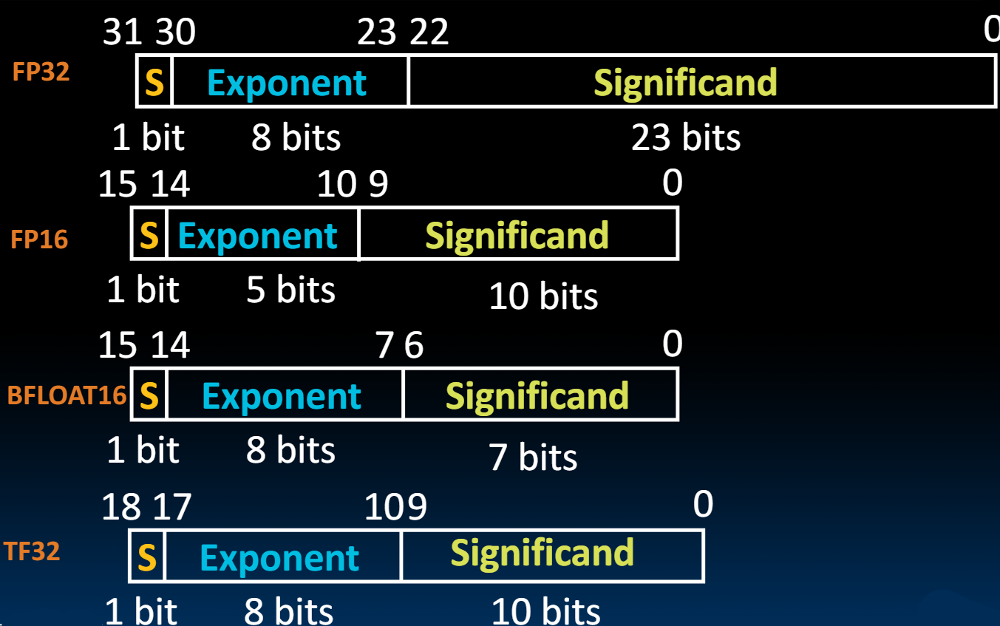
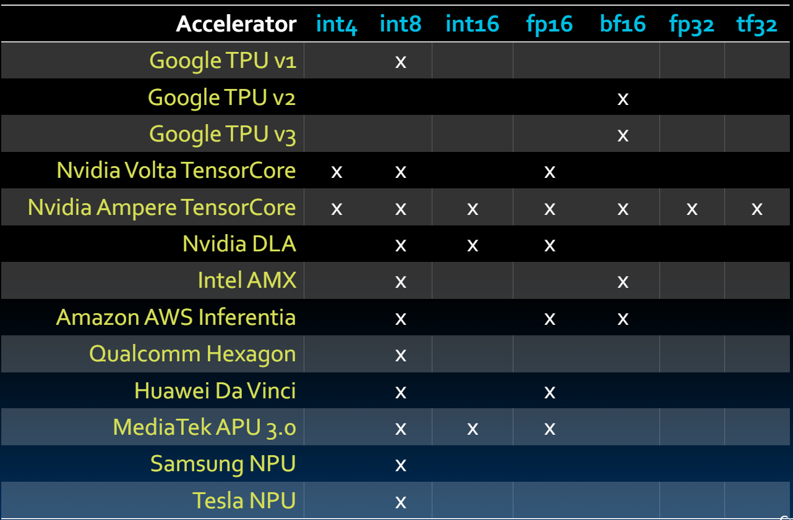
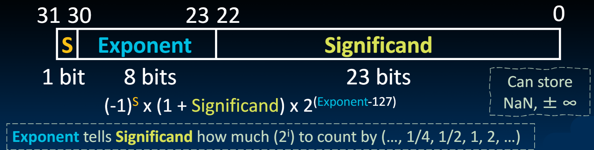

# 06.6-Other Floating Point Representations


lecture video address


## Double Precision Fl. Pt. Representation

双精度浮点数，也就是我们常用的double的规范

> 双精度是一种标准，这个同样适用于32位系统，只要传2次32位即可，16位同理

binary64: Next Multiple of Word Size (64 bits)



Double Precision (vs. Single Precision)

1. C variable declared as `double`(建议都使用double，除非数字确实很小)
2. Represent numbers almost as small as 2.0 x 10-^308^ to almost as large as 2.0 x 10^308^
3. But primary advantage is greater **accuracy** due to larger significand

> 可以看到Exponent的范围增加并不多，但是Significand的数量增加了很多

## Other Bigger/Smaller Floating Point Representations

> 这里介绍的是更大或者更小的的浮点数表示方法，但是原理和float是一样的

| Representation   | Precision            | Sign | Exponent   | Significand |
| ---------------- | -------------------- | ---- | ---------- | ----------- |
| binary128        | Quad-Precision(4倍精度) | 1    | 15         | 112         |
| binary256        | Oct-Precision(8倍精度)  | 1    | 19         | 236         |
| binary16 / fp 16 | Half-Precision(半精度)  | 1    | 5          | 10          |
| bfloat16         | Half-Precision       | 1    | 8(和fp32一样) | 7           |

> bfloat16保留了范围，但是精度



## Floating Point Soup



这里的TF32也是用于深度学习的，1/8/10bits，总共有19位

## Who Uses What in Domain Accelerators?



> 未来在租用这些显卡的时候，支持的浮点数也是参考的指标之一

## Unum

下面是一个很棒的思路

Everything so far has had a fixed set of bits for Exponent and Significant

* What if they were variable?
* Add a "u-bit" to tell whether number is exact or range
* "Promises to be to floating point what floating point is to fixed point"

Claims to save power!

***

> 【ChatGPT解释】
>
> Unum（Universal Number）表示浮点数的方法较为复杂，它结合了传统浮点数的特点并引入了一些新的元素来提高数值计算的准确性和效率。以下是对 Unum 表示浮点数的详细介绍：
>
> #### Unum 的基本结构
>
> Unum 的结构包含几个关键部分，每个部分都携带了特定的信息：
>
> 1. **Sign bit（符号位）**：表示数值的正负，通常是1位。
> 2. **Exponent（指数）**：表示数值的规模，指数部分的位数是可变的。
> 3. **Fraction（尾数）**：表示数值的精确度，尾数部分的位数也是可变的。
> 4. **Ubit（不确定性标志）**：表示数值是否准确，如果 Ubit 为 1，表示数值是一个区间而不是一个精确值。
> 5. **Exponent size（指数大小）**：表示指数部分的位数。
> 6. **Fraction size（尾数大小）**：表示尾数部分的位数。
>
> #### Unum 的表示方法
>
> Unum 使用灵活的位数和不确定性标志来表示浮点数。这种表示方法可以看作是传统浮点数表示的一种扩展和改进。
>
> **具体例子**
>
> 假设我们要表示一个浮点数 `x`，Unum 的表示方法如下：
>
> 1. **符号位（Sign bit）**：
>    * `s = 0` 表示正数
>    * `s = 1` 表示负数
> 2. **指数部分（Exponent）**：
>    * 指数部分使用变长编码，根据具体数值需求动态调整位数。例如，`e = 011` 可能表示指数部分为 3 位。
> 3. **尾数部分（Fraction）**：
>    * 尾数部分同样使用变长编码。例如，`f = 101011` 可能表示尾数部分为 6 位。
> 4. **不确定性标志（Ubit）**：
>    * `u = 0` 表示数值是精确的
>    * `u = 1` 表示数值是不精确的，表示一个区间
> 5. **指数大小（Exponent size）**：
>    * `es = 011` 表示指数部分的位数为 3 位
> 6. **尾数大小（Fraction size）**：
>    * `fs = 110` 表示尾数部分的位数为 6 位
>
> **完整的 Unum 表示**
>
> 将上述部分组合在一起，我们得到完整的 Unum 表示：
>
> ```
> | s | e | f | u | es | fs |
> ```
>
> 例如，表示一个正数 `3.14159`，假设 `e = 100`，`f = 1100101010000`，`u = 0`，`es = 011`，`fs = 110`：
>
> ```
> | 0 | 100 | 1100101010000 | 0 | 011 | 110 |
> ```
>
> #### Unum 的操作
>
> Unum 支持各种数值运算，包括加、减、乘、除等。由于 Unum 的表示方法是闭合的，即所有运算结果仍然是 Unum，因此这些运算可以在数值范围内安全地进行。
>
> **加法**
>
> * 对于两个 Unum `a` 和 `b`，首先需要对齐它们的指数部分，然后进行尾数部分的加法，最后调整指数和尾数的位数以保持数值的表示。
>
> **乘法**
>
> * 类似地，对于两个 Unum `a` 和 `b`，首先对齐指数部分，然后进行尾数部分的乘法，最后调整结果的指数和尾数。
>
> #### Unum 的优点
>
> * **高精度**：通过变长编码和不确定性标志，Unum 可以提供比传统浮点数更高的精度。
> * **减少误差**：Unum 的区间表示方法减少了舍入误差，并能更好地表示和传播误差。
> * **更好的数值稳定性**：通过减少溢出和下溢的可能性，提高了数值计算的稳定性。
>
> #### Unum 的缺点
>
> * **实现复杂**：由于需要管理变长编码和不确定性标志，Unum 的实现较为复杂。
> * **性能开销**：在某些情况下，Unum 的灵活性可能会带来额外的计算开销。
>
> 总的来说，Unum 提供了一种更灵活和精确的浮点数表示方法，特别适用于需要高精度和高稳定性的数值计算应用。

## Conclusion

Floating Point lets us:

* Represent numbers containing both integer and fractional parts; makes efficient use of available bits.
* Store approximate values for very large and very small #s.

IEEE 754 Floating Point Standard is most widely accepted attempt to standardize interpretation of such numbers

* Every computer since \~1997 follows these conventions)

Summary (single precision, or fp32)


