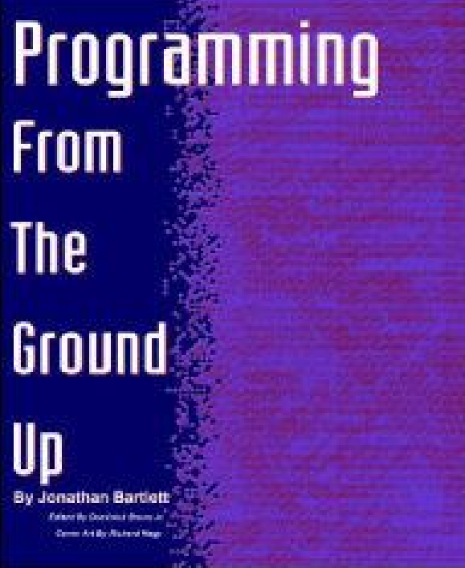

# 07.1-ISA & RISC-V Intro


lecture video address


## Great Idea #1: Abstraction (Levels of Representation/Interpretation)

在课程的早期，我们讨论了将不同抽象层次进行分层来表示复杂计算系统的思想。

* 在顶层，有高级语言。
* 在其下面是汇编语言。
* 在其下面是**汇编语言的机器可读版本**，即**机器码**。
* 再下面是架构的不同实现，可能以可以执行该代码的框图形式实现。
* 再下面是逻辑门，实际上取代了架构的框图中的方框内部的东西

逻辑门并不是计算堆栈的最底层。它们也是一种抽象。它们由晶体管构成。晶体管也是一种抽象。晶体管由不同种类的材料组成。还有导线，所有这些都用来传输电子和空穴。但是在本课程仅仅深入到逻辑门的抽象，再底层不予讨论。

C语言不是最高级的语言。还有更复杂的东西建立在它之上。有操作系统，有生产力语言(例如Python)，有软件框架(例如SpringBoot)，整个世界——或者至少是软件世界的视图——是建立在其之上的。

需要指出的是，这些抽象层之间总是有明确的接口。

* 通常，我们不写汇编语言代码。我们可以，但最常见的是由**编译器**生成。
* **汇编程序**生成机器可读代码。
* **指令集架构**定义了硬件将执行什么指令。
* 然后在这之下有不同的层次，不同的实现方式。

### Instructions & ISA

当我们讨论汇编语言的时候，我们会思考处理器执行的指令

Basic job of a CPU: **execute lots of instructions**.

当我们谈论现在以1千兆赫兹速度运行的处理器时，这意味着处理器中的一个周期持续一纳秒。这也是执行一条指令大概的时间，有时可能会多一些或者少一些。所以每个处理器每秒将执行**10亿条**指令。这是一个很大的数量。

Instructions are the <mark style="background-color:green;">**primitive operations**</mark> that the CPU may execute(这也是后续用来处理多线程同步问题的原理)

这些指令可能由很多部分组成

Like a sentence: operations (verbs) applied to operands (objects) processed in sequence …

<mark style="background-color:green;">**Different CPUs implement different sets of instructions**</mark>

The set of instructions a particular CPU implements is an Instruction Set Architecture (ISA)

> 特定CPU实现的一组指令称为指令集架构（ISA）。

* Examples: ARM (cell phones), Intel x86 (i9, i7, i5, i3), IBM Power, IBM/Motorola PowerPC (old Macs), MIPS, RISC-V, ...

### Book recommendation

《Programming From the Ground Up》

> “A new book was just released which is based on a new concept - teaching computer science through assembly language (Linux x86 assembly language, to be exact). This book teaches how the machine itself operates, rather than just the language. <mark style="background-color:green;">**I've found that the key difference between mediocre(平庸的) and excellent programmers is whether or not they know assembly language. Those that do tend to understand computers themselves at a much deeper level**</mark>**.** Although \[almost!] unheard of today, this concept isn't really all that new -- there used to not be much choice in years past. Apple computers came with only BASIC and assembly language, and there were books available on assembly language for kids. This is why the old-timers are often viewed as 'wizards': they had to know assembly language programming.” —— slashdot.org comment, 2004-02-05

那句话，也是为什么我们要学习汇编语言，程序员也由此知道软件是如何被执行的，只有如此才能成为一个优秀的程序员

### CISC & RISC

Early trend was to add more and more complex instructions to new CPUs to do elaborate operations

* E.g. VAX architecture had an instruction to multiply polynomials(多项式)!

> 在这种思想下构建了所谓的complete instruction set architect computers，这种架构简称CISC

<mark style="background-color:green;">RISC philosophy  – Reduced Instruction Set Computing</mark>

(Cocke IBM, Patterson, Hennessy, 1980s)

> 在这个时间段开始尝试构建简单的，基本的instruction sets

1. Keep the instruction set small and simple, makes it easier to build **fast** hardware.

> 让每条指令在每个cycle做的少一些，但是可以让硬件更加快速，因此可以在给定的时间内执行更多的指令。
>
> 在上面的abstraction中有说过，第三层是机器可读的汇编语言，ISC也包含这一点，如果一条指令太复杂，那么虽然一条指令执行的任务多，但是机器的速度可能会下降

2. Let software do complicated operations by composing simpler ones

> 就是让硬件变得更快，软件负责将硬件的多个简单的指令组合起来以执行复杂的任务，这也是RISC的思想

This went against the convention wisdom of the time. (he who laughs last, laughs best)

> Patterson, Hennessy也在两年后赢得了图灵奖

尽管现在仍然有CISC，比如x86，但是如果仔细看处理器是怎么构建的，仍然能够看到其**本质**就是RISC引擎，然后复杂的指令是被添加到这个简单的机器里面

## RISC-V Architecture

上面我们说过，ISA有很多种，比如ARM，Intel x86等等。

### common RISC

x86的话比较复杂，但是好处是，x86几乎可以运行任何软件，因为x86的系统是非常丰富的

older instruction sets或者说made-up instructions sets是比较容易理解的，但是并不是所有的软件都能在上面运行，很难让一个基本的编译器运行

### Why RISC-V

> 但是我们在本课程中介绍的是RISC-V，这是ISC的一种。

1. New open-source, license-free ISA spec（也就是说免费的，任何人都能用）
2. Supported by growing shared software ecosystem

> 本来RISC-V是用于教学的，但是过去几年迅速发展成为了一个很大的生态，这就是由RISC-V的简单的指令集不断扩展而来的。并且有很多的软件都能在上面运行

3. Appropriate for all levels of computing system, from microcontrollers to supercomputers
4. 32-bit, 64-bit, and 128-bit variants (we’re using 32-bit in class, textbook uses 64-bit)

> bit的不同对于汇编语言的操作是有影响的，因为汇编语言会直接应用于CPU，管理着位数

Why RISC-V instead of Intel 80x86?

* RISC-V is simple, elegant. Don’t want to get bogged down in gritty details.
* RISC-V has exponential adoption

### RISC-V Origins

Started in Summer 2010 to **support open research and teaching at UC Berkeley**

> 就是为了教学而产生的

* Lineage can be traced to RISC-I/II projects (1980s)

As the project matured, it migrated to RISC-V foundation (www.riscv.org )

Many commercial and research projects based on RISC-V, open-source and proprietary

* Widely used in education

> 也有人说未来一些年可能大量的核心是使用RISC-V构建的

Read more:

* https://riscv.org/risc-v-history/
* https://riscv.org/risc-v-genealogy/
