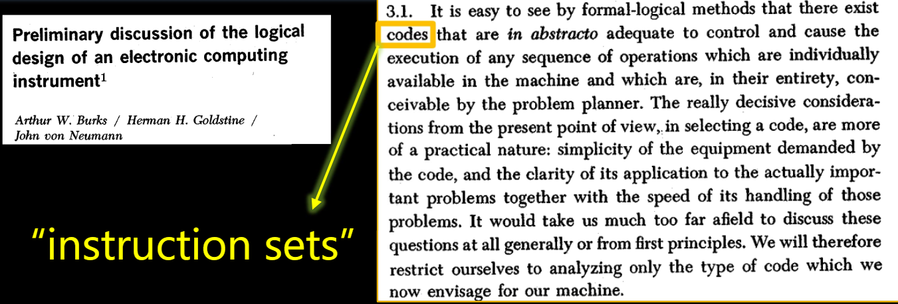
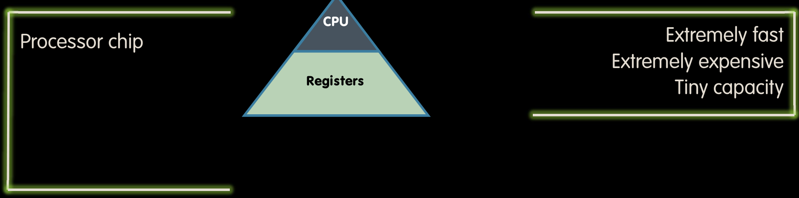

# 07.2-Register, Assembly Language


lecture video address



## Instruction Set



Instruction set for a particular architecture (e.g. RISC-V) is represented by the Assembly language

> 指令是CPU执行的内容，ISA是为特殊CPU设计的指令集，汇编语言用来表示这些指令。
>
> ISA是一种比较早的概念，要追溯到第一个电子计算机（在上面的论文中可以看到）

Each line of assembly code represents one instruction for the compute

## Register

### The variables of Assembles

Unlike HLL like C or Java, <mark style="background-color:green;">assembly cannot use variables</mark>

* Why not? Keep Hardware Simple

> C或者Java是可以定义新的变量的，但是汇编语言不行，只能使用已有的寄存器。

<mark style="background-color:green;">Assembly operands are registers</mark>

> 汇编语言的操作数就是寄存器

* Limited number of special locations built directly into the hardware
* Operations can only be performed on these!

<mark style="background-color:green;">**Benefit**</mark>: Since registers are directly in hardware, they’re very fast (faster than 0.25ns)

> 寄存器的速度是非常快的，如果处理器以 4 GHz 的速度运行，则表示每四分之一纳秒，它可以访问其寄存器 - 每个周期一次。4 GHz 处理器中的一个周期是四分之一纳秒。
>
> Recall light is $$3 \times 10^8$$ m/s = 0.3m/ns = 30cm/ns = 10cm/0.3ns!!!… where 0.3ns is the clock period of a 3.33GHz computer

### Aside: Registers are Inside the Processor


通常情况下，处理器连接到内存。在这种情况下，内存也连接到输入和输出设备。在这个模型中，看起来输入和输出设备连接到内存。在现实生活中，处理器负责从输入/输出设备加载到内存和将数据从内存发送到输出。

在处理器内部，通常有一个控制单元(Control Logic)和一个数据路径(Datapath)。在数据路径中，主要的元素是那些寄存器和执行单元（通常称为算术逻辑单元）

处理器通过发出**地址**(Address)并从内存读取数据(Read)或向内存写入数据(Write)与内存通信。(这些信号都在上图中表示了)这里还有另一个重要的概念。我们不希望意外地写入内存。读取内存不会对内存造成任何损害。读取内存时不会改变其中的值。但当我们要写入内存时，需要明确表示我们确实要写入内存。我们通过这个使能信号(Enable?)来实现这一点。

就是这样。我们将会以这个计算系统的概念视图进行工作——处理器、内存和输入/输出设备。我们会在这门课中添加一些元素，但这是一个不错的起点。

### Great Idea #3: Principle of Locality / Memory Hierarchy

为什么寄存器这么重要的另一个观点



系统的抽象和原则在于**局部性**和**存储层次结构**。这些存储系统的目标是让内存看起来像是无限快和无限大。嗯，并不是无限快，而是极快，就像寄存器一样。

但由于我们只有少量的寄存器，我们希望让大部分内存看起来像寄存器一样快。

寄存器有多快呢？在吉姆·格雷的类比中，它们是我们可以保存在脑海中的数据。这个数量是有限的，但是可以在很快把它们检索出来。

总之，由于寄存器的速度是非常快的，所以将其放在CPU当中执行计算。

## the number and bits of registers

<mark style="background-color:red;">Drawback</mark>: Since registers are in hardware, there is a predetermined(预定的) number of them

> 寄存器的数量是有限的，这也是ISA的特点之一，比如x86，其寄存器的数量是非常少的，只有8个通用寄存器以及其他特定的寄存器

* Solution: RISC-V code must be very carefully put together to efficiently use registers

> 在进行RISC-V编程的时候，要非常小心并且高效的使用寄存器

### Registers in RISC-V

32 registers in RISC-V（RISC-V有32个寄存器）

* Why 32?
* <mark style="background-color:green;">**Smaller is faster, but too small is bad**</mark>

> Goldilocks principle ("This porridge is too hot; This porridge is too cold; this porridge is just right")，也就是说32个寄存器是刚刚好

Each RISC-V register is 32 bits wide (in RV32 variant)

* Groups of 32 bits called a `word` in RV32

> 一个word一般是一个系统中某种通用的位数，这里在32RV中，一个word是32bits，4bytes

* P\&H textbook uses the 64-bit variant RV64（此时一个word是64 bits）

寄存器的编号如下

Registers are numbered from 0 to 31

* Referred to by number x0 – x31

x0 is special, always holds value zero

* So only 31 registers able to hold variable values

Each register can be referred to by <mark style="background-color:green;">number or name</mark>

* Will add names later

## C, Java variables vs. registers

In C (and most high-level languages) variables declared first and given a type. E.g

```c
int fahr, celsius;
char a, b, c, d, e;
```

Each variable can ONLY represent a value of the type it was declared as (cannot mix and match int and char variables).

In assembly language, the registers have no type

* Operation determines how register contents are treated

## Comments in Assembly

Make your code more readable: comments!

Hash (#) is used for RISC-V comments

* anything from hash mark to end of line is a comment and will be ignored
* This is just like the C99 //

## Assembly Instructions

In assembly language, each statement (called an Instruction), executes exactly one of a short list of simple commands

Unlike in C (and most other high-level languages), each line of assembly code contains at most 1 instruction

Instructions are related to operations (=, +, -, \*, /) in C or Java
