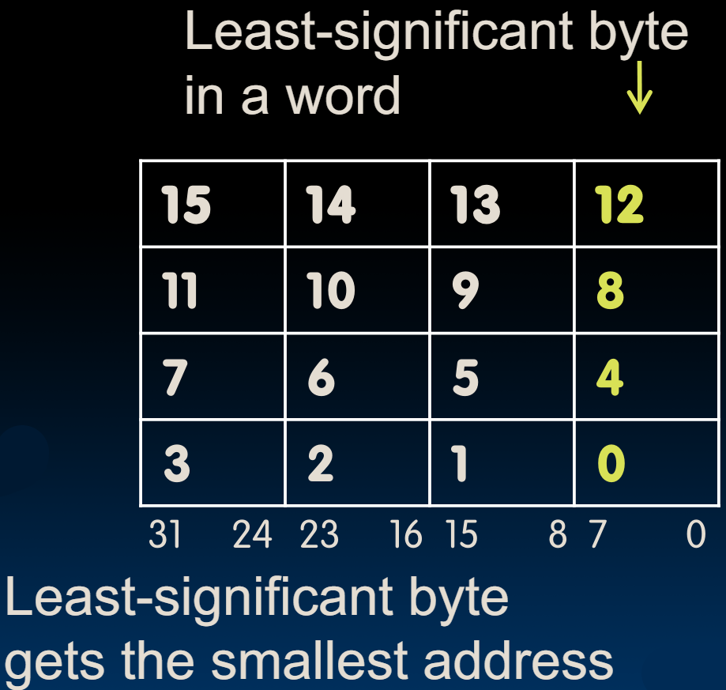

# 08.1-Intro of Memory


Lecture Video Address


回顾之前已经学过的内容

> 下面我们用一种Verilog的语言来描述之前学过的汇编语言，这种语言的语法和C语言非常相像，但是作用截然不同，这种语言是描述硬件的
>
> 虽然我们不学，但是使用这种与C非常像的语言与汇编语言类比，我们可以推断每个指令在做什么

Addition/subtraction

```assembly
add rd, rs1, rs2 # R[rd] = R[rs1] + R[rs2] 
sub rd, rs1, rs2 # R[rd] = R[rs1] - R[rs2] 
```

> `R[rd] = R[rs1] + R[rs2]` 就是Verilog的语法

Add immediate

```assembly
addi rd, rs1, imm # R[rd] = R[rs1] + imm
```

在RISC-V中有32个寄存器，其中只有x1\~x31可以赋值，在更复杂的程序中，一些寄存器可能还有指定的使用。所以我们一般可以使用的寄存器都会比30个少。

寄存器是很珍贵的，所以使用的时候需要谨慎。我们希望我们的程序相对紧凑，并且我们希望重用寄存器来存储临时变量。例如上一节的中的一个例子

```
add x10, x1, x2 # a_temp = b + c
add x10, x10, x3 # a_temp = a_temp + d
sub x10, x10, x4 # a = a_temp - e
```

这里少用一个寄存器来存储临时值。

一般来说，<mark style="background-color:green;">优化编译器的工作之一是最小化寄存器的使用</mark>。当我们完成优化时，我们会发现<mark style="background-color:green;">对于一个特定的计算例程或计算内核，我们需要使用一定数量的寄存器。这个寄存器的数量被称为</mark><mark style="background-color:green;">**特定内核的寄存器占用量**</mark>

但是如果要处理大量数据，不得不将数据从寄存器溢出到内存。因此，理解内存如何与处理器协同工作是很重要的。

> 可以理解为，内存的存在就是为了解决寄存器数量不足的问题。如果寄存器的数量是足够多的，那么可能就不需要内存了。内存就是为了扩充存储结构的容量的

本节讲述的内容就是内存与处理器协同工作

## Data Transfer: Load from and Store to memory

从这个图中学习怎么从内存中加载和怎么存储数据到内存中


在左侧，我们有一个连接到内存的处理器，并且右侧有输入和输出。

**【处理器】**

处理器有其内部的数据路径(datapath)，包括寄存器和算术逻辑单元（ALU）。

**【内存】**

内存存储我们的**程序**和我们**处理的数据**。内存可以看作是一个大的单维数组，地址充当该数组的索引，从0开始。

**【地址】**

要访问**内存中的一个字**，处理器必须提供一个**地址**，而地址是图中的Address。地址是由**处理器计算**的，并用于指向内存中的特定字。<mark style="background-color:green;">地址通常被指定为相对于基指针的偏移量</mark>。因此，每个在内存中布置的数据数组将有其基指针，当我们想要访问该数组中的特定元素时，我们必须计算相对于该基指针的偏移量。

**【操作】**

我们在指向内存中的特定word时，有两种操作可以进行。我们可以读取或者写入。记住这两种操作的**方向**非常重要。我们总是**从内存加载**和**存储到内存**。<mark style="background-color:green;">**这个世界是以处理器为中心的**</mark>。所有的主要操作都发生在处理器内部，而内存只是在那里。

> 所以加载就是从内存加载，存储就是存储到内存。

所以当我们写入数据时，我们是在存储到内存中。同样，当我们读取数据时，我们是从内存中读取到处理器中。

从内存中加载具有从内存到处理器的方向。存储到具有从处理器到内存的箭头。（就是图中的Read和Write的两个箭头）

## byte addressable memory

下面是关于memory中数据的布局。

Memory是以字为单位来组织的，以32位内存为例，一行就是一个字。而这个也与寄存器的位数是匹配的。所以<mark style="background-color:green;">**存储在寄存器中的数据很好地适应每个内存字**</mark>。

<figure><figcaption><p>memory layout</p></figcaption></figure>

Data typically smaller than 32 bits, but rarely smaller than 8 bits (e.g., 字符和图像中的颜色值，是8位)–works fine if everything is a multiple of 8 bits

> 8 bit chunk is called a byte (1 word = 4 bytes)

Memory addresses are really in bytes, not words（<mark style="background-color:green;">内存中的地址是根据bytes来编址的，因为大部分的数据都是不超过32位，但是很少有数据少于8位，所以所有事情都是8的倍数的话会很好</mark>）

Word addresses are 4 bytes apart

> 因此可以将一个word一分为四

所以我们必须有一种有效的方式<mark style="background-color:green;">**将4个字节组合成一个字**</mark>，这样我们就不会用太多不必要的0来占用空间。

### Little Endian

每个32位的字可以容纳4个字节，每个字节8位。所以当我们将字节存储在内存中的字中时，它们是怎么存储的呢？看下图



在RISC-V架构中，它们遵循一个名为小端（little-endian）的特定约定。这是什么意思呢？这意味着一个字的LSB会获得最小的地址。

> 也就是说，如上图，一个word的MSB是大地址，LSB是小地址。最后一个byte存储一个字的7\~0位
>
> 大端和小端仅仅规定了byte在word内的顺序，但是不规定bit在byte里面的顺序

> Word address is same as address of rightmost byte – least-significant byte (i.e. Little-endian convention)

它也可以以另一种方式完成（比如说大端）。它会被称为不同的名称，但是在RISC-V中，它遵循小端约定。因此，LSB实际上获得了最低的字节地址，然后是下一个，依此类推，向左移动。然后下一个地址到来，我们继续在内存数组中蛇行移动。

字有它们的地址。它们基本上是从字节继承的。所以字的地址从下往上依次是0,4,8,C,0因此，字地址与最LSB（最不重要字节）的地址相同。

## Big Endian vs. Little Endian

这节我们讨论Endianness这个策略

> 【Endian名称的由来】The adjective endian has its origin in the writings of 18th century writer Jonathan Swift. In the 1726 novel Gulliver's Travels, he portrays the conflict between sects of Lilliputians divided into those breaking the shell of a boiled egg from the big end or from the little end. He called them the "Big-Endians" and the "Little-Endians".

Endianness仅仅管理The order in which BYTES are stored in memory

> 但是一个bytes内部怎么排列的与endianness无关，也就是说，不论是big endian还是little Endian，byte内部的方式是不会变的，那就是LSB是最小的地址

Bits always stored as usual (E.g., 0xC2=0b 1100 0010，这样1100是在比较大的bits，00101是比较小的bits)

> 总之，我们讨论endianness的时候，仅仅讨论怎么bytes在word里面的排列顺序

***

Consider the number 1025 as we typically write it:（1025有32位）


绝大多数是按照little Endian的习惯设计的，但是有一些比较特的地方是按照Big-Endian设计的，比如IBM等等

endianness不仅仅关于计算机，世界上也有很多问题与endianness有关，比如中文名和英文名，中西方的时间表述
