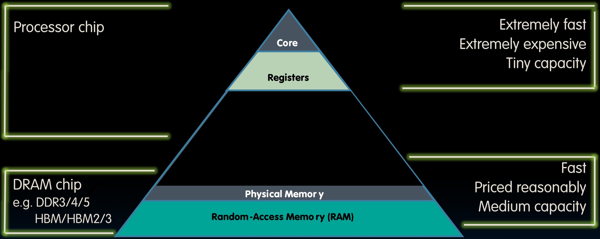
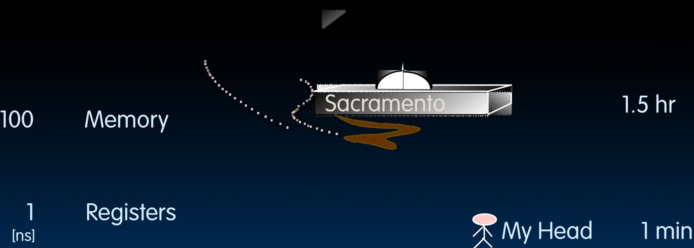
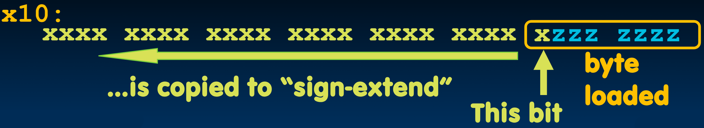
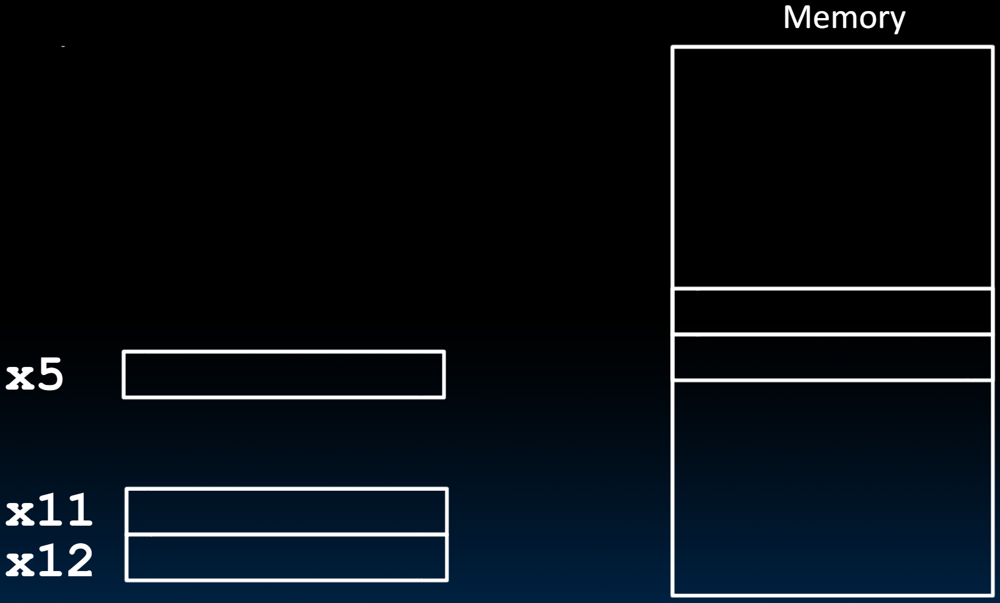

# 08.2-Data Transfer Instructions


Lecture Video Address


上一节讲述了内存与处理器的数据传递，以及在RISC-V中使用little-endian来排列一个字中的byte

> 内存仅仅负责存储01序列，但是byte怎么排列是Assembly的事情，Assembly让顺序在处理器和内存中统一

## Great Idea #3: Principle of Locality / Memory Hierarchy



这是介绍内存层次原理时的图片吗？

处理器核心位于顶部，带有它的寄存器。寄存器非常快速。它们与处理器核心共享宝贵的==**实际状态**==，因此非常昂贵。因此我们只有很少的寄存器。确切地说，总共有32个。

> 昂贵也是寄存器少的原因之一

现在，通常在一个单独的芯片上，有主存储器。它采用了一种不同的技术。它被称为动态随机访问存储器（DRAM），有不同的类型。比如说双倍数据速率（DDR）。它有不同的版本，三代、四代、五代，或者可能是高带宽存储器（HBM），它也有不同的版本。有HBM、HBM2，然后现在，我们正进入HBM3时代。

DRAM 也很快，但==**远不及寄存器快**==。它的价格合理。你可以用几十美元买到大量的吉字节，与我们在磁盘和**固态硬盘**中拥有的大容量存储相比，它的==容量中等==。

> - 价格：寄存器 > 内存 > 固态硬盘
> - 速度：寄存器 > 内存 > 固态硬盘
> - 容量：寄存器 < 内存 < 固态硬盘

## Speed of Registers vs. Memory

但是这里的问题是，金字塔中的这个差距有多大？寄存器真的比内存快多少？

Given that 

- Registers: 32 words (128 Bytes)
- Memory (DRAM): Billions of bytes (2 GB to 64 GB on laptop)

> 假设有32个寄存器，每个32位，总共1024位，也就是说总共有128字节。另一方面，在DRAM中，我们可能在低端笔记本电脑中有大约2GB的内存，在高端笔记本电脑中最多有64GB的内存，而服务器可能有1TB的内存。

and physics dictates…

- Smaller is faster

> 物理学决定了越小的越快<例如，在篮球比赛中，控球后卫通常比中锋要快得多。

寄存器和DRAM到底有多快？

How much faster are registers than DRAM??

- About 50-500 times faster! (in terms of latency of one access - tens of ns)
    - But subsequent words come every few ns

> 所以当你把这些写在纸上时，我们会发现，寄存器大约比DRAM快50到500倍。这是在访问延迟方面，==**第一个访问DRAM或获取一个单独数据项时，访问大约需要几十纳秒，而访问寄存器则只需要不到一纳秒**==。请记住，这是对于一个独立的访问而言。对附近内存位置的许多后续访问会更快。

### Analogy

我们下面用一个类比来说明

---

为了让这个更具象化，可以考虑Jim Gray的存储延迟类比图。



图的左侧是我们的寄存器，访问它们大约需要一纳秒。内存则需要大约两个数量级更多的时间，大约100纳秒。

我们来试着将这个类比到我们人类的任务。例如，如果我们想从头脑中检索数据，假设从寄存器中检索数据在我们头脑中大约需要一分钟。那么，什么东西需要长100倍的时间呢？这些数据会在哪里呢？

当我们都在伯克利生活时，可以将这个类比为驱车去一个小镇。例如，我们把某张纸忘在某个地方，现在需要去取回来。假设这个小镇是萨克拉门托，大约100分钟或一个半小时的车程。这样时间成本就很高了，一个半小时内可以做很多事情。或者如果时间间隔是500倍，那么在某些情况下可能就是这样。500分钟内我们可以往返洛杉矶。把包含我们数据的那张纸留在洛杉矶然后去取回来是不方便的。同样，去萨克拉门托取也不方便。

> 简单来说，从寄存器取数据就相当于在头脑中检索数据，比一眨眼还快。但是从内存中取数据相当于开车一个半小时到远处取一张纸。这样的时间成本是非常大的。

这就是为了说明从内存中获取数据是多么昂贵。

## Syntax

下面我们用几个简单的例子来说明一下怎么用指令实现从内存加载和存储到内存

### Load from Memory to Register

我们尝试将下面的C代码翻译成RISC-V的代码

C code

```c
int A[100];
g = h + A[3];
```

这里是创建了int[100]，然后将A[3]与h相加并保存在g中

我们需要如何得到A[100]中的A[3]

Using **Load Word** (`lw`) in RISC-V:

> RISC-V中的load word(lw)到内存中加载数据到寄存器中

```Assembly
lw x10,12(x15) # Reg x10 gets A[3]
add x11,x12,x10 # g = h + A[3]
```

> Reg是Register寄存器的意思

【Note】

- x10 - 目标寄存器
- x15 – base register (pointer to A[0])
- 12 – offset **in bytes**
- Offset must be a constant known at assembly time

> 下面再来说明一下`12(x15)`的意思，
>
> - x15是array的base Register，指向A[0]；然后还要说明A[3]对应的偏移量，即12；
> - 12：integer在内存中以32位存储，而内存是以byte编址的，也就是一个integer实际上占了4个地址。我们要获取A[3]就要偏移4个integer，也就是偏移12个地址
> - 偏移量的单位是byte，计算偏移量的时候要考虑数组的类型
> - 偏移量一定是一个常数

数据流动的方向如下


```Assembly
lw x10,12(x15)
```

是从`12(x15)`流向了`x10`

> 所以实现g = h + A[3]，是先将A[3]从内存加载到寄存器，然后在寄存器中相加得到结果

### <u>Store</u> from Register <u>to</u> Memory

C code

```c
int A[100];
A[10] = h + A[3]
```

Using Store Word (sw) in RISC-V:

```Assembly
lw x10,12(x15) # Temp reg x10 gets A[3]
add x10,x12,x10 # Temp reg x10 gets h + A[3]
sw x10,40(x15) # A[10] = h + A[3]
```

这里好的一点是复用了x10

---

再分析store word指令

```Assembly
sw x10,40(x15) # A[10] = h + A[3]
```

【Note】

- x15 – base register (pointer)
- 12,40 – offsets in bytes
- x15+12 and x15+40 ==**must be multiples of 4**==

> 因为寄存器一次是从内存中加载一个字，在32位中一个world有4个byte地址，地址必须是字对齐的，所以必须是4的倍数。
>
> 当然RISC-V是允许不是字对齐的地址，即允许从一个字的中间开始，然拐向下一个字开始，但是这仅仅是为了支持古早的代码，并不建议使用。这样做会降低效率，并且让代码更复杂。

数据流的防线是从左往右


也就是从`x10`到`40(x15)`

> 这里感觉不叫奇怪，如果反过来是比较合适的吧

### Loading and Storing Bytes

> lw和sw都是针对word的，现在讲述怎么对byte进行读和写

有的时候一个数据可能仅仅只有一个byte，这时候如果要内存用一个word来存储一个byte也太浪费了，因此可以使用一个byte存储

> 由此也可以知道了，为什么一个结构体里面可以存储两个char最终sizeof得到的还是2，因为是可以对byte进行操作的。（两个char最大的对齐要求就是1，所以不会填充2）

In addition to word data transfers (lw, sw), RISC-V has byte data transfers:

- load byte: lb
- store byte: sb

Same format as `lw`, `sw`

下面是一个例子

```Assembly
lb x10,3(x11)
```

contents of memory location with address = sum of "3" + contents of register `x11` is copied to the low byte position of register `x10`.

> 此时的偏移量就不必为4的倍数了，因为现在的操作是byte而不是word

但现在有一个问题，就是一个寄存器是32位的，现在仅仅读取了8位，那么剩下的 24位呢？



在习惯上，我们约定：

1. 拷贝byte的时候，会将byte拷贝在寄存器的low byte position（如上图，比较靠右的位置）
2. 在大部分情况下，我们操作的是有符号数，存储形式是2's complement，然后使用sign-extend进行扩展（有符号数是扩展第一位，如上图，使用sign-extend进行扩展填充整个寄存器）

---

但是有的时候我们并不希望sign-extend，因为拷贝的数可能不是有符号数，比如字符，或者无符号数

RISC-V also has "unsigned byte" loads(lbu) which zero extends to fill register. 

有一个问题：Why no unsigned store byte '`sbu`'?

因为在写入的时候前面的几位都是会截断的，填充的内容与写入的内容无关

## Example: What is in x12 ?

```assembly
addi x11,x0,0x3F5
sw x11,0(x5)
lb x12,1(x5)
```



> 我的分析：【然而这个分析出错了】
>
> 1. `addi x11,x0,0x3F5`后，x11内部是0x03F5
> 2. `sw x11,0(x5)`后，`0(x5)`对应的内存里面也是0x03F5
> 3. `lb x12,1(x5)`后，加载第一个byte为F，并进行sign-extend，结果是`0xFFFF`

出错的原因在于在base 16中，一个nibble表示4位而不是8位。

重新分析：

1. `addi x11,x0,0x3F5`后，x11内部是0x00 00 03 F5（一个byte对应2个nibble）
2. `sw x11,0(x5)`后，0(x5)对应的**内存**里面的值是0x00 00 03 F5
3. `lb x12,1(x5)`后，加载第一个byte，也就是03，到x12中，然后lb是sign-extend的，所以结果是0x00 00 00 03

## Substituting addi

> 替代的addi

The following two instructions:

```assembly
lw x10,12(x15) # Temp reg x10 gets A[3]
add x12,x12,x10 # reg x12 = reg x12 + A[3]
```

Replace addi

```assembly
addi x12, value # value in A[3]
```

But involve a load from memory!

> 也就是说，我们不需要addi，而是将常数value保存在内存当中，然后使用lw和add就可以代替addi了。这样符合RISC的理念。

但是，Add immediate is so common that it deserves its own instruction!并且lw和add两套指令是非常慢的，addi根本不需要从内存中加载一个常数

> 但是还有一个问题，就是immediate必须少于32位，即addi中的value的大小是限制的。如果要长于这个范围，就需要从内存中加载。
