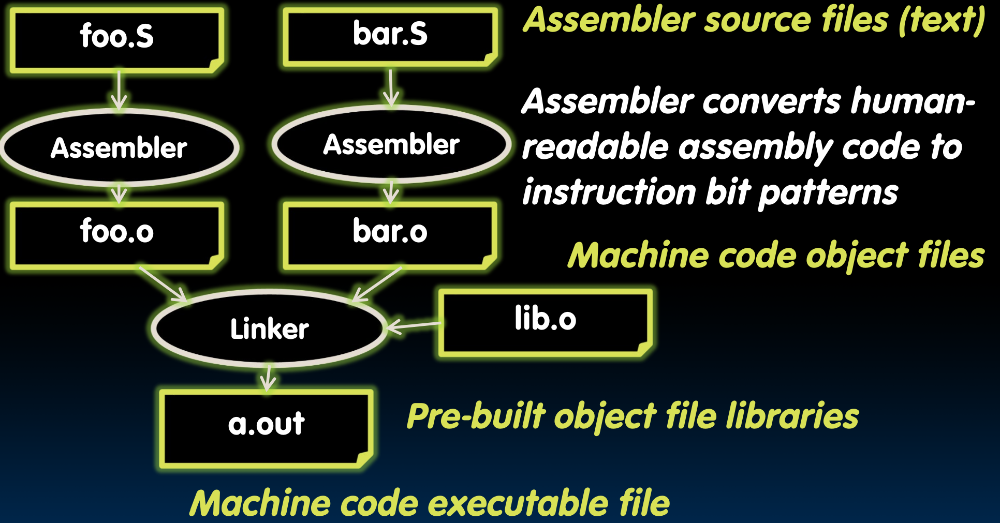
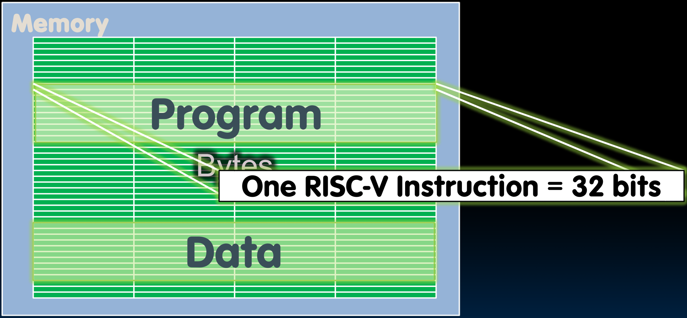
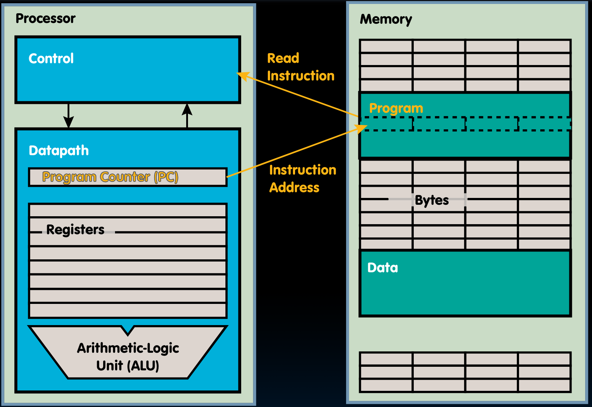

# 09.2-Assembler, Storage and Executions of Program, Pseudo-Instructions


Lecture Video Address


***

本节我们还会讨论RISC-V汇编语言，但我们要稍微绕一下，看看那个汇编程序一旦写好后会发生什么。


## Assembler to Machine Code

这里只是简要介绍一下，课程的后面会讲述更多内容



1. 假设我们有两段汇编代码，foo.S 和 bar.S，它们是我们的汇编源文件，都是用纯文本写的。
2. 我们将它们通过<mark style="background-color:green;">**汇编器(Assembler)**</mark>，生成机器代码目标文件，foo.o 和 bar.o。后缀 `.o` 代表目标文件(object files)。
3. 我们可能会有预先编译好的目标文件库，比如 lib.o，它可能包含一些常用的函数，比如division。
4. <mark style="background-color:green;">**链接器(Linker)**</mark>会将我们的目标文件和库文件链接在一起。链接它们的过程会将地址放在适当的位置，并将所有东西组合在一起，使其看起来像一个完整的程序。
5. 输出是一个名为 a.out 的机器代码可执行文件。

那么这个机器代码可执行文件(也就是图中的a.out)存放在哪里呢？

## How Program is Stored



可执行文件不够小，不适合存放在寄存器中，因此它必须存**放在内存**中。

内存很大，并且是按字节寻址的，然而这些字节组合在一起形成32位字。我们会有一部分内存用于存放数据，然后会有另一部分内存用于存放程序。

> 这些部分通常是彼此分开的，除了在61C的考试中，数据往往会覆盖程序，并在那产生有趣的效果。但在实际操作中，这种情况通常不会发生。

所以我们现在对程序的样子有了一个很好的了解。

它本质上是一系列RISC-V指令，**每个RISC-V指令都是32位宽的**。我们通常会按顺序执行它们，直到遇到一个分支或跳转指令，然后我们可能会跳转到内存的另一个位置，到不同的内存地址。

## Program Execution

如下图，在Processor的Datapath中，有一个PC，这是一种特殊的寄存器



PC (program counter) is a register internal to the processor that holds byte address of next instruction to be executed

Instruction is fetched from memory, then control unit executes instruction using datapath and memory system, and updates PC (default add +4 bytes to PC, to move to next sequential instruction; branches, jumps alter)

> 控制单元将使用程序计数器从内存中获取指令，查看那条指令是什么，并通过使用数据路径和内存系统执行它。然后我们将更新程序计数器以指向即将执行的下一条指令。
>
> 通常情况下，那将是顺序中的下一条指令，但有时它可能是一个分支。顺序中的下一条指令是4个字节远。所以为了指向下一个地址，我们需要将程序计数器增加4个字节，或者如果是一个分支，则<mark style="background-color:green;">**将新的地址加载到程序计数器中**</mark>。(在后续Datapath中会学习)

## Helpful RISC-V Assembler Features

本节介绍一些RISC-V的一些特征，以便于理解后续的关于函数的部分

### Symbolic register names

在RISC-V架构中，有32个寄存器。第一个保留为0，但其他31个是可赋值的。然而，其中一些将有非常特殊的用途，要记住31个寄存器中的每一个的用途会有点困难，所以我们给它们符号名。

* E.g., `a0-a7` for **argument registers** (x10-x17) for function calls（a means argument）
* E.g., `zero` for x0(寄存器x0被拼写为符号名0。)

### Pseudo-instructions

RISC-V中的指令都是比较基础的指令，很多操作都可以使用这些指令完成，但是看起来比较隐晦，可读性不高，编程的时候也比较麻烦。

例如，如果你想把一个寄存器的值复制到另一个寄存器，我们必须用立即数为 0 的源寄存器和目标寄存器相加。

因此有一些伪指令，本质上是之前学过的基础的指令。

【移动指令mv】

其他处理器可能有一个移动指令。因此，在这种情况下，移动指令是一个符号指令，对应于加上立即数为 0。

```assembly
mv rd, rs # = addi rd, rs, 0
```

上面两个是等价的，mv的底层就是`addi 0`

这将源寄存器的内容复制到目标寄存器。

【加载立即数li】

另一个我们也会发现有用的是加载立即数。虽然它不与内存一起工作，但它只是将一个立即数值加载到寄存器中，如果这是一个短的立即数，可以作为加上立即数的参数。

```Assembly
li rd, 13 # = addi rd, x0, 13
```

> li的意思是load Immediate

【无操作nop】

最后，我们在代码中经常运行的一个常见指令是无操作，或称为 nop。这是当处理器需要等待某些东西时——例如，等待来自内存的数据——它会旋转等待而不做任何事情。这就是 nop。那么，nop 是任何使用 x0 作为目标寄存器的东西

```Assembly
nop # = addi x0, x0, 0
```

所以 x0, x0, 0, 加上立即数, x0, x0, 0 是一个好的 nop。

<mark style="background-color:green;">这些指令不会改变它们执行的方式，只是让代码更易读</mark>。所以，不用费力去弄清楚`addi rd, rs, 0`是做什么的，我们只需写一个 mv。
