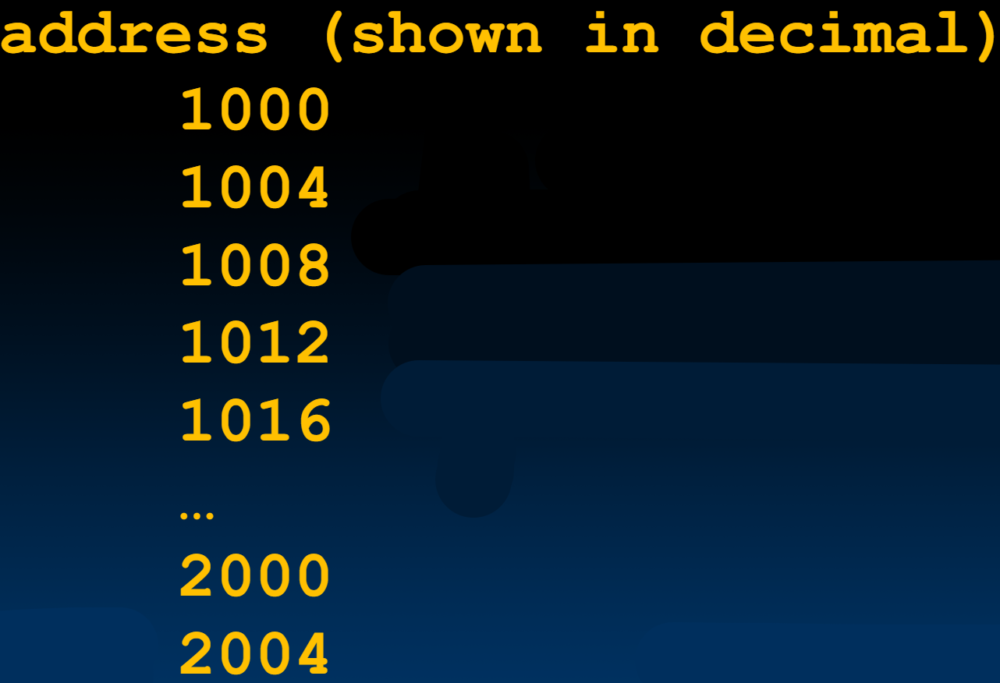
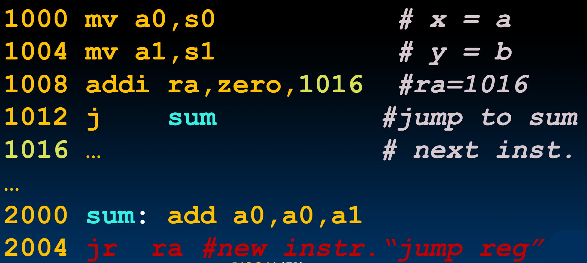

# 09.3-RISC-V Function Calls


Lecture Video Address


***

本节我们会介绍两个实现函数调用的指令。这也是关于 RISC-V 新指令几乎的全部内容了。其余需要完成基本指令集的指令只是我们之前见过的变体。


## C Functions

```c
main() {
    int i,j,k,m;
    ...;
    i = mult(j,k); 
    m = mult(i,i); ...
}

/* really dumb mult function */
int mult (int mcand, int mlier){
    int product = 0;
    while (mlier > 0) {
        product = product + mcand;
        mlier = mlier -1; 
    }
    return product;
}
```

在main中两次调用mult的过程中，指针先从`i=mult(j, k)`跳转到mult函数的代码中，然后执行完之后又跳回到该行，然后从`m=mult(i, i)`跳转到mult函数的代码中，然后又跳回。

```c
main() {
    int i,j,k,m;
    ...;
    i = mult(j,k); 
    m = mult(i,i); ...
}
```

对于main函数，What information must compiler/programmer keep track of?

> C通过值传递来调用函数，所以需要将参数传递给函数

```c
/* really dumb mult function */
int mult (int mcand, int mlier){
    int product = 0;
    while (mlier > 0) {
        product = product + mcand;
        mlier = mlier -1; 
    }
    return product;
}
```

对于mult函数，What instructions can accomplish this?

## <mark style="background-color:red;">Six Fundamental Steps in Calling a Function</mark>

> 所有的汇编语言一般都是按照这几个步骤来的

1. Put arguments in a place where function can access them
2. Transfer control to function
3. Acquire (local) storage resources needed for function
4. Perform desired task of the function
5. Put return value in a place where calling code can access it and restore any registers you used; release local storage
6. Return control to point of origin, since a function can be called from several points in a program

## RISC-V Function Call Conventions

> 下面仅仅是RISC-V的做法

Registers faster than memory, so use them（这样就不用去内存中存取数据了，加快速度）

下面是一些寄存器的别名

| alias                  | Register                | meaning                | desc                                                                                                                 |
| ---------------------- | ----------------------- | ---------------------- | -------------------------------------------------------------------------------------------------------------------- |
| a0\~a7                 | x10-x17                 | argument/return values | eight argument registers to pass parameters and <mark style="background-color:red;">two return values (a0-a1)</mark> |
| ra                     | x1                      | return address         | one return address register to return to the point of origin                                                         |
| <p>s0~s1<br>s2~s11</p> | <p>x8-x9<br>x18-x27</p> | saved register         | saved registers                                                                                                      |

> 返回值寄存器有两个，a0和a1，在C语言中，只有一个返回值，用不到a1，但是在其他语言中有多个返回值，此时就可能需要用到a1了，如果要更多的返回值，就需要内存了

>
>
> 下面是ChatGPT对saved Register的解释
>
> 在 RISC-V 架构中，保存寄存器（Saved Registers）是用于保存函数调用之间不变的数据的寄存器。它们的主要作用是确保在函数调用过程中数据不会被意外覆盖，从而保持程序的正确性和稳定性。
>
> #### 作用和用途
>
> 1. **保持调用者的上下文**：
>    * 当一个函数调用另一个函数时，调用者的某些寄存器值需要在被调用函数执行期间保持不变。保存寄存器就是为了这个目的设计的。
>    * 被调用函数可以自由地使用这些保存寄存器，但在函数返回之前必须将它们恢复到调用之前的状态。
> 2. **支持嵌套函数调用**：
>    * 在复杂的程序中，函数可能会多次调用其他函数甚至是递归调用。保存寄存器确保每次函数调用之间的寄存器状态不会相互干扰。
>    * 这使得嵌套函数调用在返回时能够正确恢复每一层调用的上下文。
> 3. **栈帧管理**：
>    * 保存寄存器有时也会用于管理栈帧，特别是 `x8` (fp) 通常用作帧指针（frame pointer）。帧指针用于跟踪当前函数的栈帧位置，方便访问局部变量和参数。
>    * 在函数入口处，帧指针通常会被设置为当前栈指针的值，并在函数返回前恢复。
>
> #### 使用约定
>
> 根据 RISC-V 的调用约定（ABI），函数需要遵循以下规则：
>
> * 被调用函数（callee）负责保存和恢复保存寄存器的值。这意味着如果一个函数在使用保存寄存器时改变了其内容，它必须在返回之前将其恢复。
> * 调用函数（caller）可以<mark style="background-color:red;">假设保存寄存器在函数调用后仍然保持不变</mark>。
>
> 通过遵循这些约定，程序员和编译器可以在函数调用之间有效地管理寄存器使用，确保数据的正确性和程序的稳定运行。

## RISC-V Call Functions

下面是C的一个代码，我们将这部分代码翻译成汇编语言来演示怎么实现函数调用的

```c
int main() {
    sum(a,b);... /* a,b:s0,s1 */
}
int sum(int x, int y) {
    return x+y;
}
```

其中a变量对应s0寄存器，b变量对应s1寄存器（s0和s1的含义在上表中解释了）

同时，RISC的地址如下（以十进制标识）



In RISC-V, all instructions are 4 bytes, and stored in memory just like data. So, here **we show the addresses of where the programs are stored**.

> 可以看到地址都是4的倍数

下面我们来演示一下每个地址对应的指令



1. 首先，值 a 和 b 将被存储在 s0 和 s1 中。所以我们将移动 s0 和 s1 到 a0 和 a1。这些值将被传递给函数。
2. 然后，我们需要为返回值做准备。我们将取下一个指令，1016，将其作为返回地址放入 ra 寄存器中。
3. 然后我们准备跳转到函数。所以我们所做的就是简单地跳转到 sum。sum 做完它的事情，将 a0 和 a1 相加，将结果保存在返回参数 a0 中。
4. 然后就完成了。接着就准备好跳回到主函数。我们使用一个新的指令 jr ra 来返回到存储在 ra 中的地址，即 1016。

### jr instruction

这里为什么不使用`j`而是用`jr ra`呢？

因为`j`是需要返回的标签的，这需要在函数中写死`j label`，但是同一函数是可以在很多地方被调用的，那就需要每次调用的时候都设置一个相同的标签，显然不实际。但是使用`jr ra`的话，只需要在调用之前设置ra存储返回地址即可。

> jr的意思是jump Register

### jal instruction

下面我们介绍一个更加简单的指令来实现函数跳转

Single instruction to jump and save return address: jump and link (`jal`)

Before:

```assembly
1008 addi ra,zero,1016 # ra=1016
1012 j sum # goto sum
```

After:

```assembly
1008 jal ra, sum # ra=1012,goto sums
```

> 可以看到，之前我们需要手动设置ra为下下行的地址，然后再手动跳转，但是使用jal可以自动设置ra然后跳转。

Why have a `jal`?

* Make the common case fast: function calls very common（这个操作是很常见的，设置一条指令也能加快速度）
* Reduce program size（减少了一条指令，让代码更加compact）
* Don't have to know where code is in memory with jal（不需要自己思考下一个地址是什么了）

## RISC-V Function Call Instructions

这节再来总结一下上面的两个指令

【jal】

Invoke function: jump and link instruction (jal)

> (really should be laj "link and jump")，也就是应该叫做laj，因为是先link，然后jump

* "link" means form an address or link that points to calling site to allow function to return to proper address
* Jumps to address and simultaneously saves the address of the following instruction in register `ra`

```assembly
jal rd, FunctionLabel
```

【jr】

Return from function: **jump register** instruction (jr)

* Unconditional jump to address specified in register: `jr ra`
* Assembler shorthand: `ret` = `jr ra`(在汇编器中，ret就是jr ra的缩写)

> `jal`是用于跳转到函数的，`jr`(或者说`ret`)是用于返回的

### pseudo-instuctions

实际上，所有的跳转指令也就只有两个

* `jal rd, Label` – jump-and-link
* `jalr rd, rs, imm` – jump-and-link **register**

`j`, `jr` and `ret` are pseudoinstructions!

```assembly
j: jal x0, Label # 向x0存数据是没有意义的
```

这些都是为了减少指令的数量
