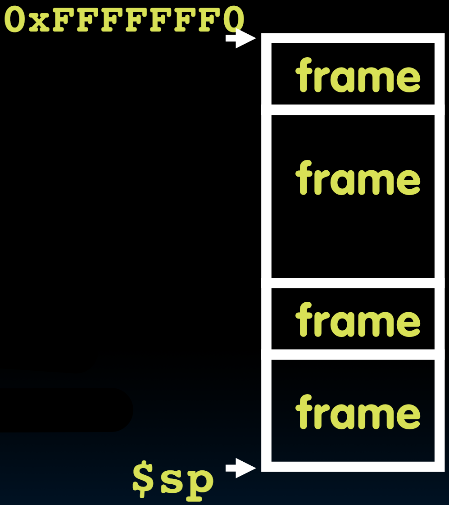
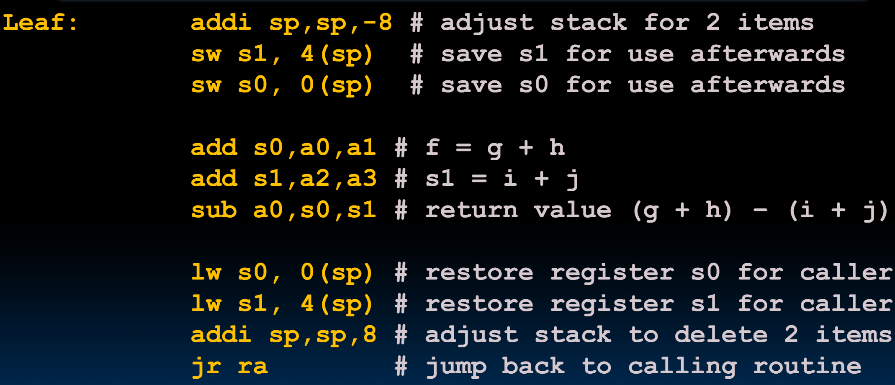
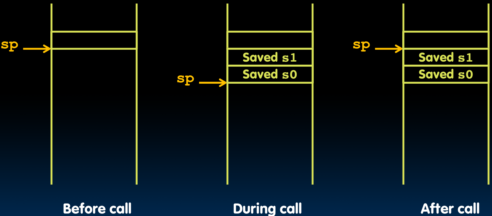

# 10.1-Function Call Example


Lecture Video Address


---

首先来回顾一下之前提到的调用函数的六步骤

1. Put arguments in a place (registers) where function can access them（将参数设置到指定的寄存器上）
2. Transfer control to function (`jal`) （此时这个function可以控制processor，以及指令指令的顺序，以及局部寄存器）
3. Acquire (local) storage resources needed for function(?)
4. Perform desired task of the function
5. Put return value in a place where calling code can access it and restore any registers you used; release local storage(?)
6. Return control to point of origin, since a function can be called from several points in a program (`ret` =`jr ra`)

现在还剩下第3步和第5步没做了

> 解释第3步和第5步，当`jal`之后，被调用的函数此时可以控制CPU，执行的指令序列以及局部寄存器。
>
> 那函数就能随意地在寄存器空间里任意使用资源吗？不能。主程序可能有一些变量存储在寄存器里，我们不能破坏它们并在处理器内部留下混乱，这样主程序就不能在暂停的地方继续执行。因此，我们需要保存一些变量，以便能够使用那些空间。当然，会有一些地方可以随意使用的临时空间，但我们不能在所有寄存器上随意书写。这就像你真的想举办一个派对，你需要先把所有的花盆和花瓶等东西收起来，等派对结束后再把它们放回去。

> 简单来说就是要先存储调用者里面的变量，然后执行函数，执行结束之后再恢复原来的变量。然后回退到调用者函数。

## Function Call Example

下面举一个C的例子，leaf function是一个非嵌套函数，里面没有调用其他函数

```c
int Leaf(int g, int h, int i, int j){
    int f;
    f = (g + h) – (i + j);
    return f;
}
```

Parameter variables `g`, `h`, `i`, and `j` in argument registers `a0`, `a1`, `a2`, and `a3`, and `f` in `s0`(saved register, i.e. **temperatory space**)

Assume need one temporary register s1

> 也就是说，可写的就是s0和s1，但是a0~a3作为参数寄存器是不能再写的

## Stack Stores Variables

> 在调用函数以后要返回，那么先前的状态保存在哪里呢？比如这里使用了s0和s1，那么原先的s0和s1的内容要存在哪里呢？

Need a place to save old values before calling function, restore them when return, and delete 

> 可能认为我们可以把它们放在寄存器中。但通常情况下，我们没有足够的寄存器来处理每次函数调用。因此，它们需要存储到内存中。

Ideal is **stack**: last-in-first-out (LIFO) queue (e.g., stack of plates)

> 在内存中有一个理想的位置，一个理想的结构，一个用于组织记忆的结构正在被使用。那就是栈。

Stack有两个操作

- Push: placing data onto stack
- Pop: removing data from stack

---

在别的指令语言(比如x86)中可能会有些专门的指令来执行push和pop，但是在RISC-V中没有

> 我们通过将Stack的地址保存在指定的寄存器中来实现Stack

Stack in memory, so need register to point to it

- `sp` is the **stack pointer** in RISC-V (`x2`寄存器来表示`sp`)

但是仅有一个Stack pointer是不够指明一个Stack的，我们还需要知道Stack从哪里开始的。

> 习惯上约定Stack始于内存中的顶部并且往下走。当我们增加Stack的时候，指针是减小的。反之，指针增加

Convention is grow stack down **from high to low addresses**

- `Push` decrements `sp`, `Pop` increments `sp`

### Stack frame

通常每个函数都有一组数据需要放入栈中。 我们称之为Stack frame。 

Stack frame includes:

- Return "instruction" address(也就是这个frame结束的时候返回的地址)
- Parameters (arguments)
- Space for other local variables

> 所以说，每个frame时间上都仅仅是用来保存数据的，具体的代码在Code区

如下图



> 回顾之前CS61A学的environment diagram，本质就是这个

- Stack frames **contiguous** blocks of memory（这些frames是连续的内存块）
- stack pointer tells where bottom of stack frame is（栈指针指示栈的地步）

当我们调用一次函数时，添加一个Stack frame，将指针继续往下移；当函数结束时，就会上移回去，并释放空间。（数据仍然可能在栈上，但现在可供下一个函数调用写入）

## RISC-V Code for Leaf()

下面我们继续来看看Leaf()函数

```c
int Leaf(int g, int h, int i, int j){
    int f;
    f = (g + h) – (i + j);
    return f;
}
```

Parameter variables `g`, `h`, `i`, and `j` in argument registers `a0`, `a1`, `a2`, and `a3`, and `f` in `s0`(saved register, i.e. **temperatory space**)

Assume need one temporary register s1

----

其翻译成汇编语言如下



代码如下

```assembly
# 第一部分叫做prologue, 序幕
Leaf: addi sp,sp,-8  # adjust stack for 2 items, 只有s0和s1两个寄存器要使用，也就是只有这两个寄存器内的数据需要暂存到内存当中
sw s1, 4(sp) 		# save s1 for use afterwards, 栈指针是下移的，减少的，所以数据要存在上面，偏移量为正。一个Integer是4bytes，所以移动4bytes
sw s0, 0(sp) 		# save s0 for use afterwards

# 执行函数内容
add s0,a0,a1 		# f = g + h
add s1,a2,a3 		# s1 = i + j
sub a0,s0,s1 		# return value (g + h) – (i + j), a0是专门用于存储返回值的

# 这一部分叫做epilogue
lw s0, 0(sp) 		# restore register s0 for caller
lw s1, 4(sp) 		# restore register s1 for caller
addi sp,sp,8 		# adjust stack to delete 2 items, sp指针移动回去
jr ra 			    # jump back to calling routine
```

> 根据这个例子总结几点：
>
> 1. `addi sp,sp,-8`就相当于创建了一个frame，frame下移大小取决于当前函数有多少个变量要被覆盖，所以说假设前面有3个int变量，那么就是-12
> 2. 在Stack Frame存储的不是当前函数的数据，而是前面几层函数的数据，比如这里，假设`f1()`调用了`Leaf()`，那么最后一个frame存储的是`f1()`的数据。而Leaf()的空间在sp下方（?）
> 3. 当回退的时候，先恢复数据，然后移动指针。移动指针过后，最后一个frame就被释放了，也说明此时执行的是`f1()`

### Stack Before, During, After Function

下面我们再来看一下Stack在leaf()执行前后的变化

Need to save old values of s0 and s1



