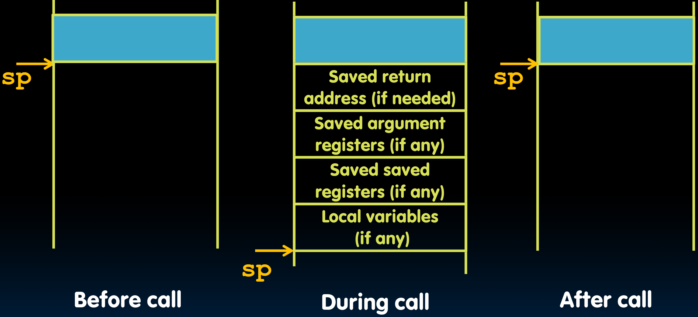
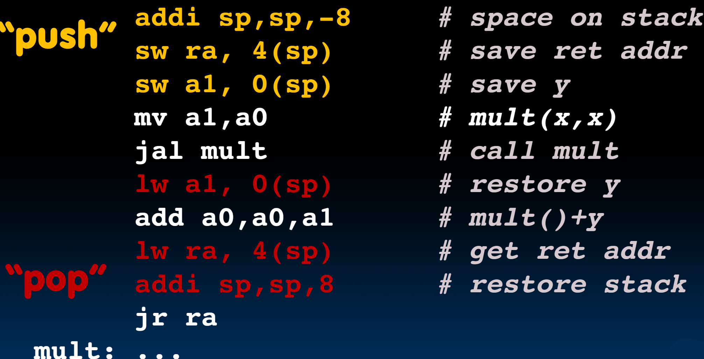
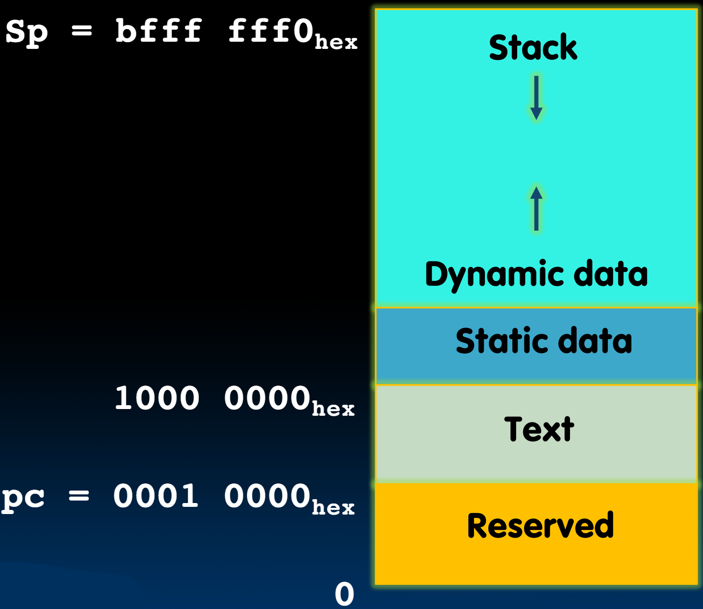

# 10.3-Memory Allocation


Lecture Video Address


***

本节我们讲述C中的内存分配在RISC-V中是怎么实现的。

## Allocating Space on Stack

C has two storage classes: `automatic` and static

* `Automatic` variables are local to function and **discarded** when function exits
* `Static` variables exist across exits from and entries to procedures

Use stack for automatic (local) variables that don't fit in registers(stack variables是不用存储的)

`Procedure frame` or `activation record`: segment of stack with saved registers and local variables

> 前两节我们提到了Stack Frame用来存储ra以及一些需要保存的寄存器，本节讲述哪些没有保存在寄存器但是在内存中的变量，这些变量可能非常大，寄存器保存不下，所以要存在内存中。
>
> 这也是为什么要叫做`procedure Frame`或者`activation record`的原因，因为函数需要这里面的数据来运行。

## Stack Before, During, After Function



1. 当我们调用一个函数的时候，我们通过下移sp指针来分配内存空间，然后存储ra，参数，registers，还有local variables
2. 完成调用之后，通过上移sp来释放内存。

## Using the Stack

Recall - `sp` always points to the last used space in the stack

To use stack, we decrement this pointer by the amount of space we need and then fill it with info

So, how do we compile this?

```c
int sumSquare(int x, int y) {
    return mult(x, x)+ y;
}
```



一些说明

1. push和pop是caller在call前后进行的
2. 参数寄存器是按顺序赋值的，从a0开始；所以在sumSquare()里面，x存储在a0当中，y存储在a1当中；

然后是分析代码

```assembly
# push
addi sp,sp,-8 # space on stack, 有ra和a1寄存器需要保存，所以为8
sw ra, 4(sp) # save ret addr
sw a1, 0(sp) # save y (在mult之后还要与y进行相加，所以y需要保存，但是x之后就没用了，所以x不会保存，也就是说，不是所有的参数寄存器都需要保存的)

# call
mv a1,a0 # mult(x, x), call前先设置参数
jal mult # call mult, 跳转到函数

# pop
lw a1, 0(sp) # restore y, 因为下一行需要y，所以先恢复
add a0,a0,a1 # mult()+y, 然后执行内容，mult的结果在a0中为返回值，并且结果也保存在a0中作为sumSquare的返回值
lw ra, 4(sp) # get ret addr, 下一行要移动sp了，所以先restore ra, 为了后续的jr做准备
addi sp,sp,8 # restore stack
jr ra
mult: ...
```

## Memory Regions

When a C program is run, there are three important memory areas allocated:

| memory area | data type                                                                                            |
| ----------- | ---------------------------------------------------------------------------------------------------- |
| Static      | Variables declared once per program, cease to exist only after execution completes - e.g., C globals |
| Heap        | Variables declared dynamically via `malloc`                                                          |
| Stack       | Space to be used by procedure during execution; this is where we can save register values            |

## Where is the Stack in Memory?

RV32 convention (RV64/RV128 have different memory layouts)

> 内存仅仅负责存储01，按什么规则存储是汇编语言的任务

Stack starts in high memory and grows down

* Hexadecimal: $$bfff\_fff0_{hex}$$
* Stack must be aligned on 16-byte boundary(not true in previous examples)

RV32 programs (`text segment`) in low end

* $$0001\_0000_{hex}$$

**static data segment** (constants and other static variables) above text for static variables

* RISC-V convention global pointer (`gp`) points to static
* RV32 `gp` = $$1000\_0000_{hex}$$

`Heap` above static for data structures that grow and shrink ; grows up to high addresses



最底部的是预留的空间为一些特殊的内容，比如printf等等IO、中断等内容
