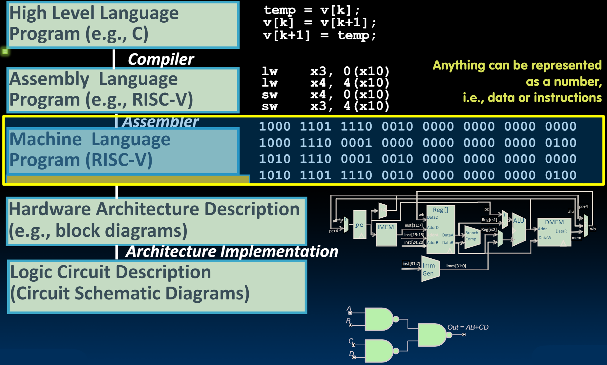
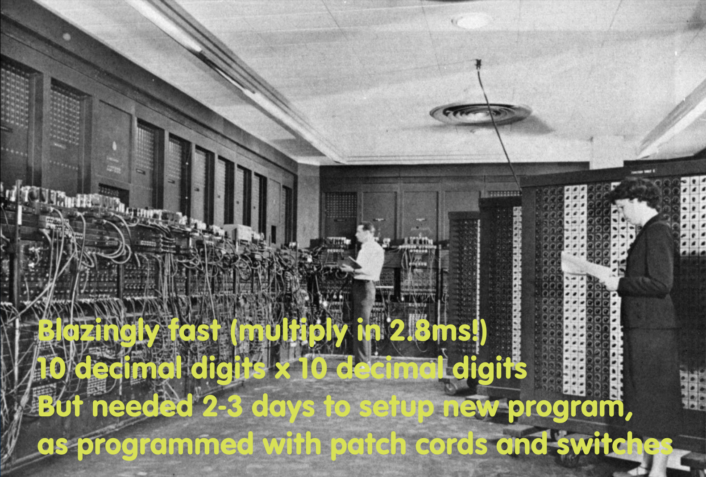
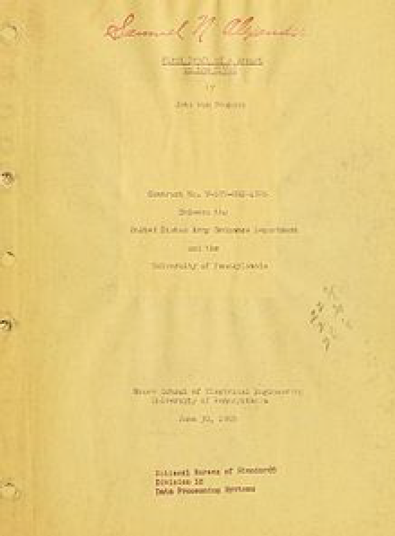
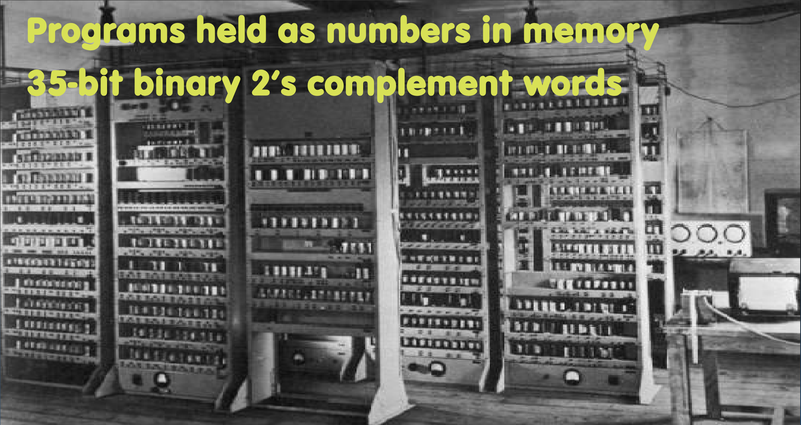
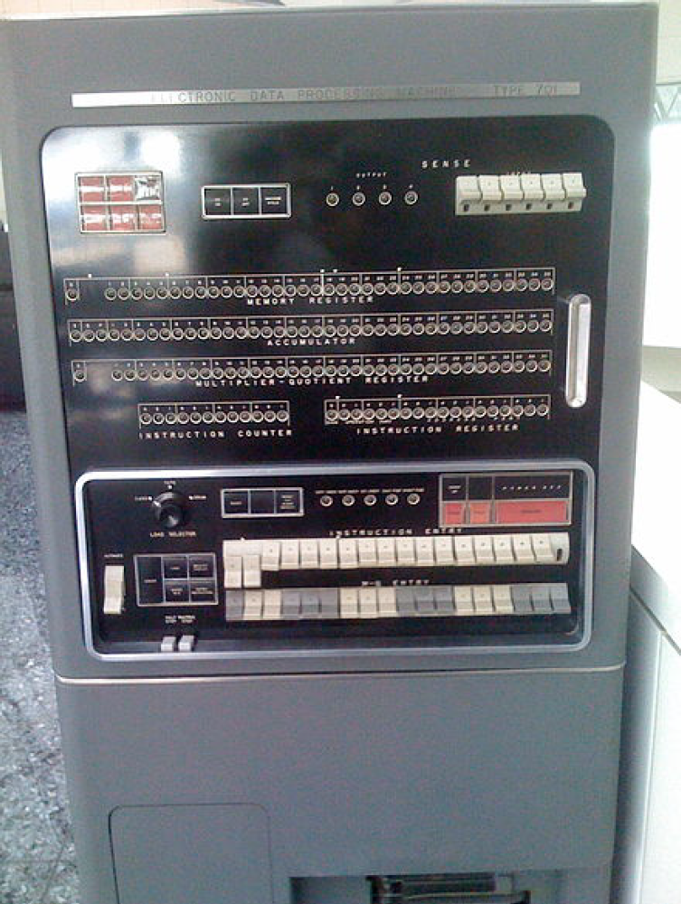

# 11.1-Intro


Lecture Video Address


## Great Idea #1: Abstraction (Levels of Representation/Interpretation)

前面我们已经学习了比较底层的汇编语言，但是机器仍然不能听懂什么是add, lw, sw等指令，机器只能理解binary，所以要将assembly language映射到machine language

> machine language也是ISA内容的一部分

本节就要学习如何将人可读的assembly language翻译成为机器语言

## Computer history

我们先来看一下有关计算机的历史

### ENIAC

ENIAC (U.Penn., 1946) First Electronic General-Purpose Computer

ENIAC 是在 1946 年由宾夕法尼亚大学为美国陆军合同建造的。它的目的并不是成为通用计算机，而是为美国陆军进行炮兵计算。通常在炮兵中，基本问题之一是已知三角形的两边和一个角，需要计算三角形的第三边，同时补偿弹道轨迹、风等因素。

为此，军队使用了不同的计算器，他们在军队中有人工计算器。实际上，我们的人工计算器会使用滑尺、绘图和预先计算的表格快速解决这些三角形问题。我读到一些人非常快，他们能够在12秒内完成这些计算。试试看，试着在12秒内解决一个三角形问题。有趣的是，这些角色在二战期间往往由女性担任。其中一位在照片中的计算器是 Francine Snyder，她在成为军队计算器后，被调到 ENIAC 的早期程序员。

ENIAC 速度极快，能够在2.8毫秒内完成一次乘法，每次乘法涉及10位数乘以10位数。它不仅能解决三角形问题，还能进行积分，这就是 ENIAC 中的 "I" 所代表的含义(inf)。

但为了执行不同的功能，它需要重新编程。而这里的编程或重新编程是通过电线完成的。有人需要把所有的电线拔掉，还有一些开关，然后重新编程以执行不同的功能。

这一过程通常需要两到三天，因为这基本上是连接线，而这些连接线不像今天我们有的那么方便，比如 RJ Levinson、RJ-45，所以我们可以重新布线我们的路由器。这些只是基本的电缆。

Blazingly fast (multiply in 2.8ms!) 10 decimal digits x 10 decimal digits But needed 2-3 days to setup new program, as programmed with patch cords and switches

## Big Idea: Stored-Program Computer

- Instructions are represented as bit patterns – can think of these as numbers
- Therefore, entire programs can be stored in memory to be read or written just like data
- Can reprogram quickly (seconds), don’t have to rewire computer (days)
- Known as the "von Neumann"(冯诺依曼) computers after widely distributed tech report on EDVAC project
    - Wrote-up discussions of Eckert and Mauchly
    - Anticipated earlier by Turing and Zuse

---

编程计算机的想法由来已久，并在同一时间出现，试图找到更好的方法来编程计算机。因此，很明显，指令可以表示为二进制模式。这些位模式可以通过**上下翻动开关**存储在计算机中，而不是移动电线。因此，如果程序存储在开关中，可以在几秒钟或几分钟内重新编程，而不是几天。这就是==**冯·诺依曼**==(Von Neumann)的**存储程序计算机**概念，因为冯·诺依曼在1945年为美国陆军撰写的报告而得名。有趣的是，这份报告被泄露了。他们本打算为此申请专利，但由于冯·诺依曼的管理员错误地将其邮寄给了他的邮件列表上的所有人，所以未能成功。

这个想法很可能源于其他人。冯·诺依曼与团队的其他成员进行了讨论，这在图灵和祖斯之前也被预见到。但冯·诺依曼是最初将报告发送给陆军的作者，所以这一概念归功于他。

## EDSAC

Programs held as numbers in memory 35-bit binary 2’s complement words

---

第一台真正通用的存储程序电子计算机是剑桥大学的EDSAC，当时由早期计算机先驱莫里斯·威尔克斯领导设计的。所有程序都以数字形式存储在内存中，这可以追溯到1949年。

这可能是第一台使用二进制补码的计算机。但是他们当时还没有完全理解字节和常数字等概念。因此，它使用35位二进制补码数字来表示数据。

## Consequence

上述计算机虽然比较古早，但仍有一些概念被采用，并被认为是计算机设计中的主要进步，沿用至今

###  1. Everything Has a Memory Address

> 类似于Java的万物皆对象，在计算机中，万物皆有内存地址

Since all instructions and data are stored in memory, everything has a memory address: instructions, data words

- Both branches and jumps use these（在进行指令跳转的时候需要用到指令地址）
- 在进行lw和sw的时候需要用到数据地址

> 内存里的也就是指令和数据了

C pointers are just memory addresses: they can point to anything in memory

- Unconstrained use of addresses can lead to nasty bugs; avoiding errors up to you in C; limited in Java by language design

> 像C和汇编语言将数据和指令存储在一块内存中，所以可能会覆盖程序。为了避免错误，可以将二者分开，Java也就是这样设计的

One register keeps address of instruction being executed: "Program Counter" (PC)

> Program Counter可能不是一个很好的名字，这听起来好像是计数的

- Basically a pointer to memory
- Intel calls it **Instruction Pointer** (IP)

> 【为什么叫做Program Counter】
>
> 很可能是因为早期的IBM计算机。
>
> 
>
> 大小看起来像个冰箱，可以看到这些前面板上的闪烁灯。当你执行程序时，它们快速闪烁。实际上它们用于调试程序，因为在面板下方有一个调试开关。可以通过上下翻动那个开关，通过它逐条执行程序指令。
>
> 上面有一些寄存器，顶部有一个内存寄存器，它包含了从内存中取出的数据的操作值。下面是一个累加器，大约有38位宽（当时他们还没有引入字节和字。）还包括乘法器商寄存器。左下角是一个Instruction Counter(基本上就是Program Counter)，和一个指令寄存器。所以当我们逐条执行程序指令时，我们会看到指令的计数以及正在执行的指令的二进制值，以及累加器中的数据和我们关心的内存位置中取出的数据。指令计数器有12个灯泡， 意味着它能够表示多达12位。 所以这台计算机能够执行多达2的12次方的指令，即4096条指令。 对于那个时代来说已经相当大了。
>
> 也就是说当时是有一个指令计数器记录有多少个指令执行了的。

### 2: Binary Compatibility

> 二进制兼容性

Programs are distributed(分发) in binary form

> 程序现在为了方便以二进制形式分发。我们通常不会分发源程序，也就是源代码，因为让每个人都编译源代码——意思是用编译器——编译源代码，提供库，链接它，最后加载可执行文件会非常不方便（因为不同的系统对于程序的兼容程度不同）。这真的会限制计算设备的普及。所以这些二进制文件是绑定到特定指令上的

- Programs bound to specific instruction set
- Different version for phones and PCs

> 不同的ISA在不同领域占主导地位。例如，PC使用英特尔x86，而大多数手机使用ARM的架构。现在有很多存储设备使用RISC-V。这些是不同的ISA，它们有适用于它们的不同二进制文件。

---

New machines want to run old programs ("binaries") as well as programs compiled to new instructions

Leads to "backward-compatible" instruction set evolving over time

Selection of Intel 8088 in 1981 for 1st IBM PC is major reason latest PCs still use 80x86 instruction set; could still run program from 1981 PC today

> 另一个非常重要的概念是，我们希望机器始终能运行所有程序。例如，当从 iPhone 10 升级到 iPhone 11 时，我们不希望得到所有新的应用程序。开发人员也不想在每次发布新手机时都开发全新的应用程序。我们也不必为不同版本的手机准备各种不同版本的二进制文件。因此，我们必须保持向后兼容。这也导致了随时间演变的向后兼容的指令集。一个显著的例子是 x86，它设计于--它设计于1981年，并被用于IBM PC。IBM当时认为--他们乐观地认为他们可能会卖出 20,000 台这样的个人电脑。但是如今，我们仍然能够在现代个人电脑上执行 8088 处理器的原始代码，这是 IBM PC 上的原始处理器。我们可以在现代个人电脑上执行这些二进制文件。

## Instructions as Numbers

Most data we work with is in words (32-bit chunks):

- Each register is a word
- `lw` and `sw` both access memory one word at a time

So how do we represent instructions?

- Remember: Computer only understands 1s and 0s, so assembler string "`add x10,x11,x0`" is meaningless to hardware
- RISC-V seeks simplicity: since data is in words, make instructions be **fixed-size 32-bit** words also
    - Same 32-bit instructions used for RV32, RV64, RV128(这些指令的位数也随之改变)

---

One word is 32 bits, so divide instruction word into "fields"

Each **field** tells processor something about instruction

We could define different fields for each instruction, but RISC-V seeks simplicity, so define six basic types of instruction formats:

> 由于RISC-V有32个寄存器，所以每个寄存器需要5个bit表示
>
> 还要有一个field来表明指令的类型是什么

| formats  | description                                            |
| -------- | ------------------------------------------------------ |
| R-format | register-register arithmetic operations                |
| I-format | register-immediate arithmetic operations and **loads** |
| S-format | stores                                                 |
| B-format | branches (minor variant of S-format)                   |
| U-format | 20-bit upper immediate instructions                    |
| J-format | jumps (minor variant of U-format)                      |
