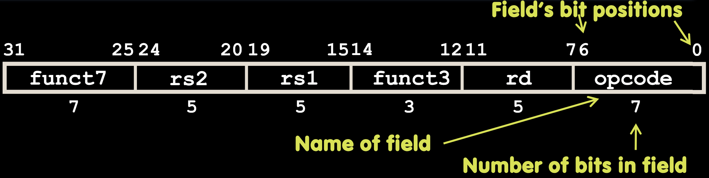
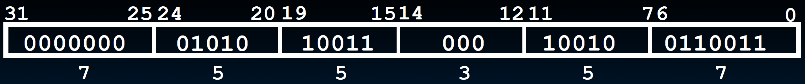
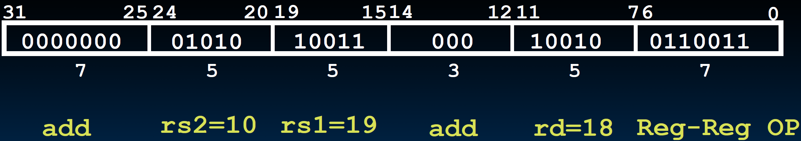

# 11.2-R-Format Layout


Lecture Video Address


## R-Format Instruction Layout



32-bit instruction word divided into six fields of varying numbers of bits each: 7+5+5+3+5+7 = 32

【Notice】：指令也是little-endian，如上图，从左到右是地址是从大到小

Examples

* opcode is a 7-bit field that lives in bits 6-0 of the instruction
* rs2 is a 5-bit field that lives in bits 24-20 of the instruction

> 所有的register-based instructions，结构都是`op, rd, rs1, rs2`，所以其翻译成机器语言的结构也都和上面的一样

下面来解释每个fields的意义

### opcode/funct Fields

| fields        | meaning                                                      | Description/Notes                                            |
| ------------- | ------------------------------------------------------------ | ------------------------------------------------------------ |
| opcode        | partially specifies what instruction it is(主要是指明instruction的类型，也可以理解为format的类型) | This field is equal to $$0110011_2$$ for all **R-Format register-register arithmetic** instructions |
| funct7+funct3 | 两个单独是没有意义的，合起来才有意义                         | **combined with opcode**, these two fields describe what operation to perform(三者共同指定是哪一个instruction) |

> * opcode + funct7 + funct3能够告诉机器执行的是add, subtract还是shift left操作
> * 同一种类型，也就是同一种format的指令有相同的opcode

***

Question1：funct7 + funct3总共有10位，可以表示1024种指令，但是实际上只有十种左右的指令？为什么要这么多位呢？

虽然有冗余，但是这样设计可以在未来让处理器弄清楚执行哪个指令时更容易（设计逻辑电路图时的需要）

Question2: You have been professing simplicity, so why aren’t opcode and funct7 and funct3 a single 17- bit field?

回答和上个问题一样

### Register fields

寄存器如下


| Register | meaning              | Description                                                     |
| -------- | -------------------- | --------------------------------------------------------------- |
| rs1      | Source Register #1   | specifies register containing first operand                     |
| rs2      | Source Register #2   | specifies second register operand                               |
| rd       | Destination Register | specifies register which will **receive** result of computation |

Each register field holds a **5-bit** unsigned integer (0-31) corresponding to a register number (x0-x31)

## R-Format Example

我们以一个RISC-V的指令为例

```assembly
add x18,x19,x10
```

> 这个指令将x10与x19的值相加，结果保存在x18当中

转化成32位机器指令如下



对应位分别如下



> * funct7和funct3单独是没有意义的，二者组合成的0000000000指明这是一个add操作
> * reg-reg op，所以opcode是固定的0110011
> * 寄存器的顺序，在指令中的顺序和在机器语言中的顺序是相反的，指令中是rd, rs1, rs2, 在机器语言中是rs2，rs1，rd

下面是一个练习

What is correct encoding of add x4, x3, x2 ?

1. 4021 8233hex
2. 0021 82b3hex
3. 4021 82b3hex
4. 0021 8233hex
5. 0021 8234hex

这里我们要做的就是填充r2, r1, rd

0000000 (r2) (r1) 000 (rd) 0110011

通过**排除法**可以知道第一个nibble是0，最后一个nibble是3，由此只剩下了2和4选项然后要判断左边第二个nibble是3(0011)还是b(1011)，也就是看rd是奇数还是偶数，这里是x4，所以是偶数，结果是4

当然可以补充完Register的二进制，得到的也是4

## All RV-32 R-format Instructions

下面是列举的所有的RISC-V的R-format指令对应的二进制编码了

| instruction | funct7  | rs2 | rs1 | funct3 | rd | opcode  |
| ----------- | ------- | --- | --- | ------ | -- | ------- |
| add         | 0000000 | -   | -   | 000    | -  | 0110011 |
| sub         | 0100000 | -   | -   | 000    | -  | -       |
| sll         | 0000000 | -   | -   | 001    | -  | -       |
| slt         | 0000000 | -   | -   | 010    | -  | -       |
| sltu        | 0000000 | -   | -   | 011    | -  | -       |
| xor         | 0000000 | -   | -   | 100    | -  | -       |
| srl         | 0000000 | -   | -   | 101    | -  | -       |
| sra         | 0100000 | -   | -   | 101    | -  | -       |
| or          | 0000000 | -   | -   | 110    | -  | -       |
| and         | 0000000 | -   | -   | 111    | -  | -       |

Notice:

上图中有`slt`是set less than的意思，当rd1 < rd2的时候，rd=1；sltu是比较无符号整数（寄存器仅仅负责存储01，怎么解释并比较01要用指令控制）

仔细发现，加法和减法非常相似。因为在计算机中，加法和减法可以公用一样的硬件，只需要在加法的基础上添加一个1信号就可以实现减法了。（具体怎么实现后面会讲）

同样的情况还发生在srl和sra上面，逻辑右移和算数右移
