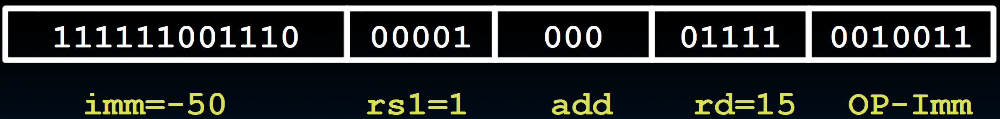

# 11.3-I-Format Layout


Lecture Video Address


---

我们希望对所有可能的指令使用相同的指令格式。但这可能不太实际。然而，我们希望在不同格式之间重用大多数字段的位置。因此，我们将看到，对于I型指令（即使用立即数的指令），我们需要一种不同的格式。但我们会尽量使其与R型指令相似。

## I-Format Instructions

What about instructions with immediates?

比较下面两个指令

```assembly
add rd, rs1, rs2
addi rd, rs1, imm
```

5-bit field only represents numbers up to the value 31: immediates may be much larger than this

Ideally, RISC-V would have only **one instruction format** (for simplicity): unfortunately, we need to **compromise**

---

Define new instruction format that is mostly consistent with R-format

Notice if instruction has **immediate**, then uses **at most 2 registers** (one source, one destination)

## I-Format Instruction Layout

首先是R-Format-Layout


再次基础上修改成为I-Format-Layout


Only one field is different from R-format, rs2 and funct7 replaced by 12-bit signed immediate, imm[11:0]

Remaining fields (rs1, funct3, rd, opcode) same as before

> 在 R 类型指令中，我们使用一个opcode(0110011)。我们将为 I 类型指令引入一个新的opcode。
>
> 另外，在 R 类型指令中，我们没有使用指令中的所有位，而是留下了一些 funct7 字段。
>
> 我们仔细思考如何对 I 类型进行编码，因为如果处理不慎，我们将失去对立即数的范围控制（使用得当，避免操作位冗余从而让立即数的范围减小）。这里需要思考要支持多少种不同的I类型指令，目前已经有7条，加上补充的2条，将会有9条。funct3可以编码8种指令，所以将使用一些技巧来添加第九种指令。
>
> 尽管如此，我们现在能够支持 12 位的立即数。它们覆盖了一个很好的范围。这是我们在汇编代码中经常看到的情况，这些立即数的范围将涵盖很广泛的循环。

imm[11:0] can hold values in range [-2048~ten~ , +2047~ten~]

> 在汇编语言中，立即数的范围是不能超过这个的

Immediate is always sign-extended to 32-bits before use in an arithmetic operation

> 由于我们总是将立即数与寄存器 rs1 中的值一起使用，而 rs1 有 32 位，所以我们必须将该值符号扩展为 32 位。

有时候需要更长的立即数，We’ll later see how to handle immediates > 12 bits

## I-Format Example

RISC-V Assembly Instruction:

```assembly
addi x15,x1,-50
```

> 这个指令将x1-50的结果保存在x15当中



## All RV32 I-format Arithmetic Instructions

| instruction | imm            | rs1  | funct3  | rd   | opcode  |
| ----------- | -------------- | ---- | ------- | ---- | ------- |
| addi        | imm[11:0]      | -    | 000     | -    | 0010011 |
| slti        | -              | -    | 010     | -    | -       |
| sltiu       | -              | -    | 011     | -    | -       |
| xori        | -              | -    | 100     | -    | -       |
| ori         | -              | -    | 110     | -    | -       |
| andi        | -              | -    | 111     | -    | -       |
| slli        | 0000000\|shamt | -    | 001     | -    | -       |
| srli        | 0000000\|shamt | -    | **101** | -    | -       |
| srai        | 0100000\|shamt | -    | **101** | -    | -       |

关于指令：

1. 没有`subi`指令，可以使用`addi`实现
2. slti是slt的立即数版本，set less than，如果rs1 < imm，那么设置rd位1，sltiu是无符号整数版本

关于编码：

1. funct3仍然是和R-Format一样的从000~111

2. imm在前面都是全部用来表示立即数，但是最后三个不一样

    - "Shift-by-immediate" instructions only use **lower 5** bits of the immediate value for shift amount (can only shift by 0-31 bit positions)

        > 因为Register存储的只有32位，那么偏移量最多是32，而且偏移量是正数，所以最多用5位即可。所以在偏移的指令中，限制了偏移量的位数

3. 最后srli和srai的funct3一样，但是imm中有一位相反，这个是控制是否sign-extension的，算数右移的时候右移时需要进行符号扩展
