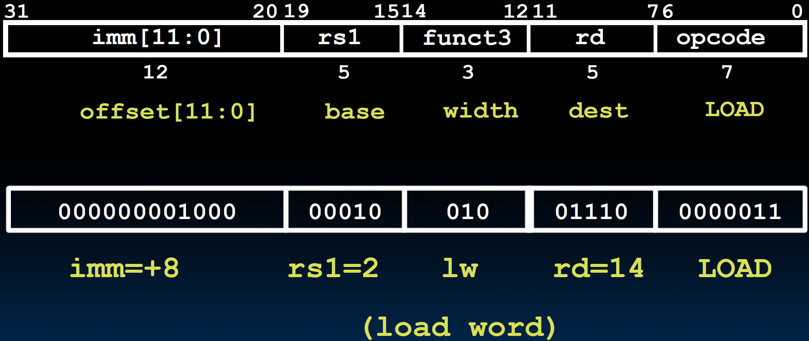

# 11.4-Loads


Lecture Video Address


---

本节来介绍load指令

## Load Instructions are also I-Type

I型指令使用I格式，其中包含一个**源寄存器**、一个**目的寄存器**和一个**立即数**，用于立即算术和逻辑指令。那么我们需要什么来支持Load呢？

在RISC-V中，只有一种类型的load指令，或者说只有一种多个加载指令，他们的本都是一样的(比如lb和lw，底层都是一种电路)。举一个例子如下

```assembly
lw x5, 8(x3)
```

这种类型指定了**基址寄存器**和基于该基址寄存器的**偏移量**，这是一个立即数，指向内存位置，我们从该内存位置获取数据并放置在**目的寄存器**中。

因此，在具有一个源寄存器、一个目的寄存器和一个立即数的指令格式中就是我们的I型因此，我们不需要一个新的指令格式。

> 因为Load指令和I-Format的指令需要的参数类型都是一样的，一个源寄存器，一个目的寄存器，一个立即数，所以用I-Format来实现Load

---


The 12-bit signed immediate is added to the base address in register rs1 to form the **memory address**

This is very similar to the add-immediate operation but used to create address not to create final result

The value loaded from memory is stored in register `rd`

对于编码的说明：

1. 新的opcode，虽然结构与I-Format一样，但是不是一种操作，所以opcode是不一样的（而且立即数指令的编码已经满了）
2. offset是偏移量，12位
3. funct3设置要加载的类型（不同指令加载的数据类型是不同的，比如lb和lw），不同的类型加载的长度也不同。

## I-Format Load Example

```assembly
lw x14, 8(x2)
```

> 这里将x2的地址偏移8个byte，也就是2个字地址对应的内存地址里面的值加载到x14



## All RV32 Load Instructions

| instruction | imm       | rs1  | funct3 | rd   | opcode  |
| ----------- | --------- | ---- | ------ | ---- | ------- |
| lb          | imm[11:0] | -    | 000    | -    | 0000011 |
| lh          | -         | -    | 001    | -    | -       |
| lw          | -         | -    | 010    | -    | -       |
| lbu         | -         | -    | 100    | -    | -       |
| lhu         | -         | -    | 101    | -    | -       |

- `lbu` is "load unsigned byte"
- `lh` is "load halfword", which loads 16 bits (2 bytes) and signextends to fill destination 32-bit register
- `lhu` is "load unsigned halfword", which zero-extends 16 bits to fill destination 32-bit register
- There is no '`lwu`' in RV32, because there is no sign/zero extension needed when copying 32 bits from a memory location into a 32- bit register

> lbu和lhu的u的作用就是为了进行符号扩展，将不足的位补上，如果是lb和lh的话就补0；但是lw是可以将寄存器填满的，不需要符号扩展。
>
> 同时可以看到在lbu和lhu的funct3 field中的MSB是1，这一位就表示sign-extension
