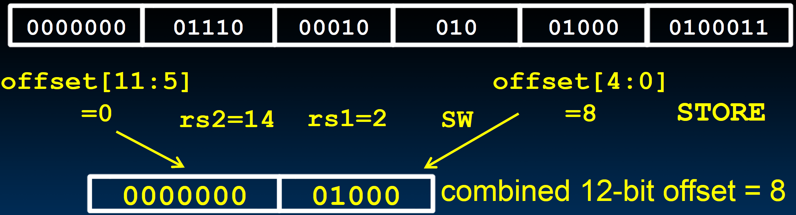

# 11.5-S-Format


Lecture Video Address


---

sw的格式如下

```assembly
sw rs2, offset(rs1)
```

rs2存储数据，rs1存储内存基地址，8是偏移量，这与前面两种格式不同：

- R-Format需要三个寄存器，两个源寄存器，一个目的寄存器
- I-Format需要一个源寄存器，一个目的寄存器，一个立即数偏移量
- 但是S-Format需要两个源寄存器，一个立即数偏移量

> 虽然I和S都是两个寄存器，但是编码的时候是对寄存器的位置有严格要求的，参考R-Format
>
> 
>
> 可以看到源寄存器必须在24\~20,19\~15这几位，不能将目的寄存器放在这个位置上。否则会让电路设计变麻烦

因此需要新的格式来编码store指令

## S-Format Used for Stores


Store needs to read two registers, rs1 for base memory address, and rs2 for data to be stored, as well immediate offset!

Can’t have both rs2 and immediate in same place as other instructions!

> 重要的是要注意，我们始终希望保持寄存器的位置在指令中保持不变，我们不希望处理器到处寻找寄存器。所以这些位置——寄存器所在的字段永远不会移动。然而，我们会移动立即值所在的字段。

Note that stores don’t write a value to the register file, no rd!

> 在这种情况下，立即数被分为上7位和原先rd所在的5位。因此，它仍然是一个12位的立即数，只是由7位上半部分和5位下半部分组成。对我们来说可能看起来很混乱，但我们并不重要--处理器才重要。处理器必须迅速找到其寄存器的位置。让我们看一个存储操作的例子。

RISC-V design decision is to move low 5 bits of immediate to where rd field was in other instructions – keep rs1/rs2 fields in same place

- Register names more critical than immediate bits in hardware design

## S-Format Example

RISC-V Assembly Instruction:

```assembly
sw x14, 8(x2)
```

> 将x14的内容存储到8(x2)对应的内存结构当中



All RV32 Store Instructions

## All RV32 Store Instructions

| instruction | imm1      | rs2  | rs1  | width | imm2     | opcode |
| ----------- | --------- | ---- | ---- | ----- | -------- | ------ |
| sb          | Imm[11:5] | -    | -    | 000   | imm[4:0] | -      |
| sh          | Imm[11:5] | -    | -    | 001   | -        | -      |
| sw          | Imm[11:5] | -    | -    | 010   | -        | -      |

