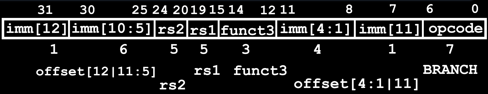

# 12.1-B-Format-Layout


Lecture Video Address



## RISC-V Conditional Branches

下面是branch的例子

```assembly
beq x1, x2, Label
```

Branches read **two source registers** but don’t write to a destination register，并且需要一个参数来表示Label (similar to stores)

How to encode label, i.e., where to branch to?

我们先来看看branch做了什么，一般在什么时候使用

## Branching Instruction Notice

这一小节主要回忆关于跳转的注意事项

在C语言中有三种类型的循环——if、else、while、for——往往会被翻译成分支指令。

【跳转的距离】

1. 这些循环在被翻译成汇编代码时，相对来说长度较短。循环内部的指令<mark style="background-color:green;">**数量通常少于50条**</mark>，最多可能几百条。
2. 如果我们需要跳转到代码中的某个较远的部分，比如一个过程，我们会使用一种不同类型的指令，即jump指令，我们将看到这是J格式的。

【代码的位置】

3. 另一个重要的观察是关于代码的位置。通常，我们知道代码保存在内存中，并且它与数据分开存放。因此，它位于内存的有限部分，并且不与数据混合。
4. 一般来说，那些Code或者Text的区域是我们内存的一个子集，并且分支的最大范围不应超过Code的大小。否则，你将跳转到内存中没有程序的部分，这样事情就不会有意义了。

【PC保存当前地址】

5. 在执行这些循环时需要记住的另一件事是，当前执行的指令所在的地址指向程序计数器。当我们按顺序执行时，程序计数器会递增，然后当我们遇到分支时，它会返回到原始位置。然后我们继续执行，这就是我们的循环。因此，当前正在执行的指令的地址位于程序计数器中。

## PC-Relative Addressing

在上面说到，由于当前执行的指令的地址保存在PC中，所以可以使用基于PC的**相对寻址**

PC相对寻址意味着我们将使用立即数来指向偏移量，从程序计数器中的当前指令计算偏移量。那么这个偏移量应该以什么单位表示呢？

【立即数】

如果我们使用非常类似于用于存储的S型格式，我们知道可以使用最多12位来编码我们的偏移量，这12位包括7位funct7，还有5位重用了rd，总范围是\[ $$-2^{11}$$ \~ $$2^{11}$$ - 1]。

【单位】

那么该用什么单位呢？

* 使用byte吗？不，因为我们<mark style="background-color:green;">**不想在代码中的某个地方分支到一条指令的中间**</mark>。RISC-V32指令集中的代码由始终为32位宽的指令组成。因此，如果我们分支到与指令开始不对齐的地址，是会出错的。所以我们不想分支到指令的中间。
* 另一种选择是只分支到指令的开头（也就是以word为单位）。分支值应该始终可以被4整除。这还有另一个好处，如果我们始终分支到字的开始，就是我们现在增加了分支的范围。它是正负2的11次方乘以字的数量，每个字是4字节或32位。所以这给了我们数万字节的分支范围。

### Ideal Branch Calculation

下面我们来看看branch的时候，PC指针怎么进行计算

* If we don’t take the branch: `PC = PC + 4` (i.e., next instruction)
* If we do take the branch: `PC = PC + immediate*4`

immediate is number of instructions to jump (remember, specifies words) either forward (+) or backwards (–)

> 但是，这并不是RISC-V实际上工作的方式

## RISC-V Feature: Compressed Instructions

RISC-V并不是使用n × 32bit的偏移计算方式，是因为其支持compressed instruction set(压缩指令)

压缩指令集是ISA的一个子集，它有16位指令，而不是32位指令。我们已经讨论了32、64、128、RV-32、RV-64、RV-128，所有这些指令都是32位的，除了有一个使用16位指令的子集。

### Why Compressed Instruction

为什么会这样呢？

因为在某些应用中，代码大小真的很重要。所以你希望你的代码占用尽可能小的空间。这通常适用于非常昂贵的消费设备。

一个很好的例子是闪存盘之类的东西。在那里，如果你需要使用更多的内存来存储你的代码，你就得花更多的钱，而人们不想这么做。所以代码的紧凑性真的很重要。这就是为什么RISC-V支持所谓的压缩指令格式，这些指令是16位宽的。

不要将其与其他RV类型混淆，所有这些都是32位指令。

### offset calculation

现在，有一个问题。我们的代码可能同时包含32位指令和16位指令。那么我们该怎么办呢？

我们需要能够分支到可能从字开始偏移2字节的16位指令上。这就是为什么RISC-V决定不使用两种不同类型的分支。你只需要一种类型的分支，能够以2字节为单位计算偏移量。

> 在这种情况下，如果跳转的那个指令在word中间，那么立即数就是奇数，否则就是偶数。由此也可以区分开。

所以默认情况下，所有分支使用一个乘以2的立即数单位。这比我们根据word计算偏移量的范围要小，但仍然足够好。

不过要记住，在这门课上，我们只使用32位指令。我们不研究复杂指令集。这意味着如果我们没有正确指定偏移量，我们可能会分支到一条指令的中间。而这不好。那样的话，在我们的情况下会产生垃圾指令，读取到垃圾指令。

> Reduces branch reach by half and means that ½ of possible targets will be errors on RISC-V processors that only support 32-bit instructions (as used in this class)

因此，我们分支的范围是正负1千字**或**4千字节。

> RISC-V conditional branches can only reach ± $$2^{10}$$ × 32-bit instructions on either side of PC

### Actual Branch calculation

所以，要对之前的式子进行修改

* If we don’t take the branch: `PC = PC + 4` (i.e., next instruction)
* If we do take the branch: `PC = PC + immediate*2`

offset也总是偶数

## RISC-V B-Format for Branches



B-format is mostly same as **S-Format**, with two register sources (rs1/rs2) and a 12-bit immediate imm\[12:1] (但是这些立即数的位置被打乱了，比如imm\[12]是31位，imm\[11]是第7位)

But now immediate represents values -4096(= $$2^{11}$$ × 2) to +4094 in 2-byte increments

> 这个范围是13位才能表示的，但是imm只有12位

The 12 immediate bits encode even 13-bit signed byte offsets (lowest bit of offset is always zero, so no need to store it)

> 所以可以看到最后的事+4094而不是应该的+4095。

## Example

RISC-V Code:

```assembly
Loop: beq x19,x10,End
add x18,x18,x10
addi x19,x19,-1
j Loop
End: # target instruction
```

> 从beq到End标签，总共跳转了4个指令（这些指令都是非压缩的）

Branch offset = 4×32-bit instructions = 16 **bytes**

(Branch with offset of 0, branches to itself)

> 意思是说如果branch的offset是0的话，那么就会一直跳转到当前行，形成一个无限的循环

下面看看`beq x19, x10, End`是怎么编码的


* opcode为1100011，是B-Format的代码
* funct3用来表示跳转的类型，这里是`beq`，对应的是000
* rs2为10，rs1为19
* imm？

**Offset** = 16 bytes = 8 x 2

> 由于最后一位固定是0，所以不用保存最后一位

<mark style="background-color:green;">在汇编过程之后，Label会被实际的偏移量取代</mark>

### RISC-Immediate Encoding

在我们弄清楚立即数的具体数值之前，让我们先来了解一下这种奇怪的立即数编码的原因。

在下图中，上面的部分是我们迄今为止见过的四种指令类型，其中有三种需要编码立即数。

下面的部分是这三种编码的立即数的扩展

> 在instruction中，立即数只有有限的12位，但是后面要与PC对应的地址进行偏移计算，这时候就需要对Immediate进行扩展，成为32位


> 上图中inst\[30:25]指的是instruction的30\~25位

I型编码将立即数放在从第20位到第31位的上位比特，进行扩展后，这12位会成为低地址的12位，并经过符号扩展之后，最高比特位会是符号扩展位（所以可以看到在imm中，经过扩展后的10\~31都是inst\[31]）。

接下来是S型，这里的立即数分布在两个字段中，前一个rd字段包含低5位，前一个funct7字段包含高7位。因此，我们通过将第7到第11位（低5位和高7位）合并起来来构造S型的立即数，并扩展位于第31位的符号位。

在B-Format中，虽然在Instruction中的imm顺序被打乱了，但是最终的imm还是要按照正确的顺序，所以在B-imm中inst\[7],也就是imm\[11]移动回了原来的位置，但是为什么要这么做呢？

B型指令，它**几乎**与S型立即数的编码相同。所以所有的比特都在相同的位置。**最重要的是**，第31位比特位于最顶端，并且会被扩展。但区别在于，我们在编码中将第7位的比特位前移。

> 这看起来有点奇怪的原因是因为我们是人类，对我们来说看起来很奇怪，但这对于处理器来说完全正常。

这实际上更容易，因为<mark style="background-color:green;">**我们通过保持立即数大部分在相同位置来帮助处理器找到立即数**</mark>。因此，我们的寄存器会在相同的位置，并且大部分的立即数也会在相同的位置，这会带来好处。

> 简单来说，让B-imm和S-imm的结构在大部分地方保持相同，这样处理器在提取imm的时候就会非常省事，可以使用相同的电路，只需要在提取B-imm的时候将inst\[7]往前移动即可。
>
> 这样做的原因是B-Format最后一位必定为0且省略了
>
> 也由此容易记住B-Format的结构，只需要将imm\[11]移到最后一位，然后再提取的时候前移

## Branch Example, Complete Encoding

beq x19,x10, offset = 16 bytes

```assembly
beq x19,x10# offset = 16 bytes
```


> 最后要保存的是8，但是偏移量是16byte

## All RISC-V Branch Instructions

| instructions | imm           | rs2 | rs1 | branch type | imm           | opcode  |
| ------------ | ------------- | --- | --- | ----------- | ------------- | ------- |
| beq          | imm\[12:10:5] | rs2 | rs1 | 000         | imm\[4:1\|11] | 1100011 |
| bne          | -             | -   | -   | 100         | -             | -       |
| blt          | -             | -   | -   | 101         | -             | -       |
| bge          | -             | -   | -   | 110         | -             | -       |
| bltu         | -             | -   | -   | 111         | -             | -       |
| bgeu         | -             | -   | -   | 111         | -             | -       |

最后两位总是11，前面的两位则是00，这是一个特点

我们只用opcode的前两位来指明instruction的类型，最后的四位是用来编码ISA的其他部分

> 这里不是课程的重点
