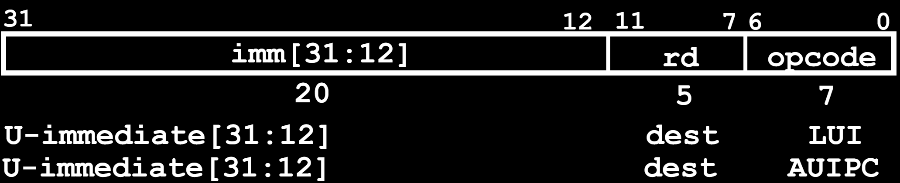
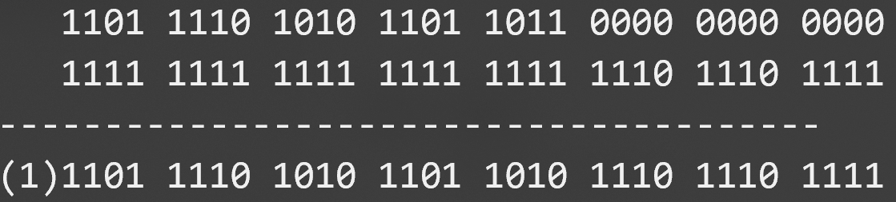

# 12.2-Upper Immediates(U-Format)


Lecture Video Address


***

在前面的Format中，我们将Immediates限制为12bits，现在来讨论如何使用32位的立即数

## Questions on PC-addressing

Does the value in branch immediate field change if we **move the code**?

> 在branch指令中，使用的是PC相对寻址，所以关键要看这个相对值是否改动，Immediate field就是偏移量

* If moving individual lines of code, then yes（如果仅仅移动了一条指令，不论是跳转指令还是Label，那么相对位置就会改变，因此需要改变Immediate）
* If moving all of code, then no ('position-independent code')(但是如果整体移动了，那么相对位置就保持不变，不用改动Immediate)

> 我们经常要处理的就是可以移动的代码，大多数的编译是由汇编程序进行的，并且经常会链接不同的过程和外界的库，所以代码可能会在内存中移动。
>
> 但这也是PC相对寻址的好处了，可以很好地应对代码移动的问题（相对于绝对寻址），所以，这种方式也被成为`position-independent code`

另一个问一就是，branch指令是有范围的，因为偏移量的长度只有13bit，范围被限制在了±1024( $$2^{12}$$ / 4 = $$2^{10}$$ )条指令，如果超出了这个范围该怎么办

* Other instructions save us

这是原先的指令，跳转的Label太远了，超出了范围

```assembly
beq x10, x0,far
# next instr
```

> 当x10 与 x0的内容相等时，跳转

可以使用j指令来实现

```assembly
bne x10,x0,next
j far
next: # next instr
```

1. 翻转判断条件，此时是如果x10与x0不等，就跳转到next（虽说是跳转，但是逻辑上是执行下一行指令）
2. 否则（也就是`beq x10, x0`），那么`j far`

由此使用j指令来进行大范围的跳转。

那么j指令为什么能有更大的立即数范围呢？

## U-Format for "Upper Immediate" Instructions

下面是一个支持更长的立即数的Format，也就是U-Format，其表示upper immediate instructions，也叫作long immediates

> 在I-Format，S-Format，B-Format，都是通过重新利用funct7和一个寄存器的位置来表示12位的立即数。
>
> 但是如果我们想加载32位的操作数到寄存器中，那么我们还缺少20位。
>
> 所以U-Format就提供一种方式用来得到这缺少的20位到寄存器中。

如下



<figure><figcaption><p>U-Format</p></figcaption></figure>

Has 20-bit immediate in upper 20 bits of 32-bit instruction word

One destination register, rd（表示目的寄存器）

Used for two instructions（对应着opcode也有两种，当然也只有这两种）

* `lui` – Load Upper Immediate(到目的寄存器并且留下低位的12bits，也就是重置低位的12位为0)

> Upper的意思就是高位的意思，`lui`是load upper immediate的意思。
>
> lui有点类似于lw，都是直接加载数字到寄存器，但是lui是加载立即数（之前我们还未曾学习过加载立即数到寄存器）

* `auipc` – Add Upper Immediate to PC(并且将结果存储在目的寄存器中)

## LUI to Create Long Immediates

### load 32-bits immediate

> 下面我们来讨论LUI的作用

LUI writes the **upper** 20 bits of the destination with the immediate value, and **clears the lower 12 bits**.

Together with an `addi` to set low 12 bits, can create any 32-bit value in a register using two instructions (`lui`/`addi`).

> 也就是说，如果要加载32位的整数，我们需要将其分割成两部分，一部分是20位，由lui加载；另一部分是12位，由addi来添加

下面是加载32位整数到寄存器的例子

```assembly
lui x10, 0x87654 # x10 = 0x87654000
addi x10, x10, 0x321 # x10 = 0x87654321
```

1. lui加载了前20位(前五位nibble)，并清除了最后12位(最后三个nibble)，得到了0x8765400
2. 然后0x8765400 + 0x321 = 0x87654000 + 0x00000321 = 0x87654321

> 这里就要注意了，在进行相加的时候，对于0x321，要进行sign-extension然后才能加入到加法器当中。

### catch: sign-extension

但是这里有一个陷阱(catch)

How to set **0xDEADBEEF**?

```assembly
lui x10, 0xDEADB # x10 = 0xDEADB000
addi x10, x10, 0xEEF # x10 = 0xDEADAEEF
```

分析：

1. lui结果没问题
2. addi 0xEEF的时候，是会先进行sign-extension，EEF的MSB是1，那么扩展后就是0xFFFFFEEF
3. 最终的结果upper Immediate的最后一个nibble-1，由B变为了A

> 运算的过程如下
>
> 
>
> 一个数与全1相加之后，相当于-1。因为在2's complement中，全1就表示-1

所以现在就出现了一个问题，如果addi，且Immediate的MSB是1的话，那么会由于sign-extension使得upper Immediate -1

> addi12-bit immediate is always sign-extended, if top bit is set, will subtract -1 from upper 20 bits

***

那么有没有addi的无符号版本呢？这样就不会进行sign-extension了。答案是没有

> 因为在addi所属的I-Format中，我们已经用尽了funct3所有的表示，没有空间位其他的指令了。所以没有addi的无符号版本。

所以只能用现有的指令实现。

### solution

**Pre-increment value placed in upper 20 bits, if sign bit will be set on immediate in lower 12 bits.**

在执行lui的时候，直接在本要加载的upper Immediate的基础上，在最后一个nibble上+1，从而抵消由于sign-extension导致的-1，如下

How to set 0xDEADBEEF?

```assembly
LUI x10, 0xDEADC # x10 = 0xDEADC000
```

这里原本是`lui x10, 0xDEADB`，现在+1得到了0xDEADC

```assembly
ADDI x10, x10, 0xEEF # x10 = 0xDEADBEEF
```

最终得到了正确的结果

### pseudo-insturction: li

之前只有lui能加载20bits的Immediate，现在可以加载32位了。

因此提供了一个微指令，执行上述的两个步骤

Assembler pseudo-op handles all of this:

```assembly
li x10, 0xDEADBEEF # Creates two instructions
```

## AUIPC

Adds upper immediate value to PC and places result in destination register

> 这样我们可以将偏移量添加到PC当中，并且是32-bits，添加了upper immediates，然后addi即可。

Used for PC-relative addressing

还有一个用处，如下

```assembly
Label: AUIPC x10, 0 # Puts address of Label in x10
```

这里将PC+0加载到x10中，本质上就是将当前的指令地址存储在PC中，这是返回地址。
