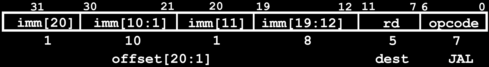
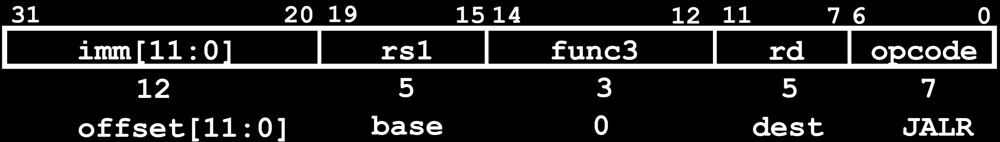

# 12.3-J-Format-Layout


Lecture Video Address


***

只有一个jump instruction，jal(jump and link), 其他的都是在此基础上的伪代码。

## J-Format for Jump Instructions

Format格式如下



> 要写的寄存器都是目的寄存器，要读的寄存器都是源寄存器

1. 20位long immediate，用来表示offset
2. 一个目标寄存器，用来存储地址
3. opcode表示是J-Format类型的指令（当然只有一个JAL）

这里的Immediate是被打乱的，和B-Format的原因很类似，因为我们希望J-Format的行为和branch很像。

jal做了什么？

1. jal将下一个指令（也就是PC+4）保存到了目标寄存器，这也是return返回的地址。
2. 并且将PC设置为PC+offset（PC相对寻址）

> Assembler "j" jump is pseudo-instruction, uses JAL but sets rd=x0 to discard return address
>
> j指令本质上就是jal，只不过目的寄存器为x0，所以其所做的事情仅仅是设置PC进行跳转

关于jal的范围，是21bits，这里遵守了和B-Format相同的约定（RISC-V有compressed instructions），所以偏移量最后会默认×2，也就是说最后一位固定为0，就不用保存了

所以最终跳转的指令范围为± $$2^{19}(2^{20} / 2)$$，也就是± $$2^{18}$$ 32-bit instructions

***

还有一点要记住

Immediate encoding optimized similarly to branch instruction to <mark style="background-color:green;">**reduce hardware cost**</mark>

> 打乱了Immediate的顺序，让其与其他的指令使用非常接近的结构来节省硬件开销。

## Uses of JAL

`jal`指令的例子如下

```assembly
# j pseudo-instruction
j Label = jal x0, Label # Discard return address
```

`j Label`本质上就是`jal x0, Label`，但是仅仅使用了其跳转的功能（也就是设置PC=PC+offset的功能），并没有将next instruction的地址保存在某个寄存器中

```assembly
# Call function within 218 instructions of PC
jal ra, FuncName
```

另一个就是`jal`指令

1. 将下一个指令的地址（通常也是Func的返回地址）保存在`ra`中（在RISC-V中，ra是固定保存返回地址的，ret本质也是`jr ra`）
2. 然后设置PC=PC+offset进行跳转

> 使用J-Format的也就这两个指令了

## JALR Instruction (I-Format)

> jalr(jump and link register)

jalr是另一个`jump instruction`，但是前面又说了，使用J-Format的只有jal，为什么呢？

因为`jalr`是I-Format的，其需要一个源寄存器，一个目的寄存器

格式如下



jalr的指令格式如下

```assembly
jalr rd, rs, immediate
```

执行的任务如下（主要做了两件事）

* Writes PC+4 to rd (return address)
* Sets PC = rs + immediate（聚堆地址）
* Uses same immediates as arithmetic and loads
  * no multiplication by 2 bytes
  * In contrast to branches and jal

> 与jal或者branch指令不同，这里的rs+Immediate的立即数是不需要×2的，我们不能假设LSB是0，也就是说，可以跳转到奇数地址。当然，跳转的范围就减少了。我们总是将最低位设置为0，以便总是跳转到偶数地址。
>
> 这个指令实现了跳转到绝对地址。

## Uses of JALR

应用如下

```assembly
# ret and jr psuedo-instructions
ret = jr ra = jalr x0, ra, 0
```

在ret的时候，就不能使用相对寻址了，所以这里是绝对寻址

```assembly
# Call function at any 32-bit absolute address
lui x1, <hi20bits>
jalr ra, x1, <lo12bits>
```

这里就是进行长距离绝对跳跃

```assembly
# Jump PC-relative with 32-bit offset
auipc x1, <hi20bits>
jalr x0, x1, <lo12bits>
```

长距离相对跳跃
