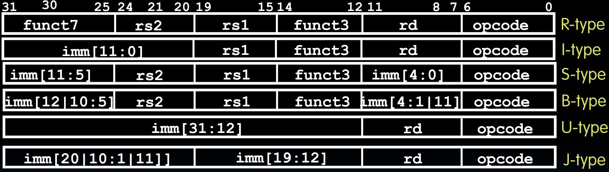
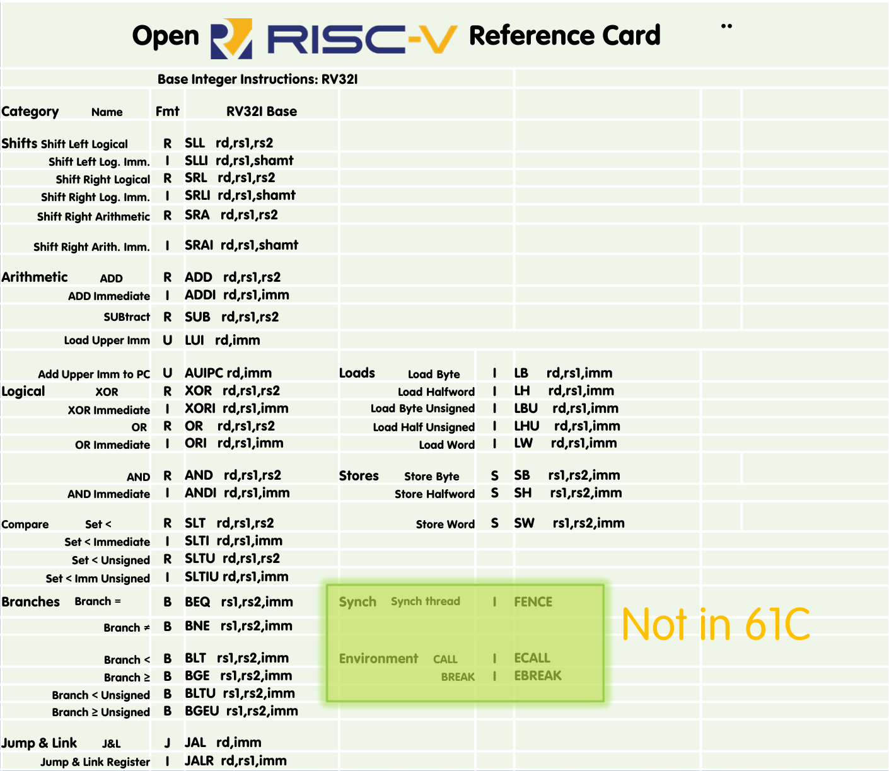

# 12.4-Summary


Lecture Video Address


## Summary of RISC-V Instruction Formats

我们已经讲述了RV32版本中遇到的所有六种指令类型，涵盖了所有的整数操作。如下

可能会有不同的扩展对应不同的指令，但这是一个足够好的base，可以让我们将任何C程序编译到这个平台上。

这里可以看到的原则是，我们为了硬件设计的便利性而打乱了部分立即数的顺序，牺牲了一些立即数的可读性。事物总是放置在同一个位置。寄存器总是放置在相同的位置，以便处理器或硬件更容易找到它们。同样，所有的立即数都被放置、对齐，以便处理器通常能够在同一个位置找到它们。这将使设计更容易，使硬件运行更快，这就是我们需要记住这些指令的工作原理所增加的任何复杂性所值得的。

## Complete RV32I ISA!

RISC-V规范已经发生了很多变化。在过去的十年中，自项目启动以来，我们见证了许多版本。但有一件非常令人兴奋的事情是，RISC-V的基础和几个扩展已经得到了批准。这意味着社区已经接受了它们，并且它们将永远保持不变。它们不会改变。

有一个小问题。有很多东西是基于RISC-V的(?)规范的，包括Patterson和Hennessy的教科书。因此，我们在教科书中找到的一些内容与今天的情况并不完全相同。这本教科书大约是两三年前的了，事情已经发生了变化。但它们将来不会再改变。区别实际上非常小。其中一些编码已经改变了，一些命名也改变了。但总的原则保持不变。

所以我们这里有的是RISC-V RV32I ISA中所有基本指令。

我们还没有涵盖三条对于环境调用、通常操作系统支持和运行多个线程有用的指令。我们现在不需要那些。

目前，我们可以用现有的指令集运行任何C程序。这将使我们能够穿过我们的计算系统构建堆栈，从C开始，然后是汇编语言、机器语言，现在我们真正理解了ISA。

后面，在我们了解了如何构建、如何编译、汇编、链接和加载之后，我们将开始实际构建能够执行所有这些操作的硬件。
