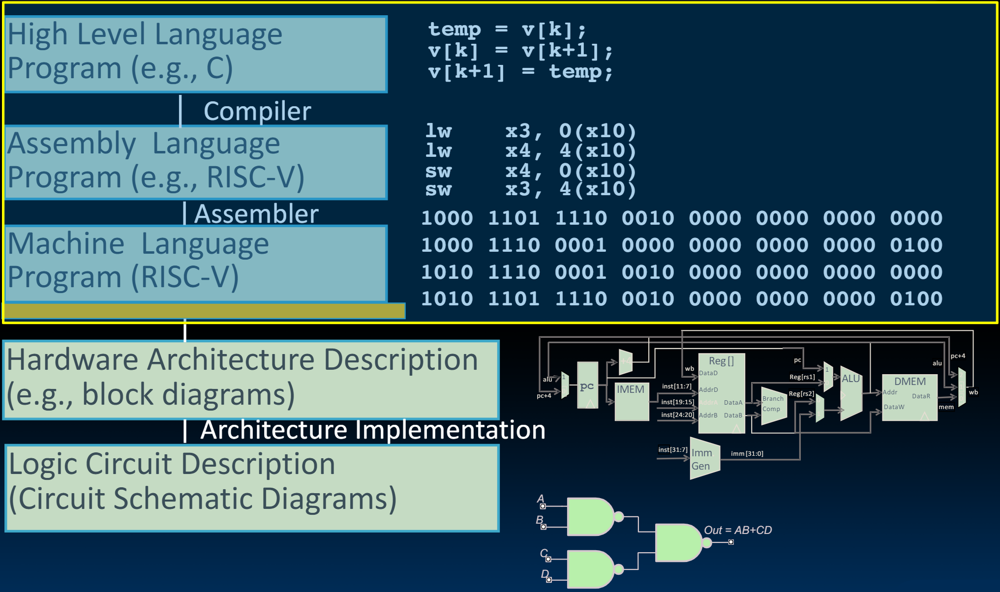
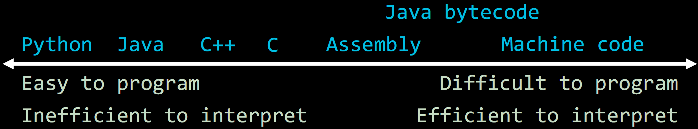
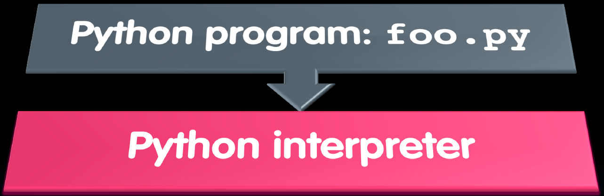

# 13.1-Interpretation vs Translation


Lecture Video Address


## Great Idea #1: Abstraction (Levels of Representation/Interpretation)

前面几节已经学习了上面三层，本节课要将上面三层连起来，从高级语言到汇编语言，再到机器语言，讨论程序是如何运行起来的

## Language Execution Continuum

解释是程序运行的方式之一

Interpreter is a program that executes other programs

我们将语言视为一个continuum，比较不同语言的特性

* 左边的语言很容易编程，但是执行起来效率就比较低(Python < Java < C++ < C)
* 右边的语言很难编程，特别是没有计算机的情况下。但是解释的效率很高。

1. Machine code是最难编程的，最早的电子计算机ENIAC就是machine code
2.  这里列出了Java bytecode，可以看出这是比较高效的

    > C和C++都会编译为machine code，这个的效率是最高的，Java最多编译为Java bytecode，然后进行解释，速度不及Machine code，但也可以了
3. Python可以在任意的计算机上运行，（只要解释器可以在计算机上运行即可），所以编写Python的人不大需要考虑语言兼容性的问题

Language translation gives us another option——Compilation

> 以上面的刻度线为例，编译就是将靠左的语言翻译成靠右的语言。并且要注意：
>
> 1. 所有的语言都可以解释（包括Java源码，C源码，虽然现实中都是对源码进行编译）
> 2. 所有的语言也都可以编译，但是一般都是向着右边翻译

When to choose? In general, we

* 当不考虑性能的时候，我们通常对高级语言进行**解释**
* 如果要提高性能，一般将高级语言翻译成低级语言

### Interpretation vs Translation

所以现在就有了两种运行程序的方式了

* Interpreter: Directly executes a program in the source language
* Translator: Converts a program from the source language to an equivalent program in another language

## Interpretation

For example, consider a Python program `foo.py`

Python interpreter is just a program that reads a python program and performs the functions of that python program

### Why interpret mahcine code

也就是说machine code也是可以和高级语言一样进行解释的

1. 想要模拟仿真的时候，需要解释machine code

例如，VENUS RISC-V simulator useful for learning/debugging

> 以下是ChatGPT关于VENUS的介绍
>
> VENUS RISC-V Simulator 是一个基于 JavaScript 的 RISC-V 指令集架构（ISA）模拟器。它用于教育目的，特别是在计算机科学和计算机工程课程中，帮助学生理解和学习 RISC-V 架构和汇编语言。以下是一些关于 VENUS RISC-V 模拟器的主要特征和功能：
>
> 1. **在线模拟器**：VENUS 是一个基于浏览器的在线模拟器，可以直接在网页上运行，无需安装任何软件。这使得它非常方便用于教学和学习。
> 2. **RISC-V 汇编语言支持**：VENUS 支持 RISC-V 的 RV32I 指令集，可以用来编写、运行和调试 RISC-V 汇编程序。
> 3. **交互式调试**：VENUS 提供了交互式调试功能，包括单步执行、断点设置、寄存器和内存查看等，帮助用户更好地理解程序的执行过程。
> 4. **教育工具**：由于其易用性和交互性，VENUS 常用于大学和其他教育机构的计算机体系结构课程，帮助学生掌握底层计算机架构和汇编编程的基本概念。
> 5. **开源项目**：VENUS 是一个开源项目，源代码可以在 GitHub 上找到，允许用户和开发者对其进行扩展和修改。
>
> 如果你想尝试使用 VENUS RISC-V 模拟器，可以访问以下链接：[VENUS RISC-V Simulator](https://venus.cs61c.org/)。

我们要模拟一个可以执行RISC-V的软件，这时候需要解释machine code

2. 可以将一种ISA转化为另一种ISA（如果你想使你的代码向后兼容）

例如：Apple Macintosh conversion

假设我们希望从Motorola 680x0 ISA移植到PowerPC，可能需要所有程序的源代码都需要重新翻译。这很麻烦，但是可以通过翻译machine code实现。

假设我们有支持新的ISA的硬件，但是有运行在旧的ISA上的machine code，希望彼此可以兼容，一个办法就是解释这个old ISA，也就是在new ISA上使用解释器来解释old ISA，从而可以让old ISA软件运行在new ISA硬件上面，从而实现了系统的向后兼容。

这就是模拟器(emulator)的作用，模拟器接受旨在直接在硅片上运行的低级代码，并假装你在软件中并对其进行模拟、解释，并假装你正在运行该硬件

> 这也是abstraction的一种体现

我不知道我是在解释器上运行还是在裸硅上运行。 只要能正常工作就好。 当我给它一个加法运算时，它会执行加法。 现在，是软件在执行这个操作，还是硬件在执行加法呢？ 从程序的角度来看，我们并不关心。所以，如果你解释另一种指令集，能够保持向后兼容性就非常好。编写解释器也容易得多。

## Interpretation vs. Translation

### The advantage of interpretation

1. 解释器更接近高级语言，意味着可以得到更好的错误信息，也便于debug（例如VNNUS）。
   *   Translator reaction: add extra information to help debugging (line numbers, names)

       > 如果从"编译器、汇编器、链接器和加载器"的角度来看，那么可以添加额外的信息。当把代码编译下来时，可以做个标记，记录下是哪一行（有错误），将其添加到我传递给下一代(比如编辑器传给汇编器可以接受的信息，汇编器传给链接器可以接受的信息)，运行时，如果出现错误，就可以反馈这些信息。
       >
       > 总之就是发现错误后，translator会一直往下传，传到底部后再往上反馈错误
2. 解释器是非常慢的，所以一般在两种情况下使用解释器：
   * 不考虑性能时
   * 解释其他的ISA以实现系统的向后兼容性
3. 解释器的代码要小得多（相比于编译器）。
4. 另一点是解释器提供指令独立性，也就是说解释型语言可以在任意的机器上运行，不用关心在什么硬件上。

### The advantage of translation/compilatioin

1. Translated/compiled code almost always more efficient and therefore higher performance:
   * Important for many applications, particularly operating systems
2. Translation/compilation helps "hide" the program "source" from the users:
   * One model for creating value in the marketplace (e.g., Microsoft keeps all their source code secret)
   * （但也有另一种观点）Alternative model, "open source", creates value by publishing the source code and fostering a community of developers.
