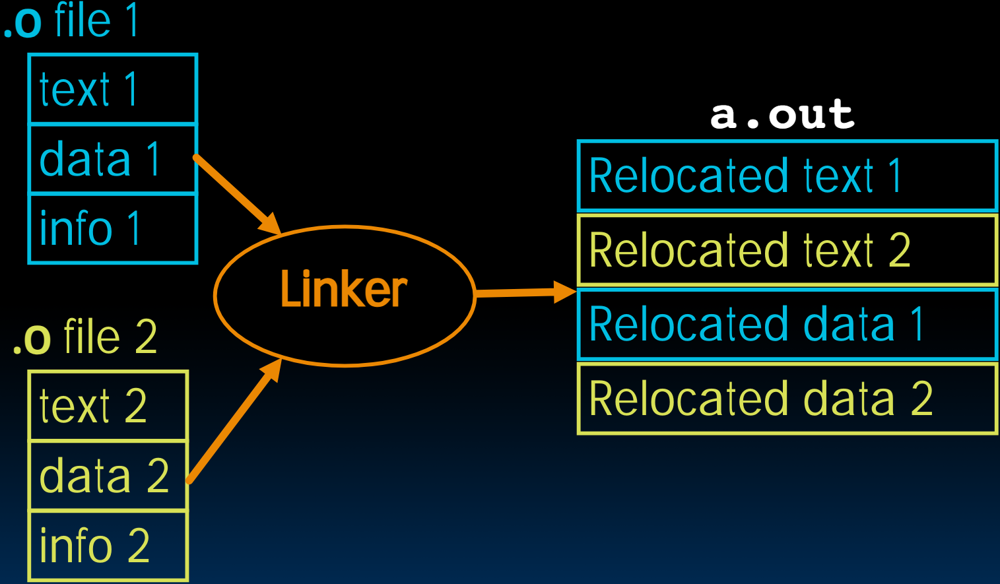

# 13.4-Linker


Lecture Video Address


Linker链接器的作用就是将多个`.o` Object file链接在一起

## Linker

- Input: Object code files, information tables (e.g., `foo.o`,`libc.o` for RISC-V)
- Output: Executable code (e.g., `a.out` for RISC-V)

> 一种可执行文件是对应着ISA架构的，在x86上的可执行文件不一定能在ARM上执行；ISA和操作系统不是一回事，操作系统也是建立在ISA上的

- task: Combines several object (.o) files into a single executable (这个过程叫做"linking")

那么为什么需要Linker呢？

Enable separate compilation of files

> 让每个小文件都能单独编译和汇编

- Changes to one file do not require recompilation of the whole program(Linux source > 20 M lines of code!，Photoshop也是非常大的)

> 这在之前也提到过，将不同模块分开为不同的文件，这样修改这一个文件的时候仅仅需要重新编译一个文件，不需要重新编译

Old name "Link Editor" from editing the "links"  in jump and link instructions（Linker的以前的名字叫做Link Editor，因为这个过程做的事情就是修补relocation table的Link）

## Steps of Linking

> info包括symbol table，relocation table，debugging information

- Step 1: Take text segment from each .o file and put them together
- Step 2: Take data segment from each .o file, put them together, and concatenate this onto end of text segments
- Step 3: Resolve references
    - Go through Relocation Table; handle each entry
    - I.e., fill in all **absolute addresses**

> Linker得到的是`a.out`可执行文件，即上图中右边的是一个文件，分为relocated text和relocated data两个部分

那么有哪些是绝对地址呢？

## Four Types of Addresses

下面是一些常见的地址类型

| types of address            | intructions                         | relocate?                                               |
| --------------------------- | ----------------------------------- | ------------------------------------------------------- |
| PC-Relative Addressing      | `beq`, `bne`, `jal`; `auipc`/`addi` | Never need to relocate (PIC: Position-Independent Code) |
| Absolute Function Address   | `auipc`/`jalr`                      | Always relocate                                         |
| External Function Reference | `auipc`/`jalr`                      | Always relocate                                         |
| Static Data Reference       | `lui`/`addi`                        | Always relocate                                         |

## Absolute Addresses in RISC-V

Which instructions need relocation editing?

> 以下是一些需要修改绝对地址的指令；（Link的时候修改地址是作用在汇编后得到的二进制代码的，也就是直接更改指令的二进制值）

J-format: jump/jump and link

I-,S- Format: Loads and stores to variables in static area, relative to global pointer

> 如果lw和sw都是要基于某个源寄存器的，如果这个源寄存器是global pointer，那么就需要relocate

What about conditional branches?

PC-relative addressing preserved even if code moves（这个不需要进行修改）

## Resolving References

Linker assumes first word of first text segment is at address 0x10000 for RV32（也就是前面有64K的地址）

- (More later when we study "virtual memory"

> 再上面是text1, text2, text3，再上面是data1, data2, data3... 再上面就是Heap，Stack了

Linker knows:

- Length of each text and data segment（就是上面每一段的长度）
- Ordering of text and data segments

Linker calculates:

- Absolute address of each label to be jumped to (internal or external) and each piece of data being referenced

To resolve references:

- Search for reference (data or label) in all "user" symbol tables
- If not found, search library files (e.g., for `printf`)
- Once absolute address is determined, fill in the machine code appropriately

> 在这个过程中，可能会出现冲突的名字，compiler和Assembler是并不知道这个问题的，(因为这两个仅仅负责处理各自的文件)，当Linker在进行链接的时候才会发现这个问题，在查询symbol table的时候，会发现两个相同的symbol，从而报错。

Output of linker: executable file containing text and data (plus header)

## Static vs. Dynamically Linked Libraries

### static linked library

What we've described is the traditional way: statically-linked approach

> 以上我们所说的都是static Linked executable，也就是说load所有的data和text，然后将他们读放在一起。

问题如下：

- Library is now part of the executable, so if the library updates, we don't get the fix (have to recompile if we have source)

> 举一个极端的假设，所有的Apple，MacOS的源代码都引用一个关键的library，那么这个library更新的时候，那么需要重新编译整个系统，然后每个用户的每个app都需要重新进更新

- Includes the entire library even if not all of it will be used

- 一个可执行文件(即`a.out`会太大)

- 每次更新一个lib，需要重新compile整个可执行文件

- **advantage**: Executable is self-contained

> “Self-contained” 指的是一个系统、模块或程序具备独立运行的能力，不依赖于外部资源或组件。这意味着它包含了完成特定任务所需的所有元素或信息，能够在自身的环境中独立工作，不需要额外的依赖或外部输入。
>
> 在编程和软件开发中，“self-contained” 的应用场景包括但不限于以下几点：
>
> 1. **模块化编程**：一个自包含的模块可以在没有外部依赖的情况下运行，并且其内部逻辑和数据是独立的。这种设计有助于提高代码的可维护性和可复用性。
>
> 2. **文档或教程**：一个自包含的文档或教程包含了所有必要的背景信息、说明和资源，使读者不需要查找外部参考资料就能理解和完成任务。
>
> 3. **测试用例**：自包含的测试用例具有所有执行测试所需的输入数据和设置，不需要依赖外部的测试环境或数据。
>
> 4. **应用程序**：自包含的应用程序（例如某些便携式软件或独立应用）不需要安装额外的库或工具，可以直接运行。
>
> 通过设计自包含的系统或组件，可以减少依赖管理的复杂性，提升系统的稳定性和可靠性。

---

> 下面是ChatGPT的解释
>
> 静态链接库（Static Linked Library，SLL）是一种在编译时将库中的代码直接复制到目标程序中的文件。静态链接库的文件通常以`.lib`（Windows）或`.a`（Unix/Linux）为扩展名。与动态链接库不同，静态链接库在程序运行时不需要额外的库文件，因为所有需要的代码在编译时已经包含在可执行文件中。
>
> 以下是静态链接库的主要特点和优点：
>
> 1. **独立性**：静态链接库将所需的库代码包含在生成的可执行文件中，因此在运行时不需要额外的库文件，这使得程序更加独立。
>
> 2. **性能**：因为静态链接库的代码在编译时已经包含在可执行文件中，所以程序在运行时不需要动态加载库文件，这可以减少运行时的开销，提高性能。
>
> 3. **部署方便**：使用静态链接库的程序在部署时不需要担心目标系统是否安装了所需的库，因为所有需要的代码已经包含在可执行文件中。
>
> 4. **版本控制**：静态链接库的版本控制相对简单，因为程序在编译时就已经确定了使用的库版本，不会在运行时受到外部库版本的影响。
>
> 然而，静态链接库也有一些缺点：
>
> 1. **文件大小**：由于静态链接库的代码被复制到每个使用它的可执行文件中，这会导致可执行文件的大小增加。
>
> 2. **内存使用**：在运行多个使用相同静态链接库的程序时，每个程序都有一份库代码的拷贝，这会增加内存的使用。
>
> 3. **更新困难**：如果静态链接库中的代码需要更新，则需要重新编译所有使用该库的程序，这相比动态链接库更新更加繁琐。
>
> 总的来说，静态链接库适用于那些对独立性和性能有较高要求的场景，而动态链接库则更适合需要代码重用和模块化设计的场景。

### dynamically linked library

Alternative is dynamically-linked libraries (DLL), common on Windows & UNIX platforms

> 动态链接库（Dynamic Link Library，DLL）是一种包含可以由多个应用程序同时使用的代码和数据的文件。与静态链接库（Static Link Library，静态库）不同，动态链接库在**运行时**被**加载**到内存中，而不是在编译时链接到应用程序。从而节省内存和硬盘空间，并促进代码重用和模块化设计。
>
> 动态链接库通常以`.dll`（在Windows操作系统中）、`.so`（在Unix和Linux操作系统中）或`.dylib`（在macOS操作系统中）为后缀。
>
> 动态链接库的特点和优势
>
> 1. **共享代码**：多个程序可以同时使用同一个动态链接库中的代码，这样就可以减少代码冗余，节省内存和磁盘空间。
> 2. **模块化设计**：程序可以分成多个模块，每个模块作为一个独立的动态链接库。这种设计方式有助于代码的维护和更新，因为可以独立更新某个模块而不需要重新编译整个程序。
> 3. **延迟加载**：动态链接库允许程序在需要时才加载特定的库，这样可以加快程序的启动速度和减少内存消耗。
> 4. **版本控制**：通过使用动态链接库，可以轻松更新和替换特定模块，而不需要重新部署整个应用程序。
> 5. **多语言支持**：动态链接库可以用不同的编程语言编写，只要它们遵循相同的调用约定，这样可以更灵活地开发和集成多语言项目。
>
> 在Windows操作系统中，动态链接库通常以`.dll`为文件扩展名，而在Linux和Unix系统中，则通常以`.so`（Shared Object）为扩展名。在macOS系统中，动态链接库则以`.dylib`为扩展名。
>
> 动态链接库通过在运行时加载和共享代码和资源，提高了内存使用效率，促进了代码重用和模块化开发，同时也简化了应用程序的更新和维护。

#### Advantages

1. Space/time issues
    - Storing a program requires less disk space
    - Sending a program requires less time
    - Executing two programs requires less memory (if they share a library)

> 所以有些程序设计大赛可以设计出非常小的代码来实现很大的功能，都是在调用系统的.dll文件库。但是在实际运行的时候，仍然需要加载这些库。

2. Upgrades
    - Replacing one file (`libXYZ.so`) upgrades every program that uses library "`XYZ`"

#### donwsides

- At runtime, there's time overhead to do link
- Having the executable isn't enough anymore(就是如果dll出了问题的话，即使不动这个Executable，可执行文件就不能独立运行了)

> Overall, dynamic linking adds quite a bit of complexity to the compiler, linker, and operating system. However, it provides many benefits that often outweigh these

#### summary

Prevailing approach to dynamic linking uses machine code as the "lowest common denominator"

> 当前对动态链接的主流方法是使用机器代码作为“最低公分母”，也就是动态链接库一般都是机器代码，并不是语言。所以也就是在load的过程中使用这个库

- Linker does not use information about how the program or library was compiled (i.e., what compiler or language)
- Can be described as "linking at the machine code level"
- This isn't the only way to do it ...

> 动态链接的作用在load的时候体现，静态链接在Link的时候体现
