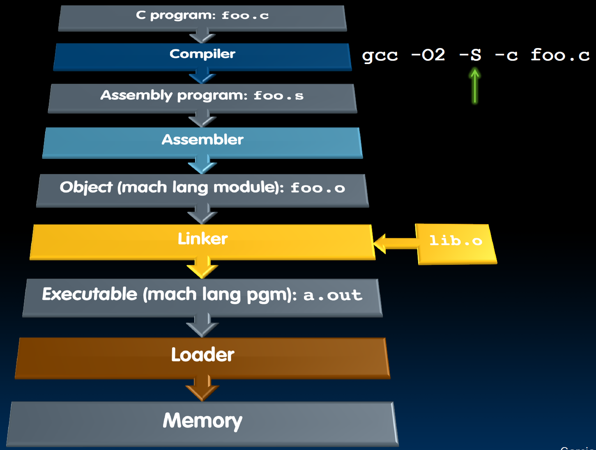

# 13.5-Loader


Lecture Video Address


我们已经得到了a.out并保存在硬盘中(在Link的时候使用的是statically linking)，本节介绍怎么将其加载到内存当中并运行

## Loader Basics

- Input: Executable Code (e.g., `a.out` for RISC-V)
- Output: (program is run)

Executable files are stored on disk

When one is run, loader's job is to load it into memory and start it running

In reality, loader is the operating system (OS)

- Loading is one of the OS tasks

> 在本课程中只是简单介绍Loader的作用是什么，一般担任Loader任务的是OS，具体OS怎么做，本课程并不过多讨论。

## Loader … What Does It Do?

下面是Loader的一般步骤

1. Reads executable file's header to determine size of text and data segments

2. Creates new address space(in virtual memeory) for program large enough to hold text and data segments, along with a stack segment(stack用于存储参数)

3. Copies instructions + data from executable file into the new address space

4. Copies arguments passed to the program onto the stack(程序执行使用命令行，可能有命令行参数，将参数复制到Stack当中，因为不知道参数到底有多大，参数名称可能非常长，超过了寄存器的容量，不能将其直接放在寄存器当中)

5. Initializes machine registers

    - Most registers cleared, but stack pointer assigned address of 1st free stack location

6. Jumps to start-up routine that copies program's arguments from stack to registers (一般是main函数，一般也有两个参数，main的argc和argv，分别拷贝到`a0`和`a1`)& ==**sets the PC**==

    - If main routine returns, start-up routine terminates program with exit system call

> 程序的参数是保存在Stack的，即使是main的参数，是由命令行来的，也是要保存在Stack当中
