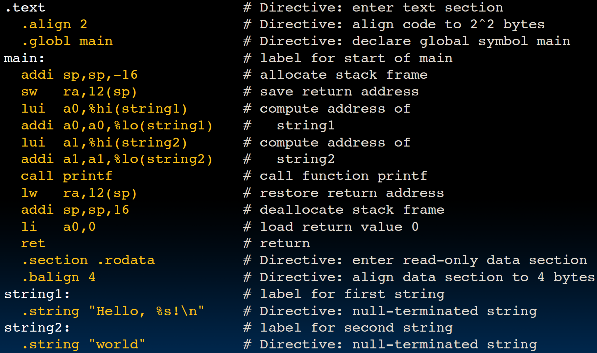
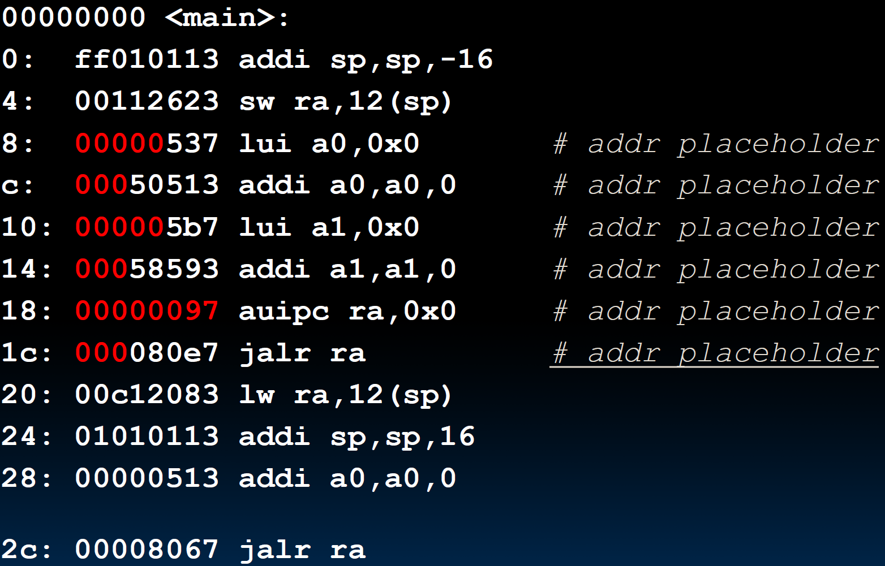
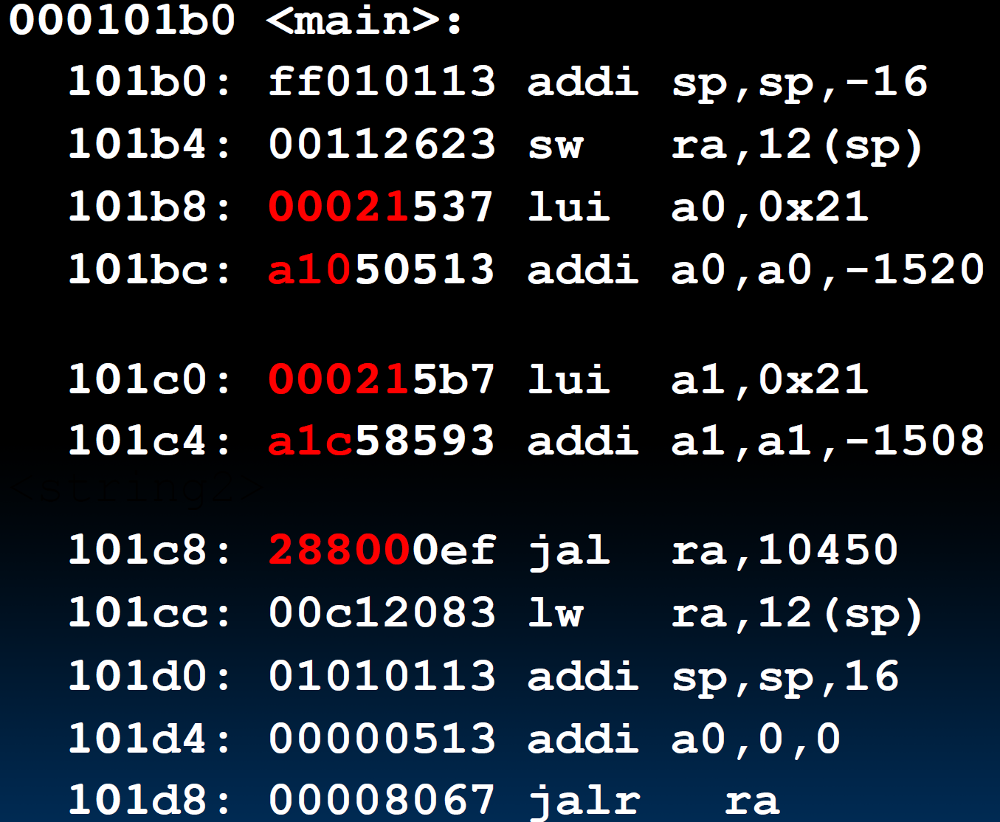

# 13.6-Example


Lecture Video Address


## Example C Program: Hello.c

```c
#include <stdio.h>
int main(){
    printf("Hello, %s\n", "world");
    return 0;
} 
```

本节我们会以这个程序为例演示程序是如何从源代码到可以执行的程序的。这里是没有`argc`和`argv`的

## Compiled Hello.c: Hello.s



```assembly
.text # Directive: enter text section
    .align 2 # Directive: align code to 2^2 bytes
    .globl main # Directive: declare global symbol main
main: # label for start of main
    addi sp,sp,-16 # allocate stack frame
    sw ra,12(sp) # save return address
    lui a0,%hi(string1) # compute address of string1
    addi a0,a0,%lo(string1) 
    lui a1,%hi(string2) # compute address of string2
    addi a1,a1,%lo(string2)
    call printf # call function printf
    lw ra,12(sp) # restore return address
    addi sp,sp,16 # deallocate stack frame
    li a0,0 # load return value 0
    ret # return
    .section .rodata # Directive: enter read-only data section
    .balign 4 # Directive: align data section to 4 bytes
string1: # label for first string
	.string "Hello, %s!\n" # Directive: null-terminated string
string2: # label for second string
	.string "world" # Directive: null-terminated string
```

下面是请ChatGPT添加的注释

```assembly
.text                    # 指示接下来的代码是程序代码
    .align 2            # 将对齐到 2 的倍数的地址（因为RISC-V有compressed instructions，在branch指令中，跳转的step也是2的倍数而不是4的倍数）
    .globl main         # 声明 main 函数为全局符号，可以被外部引用
main: 
    addi sp,sp,-16      # 为栈帧分配 16 字节的空间，减少栈指针
    sw ra,12(sp)        # 将返回地址保存到栈帧中
    lui a0,%hi(string1) # 将 string1 的高 20 位加载到寄存器 a0 中
    addi a0,a0,%lo(string1) # 将 string1 的低 12 位加载到寄存器 a0 中，得到 string1 的完整地址
    lui a1,%hi(string2) # 将 string2 的高 20 位加载到寄存器 a1 中
    addi a1,a1,%lo(string2) # 将 string2 的低 12 位加载到寄存器 a1 中，得到 string2 的完整地址
    call printf         # 调用 printf 函数，打印字符串
    lw ra,12(sp)        # 从栈帧中恢复返回地址
    addi sp,sp,16       # 释放栈帧，增加栈指针
    li a0,0             # 将立即数 0 加载到寄存器 a0 中，表示程序返回值为 0（a0不仅仅表示第一个参数，还表示返回值）
    ret                 # 返回调用者
    .section .rodata    # 指示接下来的代码是只读数据段
    .balign 4           # 将对齐到 4 的倍数的地址(数据是字对齐)
string1: 
    .string "Hello, %s!\n" # 定义字符串 "Hello, %s!\n"
string2: 
    .string "world"     # 定义字符串 "world"
```

在`call printf`之前，已经将参数保存在`a0`和`a1`了，在调用的时候会自动读取这两个寄存器作为参数，这里printf使用的是两个字符串的地址

## Assembled Hello.s: Linkable Hello.o

汇编的任务：

1. 第一次pass将伪指令用真实指令替换
2. 第二次pass标注Label的位置
3. 第三次pass将指令转换成机器语言。

如下是汇编后的结果



右边的RISC-V instruction是对应的指令；`:`左边的是地址，都是以4对齐(但是按理说是存在2对齐的)，这些都不是.o文件中应该有的内容。

只有二进制的是文件中有的，如下

```
ff010113 
00112623 
00000537 
00050513 
000005b7
00058593
00000097
000080e7
00c12083
01010113
00000513
00008067
```

解释上面中的一些指令

```assembly
00000000 <main>:
0: ff010113 addi sp,sp,-16
4: 00112623 sw ra,12(sp)
8: 00000537 lui a0,0x0 # addr placeholder, 这里的一些地址无法在汇编的时候确定，因此前面5个nibble用0代替
c: 00050513 addi a0,a0,0 # addr placeholder，同理，无法确定位置，前面3个nibble用0代替，与上一条指令总共是8个nibble
10: 000005b7 lui a1,0x0 # addr placeholder
14: 00058593 addi a1,a1,0 # addr placeholder
18: 00000097 auipc ra,0x0 # addr placeholder，这里原本是call printf，是伪指令，在第一次pass的时候使用auipc ra替换了，这里应该在ra保存printf地址的前面5个nibble，但是地址无法确定
1c: 000080e7 jalr ra # addr placeholder，保存printf地址的后面3个nibble，但是地址仍然无法确定
20: 00c12083 lw ra,12(sp)
24: 01010113 addi sp,sp,16
28: 00000513 addi a0,a0,0
2c: 00008067 jalr ra
```


## Linked Hello.o: a.out

这里只有一一个文件需要Link，这里关键是进行relocate了



```assembly
000101b0 <main>:
101b0: ff010113 addi sp,sp,-16
101b4: 00112623 sw ra,12(sp)
101b8: 00021537 lui a0,0x21
101bc: a1050513 addi a0,a0,-1520 # 20a10
<string1>
101c0: 000215b7 lui a1,0x21
101c4: a1c58593 addi a1,a1,-1508 # 20a1c
<string2>
101c8: 288000ef jal ra,10450 # <printf>, 28800是printf的地方
101cc: 00c12083 lw ra,12(sp)
101d0: 01010113 addi sp,sp,16
101d4: 00000513 addi a0,0,0
101d8: 00008067 jalr ra
```

## LUI/ADDI Address Calculation in RISC-V

那么如何计算这些地址的呢？以string1为例，上图中的0x21和-1520是怎么来的

1. `string1`的目标地址是`0x00020 A10`(0x00020是高位，A10是低位)

2. 存储string1的指令是 `lui 0x00020`, `addi 0xA10`

3. 但是这样做是有问题的，因为RISC-V中的Immediate总是sign-extended的，addi的0xA10的最高位是1，符号扩展的结果是`0xFFFFF A10`)

    0x00020 000 + 0xFFFFF A10 = 0x0001F A10(这并不是我们预期的0x00020 A10)

4. 所以我们要在lui的时候+1，即`lui` 0x00021；

5. 在`addi`的时候，直接使用了立即数-1520，因为0xFFFFF A10就是-1520

    > 0xFFFFF A10的2's complement是0x00000 5EF + 1 = 0x00000 5F0 = 1520~ten~，所以0xFFFFF A10 = -1520~ten~

6. 最终的指令就是`lui 0x00021`; `addi -1520`

最终得到了`0x00020 A10`

## And In Conclusion

总结一下每一步做了什么

1. Compiler converts a single HLL(high level language) file into a single assembly language file
2. Assembler removes pseudoinstructions, converts what it can to machine language, and creates a checklist for the linker (`relocation table`, `symbol table`, `debugging information`): A .s file becomes a .o file
    - Does 2 passes to resolve addresses, handling internal forward references
3. Linker combines several .o files and resolves absolute addresses
    - Enables separate compilation, libraries that need not be compiled, and resolves remaining addresses
4. Loader loads executable into memory and begins execution
