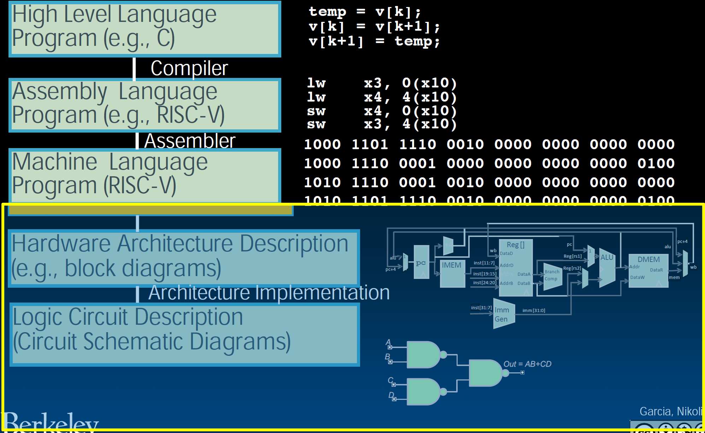

# 14.1-Switches


Lecture Video Address


> Switch(开关)

## Machine Structures

### Old-School Machine Structures

这是以前的机器架构

- Instruction Set Architecture是连接软件和硬件之间的其桥梁
- 在其之上，我们已经通过从上到下的顺序讲述HLL怎么转化成机器语言
- 在其之下，我们将通过从下到上的顺序讲解计算机是怎样实现的

### New-School Machine Structures

新型机器结构有点复杂。你会看到一个仓库级的机器，它被拆分成多台计算机。而每台计算机有多个核心。在其中一个核心中，有一个处理器，这是核心的一部分，包括执行单元、功能单元、内存。而在这些单元内部是主内存，再往里是逻辑门。

因此，当我们谈论左边的并行性时，我们提到有很多内容，在后面的课程中，将会讲授这五个方面中的全部内容。但现在，学习的是第一个方面，即并行硬件描述。

当你说A和B的按位与时，32个并行的与门会同时工作，输出是另一个32位的结果。所以这是一个32位宽的按位与门。那么你如何构建这个？你如何考虑这个？你可能可以想象如何做这个，只需将32个与门组合在一起。但是当操作变得更复杂时，又该怎么办

### Great Idea #1: Abstraction (Levels of Representation/Interpretation)

从本节开始，要学习ISA以下的部分，从逻辑电路到硬件架构

## Synchronous Digital Systems

Hardware of a processor, e.g., RISC-V, is a Synchronous Digital System

Synchronous:

- All operations coordinated by a central clock
- "Heartbeat" of the system!

> 所以4GHz意味着，每秒40亿次，那时钟以方波形式在1和0之间转换。非常令人难以置信，非常非常快。

Digital

- All values represented by discrete(具体的) values
- Electrical signals are treated as 1s and 0s; grouped together to form words

> 这里是将现实世界中的电压和电流模拟值量化为0和1，这就是一个bit的来源。当电流流动时，我们得到一个1。电流不流动时，就是0。

## Why Study Logic Design

Next several weeks: we’ll study how a modern processor is built; starting with basic elements as building blocks

> 之前我们已经学习过如何将HLL转化为machine code，现在我们要学习如何设计process来运行machine code

Why study hardware design?

- Understand capabilities and limitations of hw in general and processors in particular
- What processors can do fast and what they can’t do fast (avoid slow things if you want your code to run fast!)
- Background for more in depth HW courses (150, 152)
- There is just so much you can do with standard processors: you may need to design own custom hw for extra performance

## Switches: Basic Element of Physical Circuit

> 虽然这些内容在中学的物理课上已经学过了，但是还是从最基础的开始讲起

Implementing a simple circuit

Close switch when A is 1, open when A is 0

> 这就是基础的电路，其中底部的是电源。
>
> - A关闭，即A is '1'，称作assert A，Z亮起
> - A打开，即A is '0'，称作unassert A, Z熄灭
>
> assert A, light goes on; unassert A, light goes off;

可以使用这样的一些电路来实现逻辑

Compose switches into more complex ones (Boolean functions):

> 此时Z可以用A与B的逻辑式表示，可以使用Switch来实现boolean。
>
> 我们在SDS中仅仅讨论有无电流，并不讨论电流的大小，只要有电流，就是1，因此只需要关注是否存在电流即可。

## Historical Note

Early computer designers built ad hoc(临时的) circuits from switches。(但并没有想到使用这个来实现什么系统). Began to notice common patterns in their work: ANDs, ORs, …

Master’s thesis (by Claude Shannon, 克劳德·香农) made link between transistors(晶体管) and 19th Century Mathematician George Boole

> 人们认为香农是信息系统的创始人。其将晶体管与19世纪的数学家乔治·布尔联系起来。也由此命名为布尔运算。这就是boolean的来源

- Called it "Boolean" in his honor

Could apply math to give theory to hardware design, minimization, …

> 我们可以使用这种联系来做一些很了不起的设计
