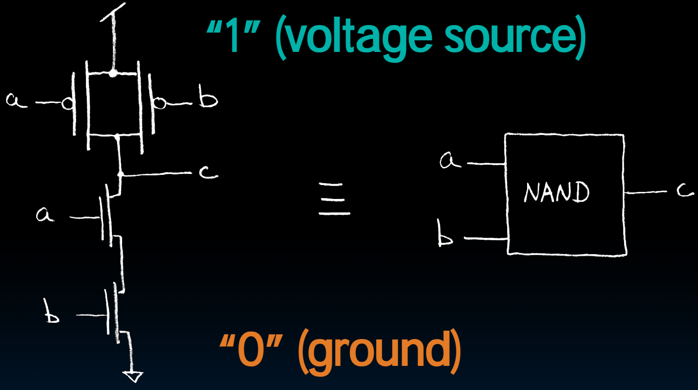

# 14.2-Transistors


Lecture Video Address


> Transistor(晶体管)

## What is Transistor 

> ("born" 1947-12-23)

Semiconductor device to amplify(放大) or switch signals

> 【ChatGPT】晶体管是一种半导体器件，用于控制电流的流动。它是现代电子设备中最基本的元件之一，广泛应用于集成电路和电子电路中。晶体管通常由硅等半导体材料制成，具有三个电极：源极、漏极和栅极。
>
> 晶体管的工作原理基于半导体材料的特性，其中包括P型半导体和N型半导体。当两种类型的半导体材料相接触时，形成PN结。晶体管通常由两个PN结构成，称为PNP晶体管或NPN晶体管，它们分别是双极晶体管的两种主要类型。
>
> 晶体管的工作可以通过控制栅极电压来实现。当栅极电压变化时，影响了PN结的电场分布，从而控制了电流的流动。晶体管可以作为开关或放大器使用，是现代电子设备中不可或缺的部件。

- Key component in ALL modern electronics（现在所有的电子元件底层都是靠晶体管实现的）

> "The Transistor was probably THE most important invention of the 20th Century" - Ira Flatow, Transistorized! (PBS Special)

## Transistor As Switch

在前面我们已经学过了使用Switch来实现逻辑，但是在现代电路中不可能真的放一个开关打开关闭，而是使用Transistor来实现开关

Modern digital systems designed in CMOS

- MOS: Metal-Oxide on Semiconductor(金属氧化物半岛图)
- C for complementary(互补的): normally-open and normally-closed switches

> 半导体只有两个状态，open或者closed的

MOS transistor使用电压来控制开关，也就不再需要Switch打开关闭了

所以我们后面讨论的仍然是开关的问题，并不涉及放大(amplify)等问题。

## MOS Transistors

### structure

Transistor是一个三引脚器件(three-lead device)

可以通过是否有散热器来判断是否有放大作用，因为这些东西会放热。如果没有，只是一个较小的晶体管，那么很可能被用作开关器件，或者是一个低级别的放大器。

- Three terminals: Drain, Gate, Source

- Source有点位，希望能够流向Drain
- 中间有一个Gate阻止它，以此来实现开关

### mechanism

一般晶体管有两种工作机制

Switch action:if voltage on gate terminal is (some amount) higher/lower than source terminal then conducting path established between drain and source terminals

|               | n-channel                                                    | p-channel                                                    |
| ------------- | ------------------------------------------------------------ | ------------------------------------------------------------ |
|               |  |  |
| switch action | **open** when voltage at G is low closes when:  voltage(G) > voltage (S) + e | **closed** when voltage at G is low opens when:  voltage(G) > voltage (S) + e |
| G low         |  |  |
| G high        |  |  |

> 助记，可以理解为N是negative的意思，P是Position的意思。
>
> 这里e的作用是必须严格大于，不能是等于

## MOS Circuit(Network)

下面是用两个MOS搭建的简单的电路，X是两个晶体管的电压，Y是最终的电压。

使用这样的电路可以得到X和Y之间的逻辑

- 3V是voltage source, 我们称之为1；0V是ground，没有电源，称之为0
- 两点注意事项：
    - 输出必须至少有一个驱动它的东西。（在这里，y由3V的voltage source和0V的ground驱动，如果没有线从0V到3V连起来，那么y就没有任何的意思）
    - 不能直接将0和1不经过晶体管连接起来，造成短路

那么y和x的关系是什么呢？也就是下面的表格应该怎么填呢？

| x       | y    |
| ------- | ---- |
| 0 volts | ?    |
| 3 volts | ?    |

下面我们逐一来分析

| x       | Circuit                                                      | desc                                                         | y       |
| ------- | ------------------------------------------------------------ | ------------------------------------------------------------ | ------- |
| 0 volts |  | 上方: p-channel, X = 0V < 3V, 通过； 下方：n-channel，x = 0V，不通过 | 3 volts |
| 3 volts |  | 上方: p-channel, X = 3V, 通过； 下方：n-channel，x = 3V > 0V，不通过 | 0 volts |

所以最终的结果就是

| x       | y       |
| ------- | ------- |
| 0 volts | 3 volts |
| 3 volts | 0 volts |

这是一个非们

> 非门也就是这样设计的

## Transistor Circuit Rep. vs. Block diagram

Chips are composed of nothing but transistors and wires.

> CPU，也是一个芯片，其内部其实就是由晶体管和线构成的。

Small groups of transistors form useful building blocks.

如下是一个例子

解释一下：

1. 这个电路有两个输入，a和b，一个输出c
2. 最上面的是1，是voltage source
3. 下一层是分别以a和b做Gate的p-channel，并且两个channel并联
4. 再下面是两个以a和b做Gate的n-channel串联
5. 中间是C作为输出

> 一般都会认为有值的为source，没有的为Drain

需要填补如下的真值表

| a    | b    | c    |
| ---- | ---- | ---- |
| 0    | 0    | ?    |
| 0    | 1    | ?    |
| 1    | 0    | ?    |
| 1    | 1    | ?    |

逐一分析

| a    | b    | circuit                                                      | desc                                   | c    |
| ---- | ---- | ------------------------------------------------------------ | -------------------------------------- | ---- |
| 0    | 0    |  | 上面两个p-channel是通的，下面两个断开  | 1    |
| 0    | 1    |  | 上面的a是连通的，b不通；下面a不通，b通 | 1    |
| 1    | 0    |  |                                        | 1    |
| 1    | 1    |  |                                        | 0    |

最终得到的结果如下

| a    | b    | c    |
| ---- | ---- | ---- |
| 0    | 0    | 1    |
| 0    | 1    | 1    |
| 1    | 0    | 1    |
| 1    | 1    | 0    |

这是一个NAND的逻辑（与AND的negative）

You can build AND, OR, NOT out of NAND!

---

Block are organized in a hierarchy to build higher-level blocks: ex: adders.

