# 14.3-Signals and Waveforms


Lecture Video Address


> Signals and Waveforms(信号与波形)

本节将学习什么是信号以及信号如何随着时间拨动

## Clocks

clock是一个系统的"heartbeat"

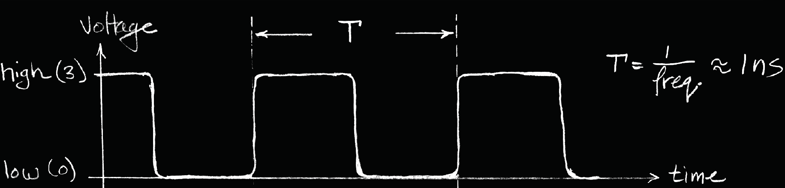

terms:

- T，周期，波形变化的周期
- freq，频率，T的倒数
- 一般来说T和freq的单位也是有对应的，如果T是1 nanosecond的话，那么freq是1 gigahertz；T是3nanosecond，freq是3 gigaheritz

Signals（有关信号的说明）

- When digital is only treated as 1 or 0（虽然实际的电压可能是0V和3V，但是我们不考虑大小，仅仅将其看做01）
- Is transmitted over wires continuously
- Transmission is effectively instant

(上面的三点)Implies that a wire contains 1 value at a time

## Issues: noisy & delay

下面是一个加法器的例子

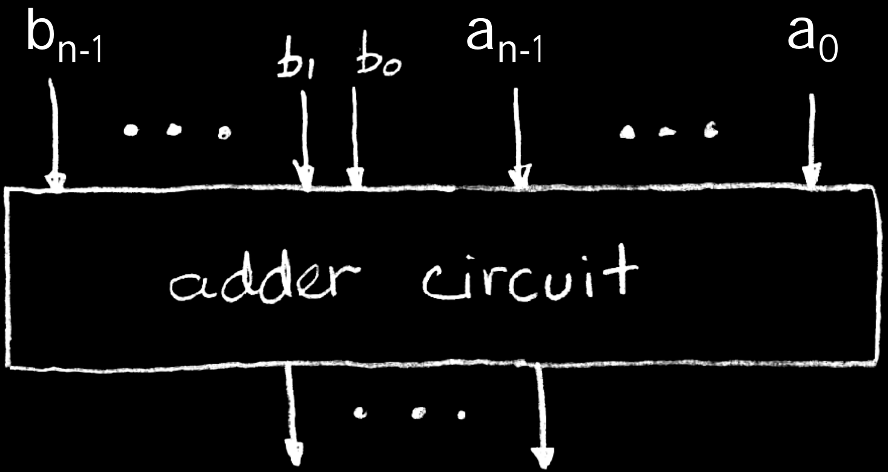

下面是b1b0随着clock变化的波形图

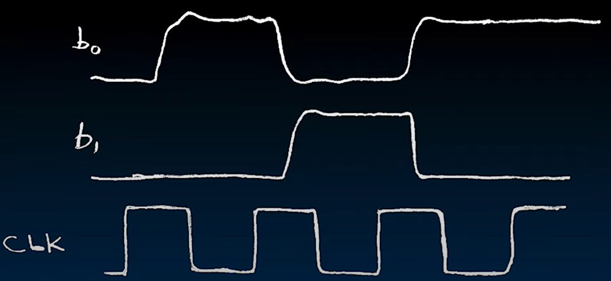

发现有两个问题：

1. 峰值不是稳定的，是有波动的
2. b0b1的变化与CLK并不是完全同步的，是有一定的延迟的（而且这仅仅是输入的延迟，输出可能有更大的延迟）

这也是在circuit中常见的问题，noisy和delay

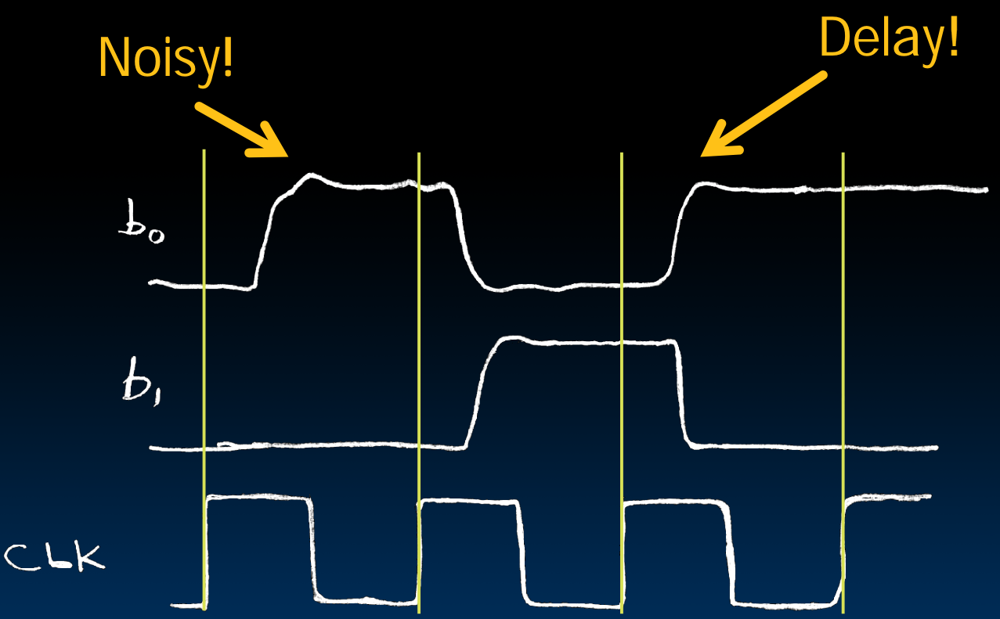

后面我们将要处理这些问题

## Grouping Representation

下面我们学习一种简介的方式来表示waveforms

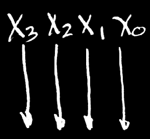

如上，用x~3~x~2~x~1~x~0~四个并行的信号来表示一个nibble

四个信号的波形随着clock的变化如下

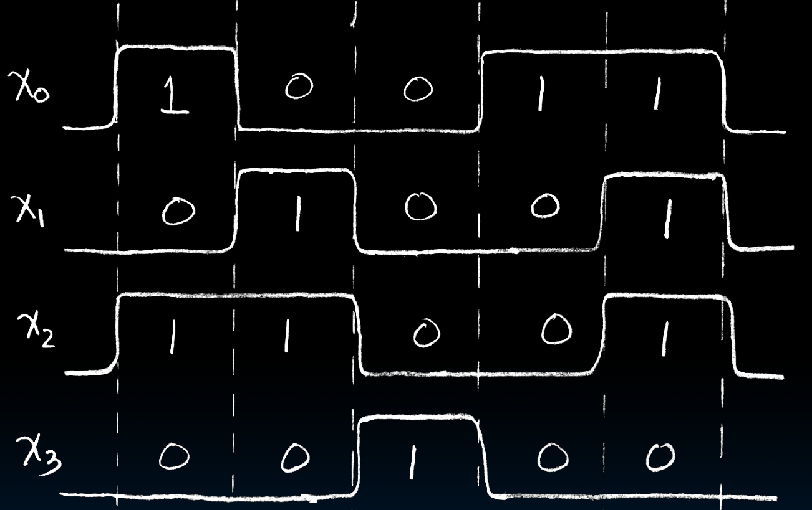

我们将x~3~当做MSB，将x~0~当做LSB，那么就可以表示nibble的value了。但是如果要画出这4个波形图太麻烦了，所以有一种简单的表示方式Grouping

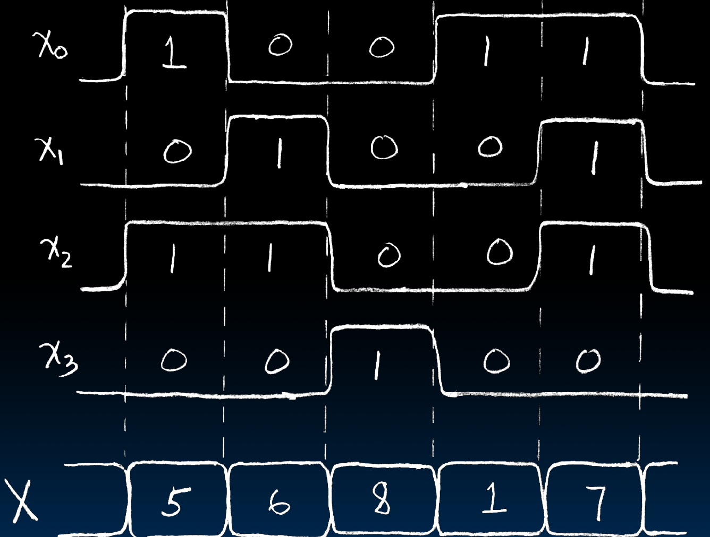

使用大写的X充当一个Vector，表示x~3~x~2~x~1~x~0~表示的nibble，并且直接赋予hex的数值，这样就不用每次画4个波形图，只需要一个图即可

## Signals and Waveforms: Circuit Delay

下面我们来说明一下Circuit中的delay的存在

如下是一个4-bits的adder

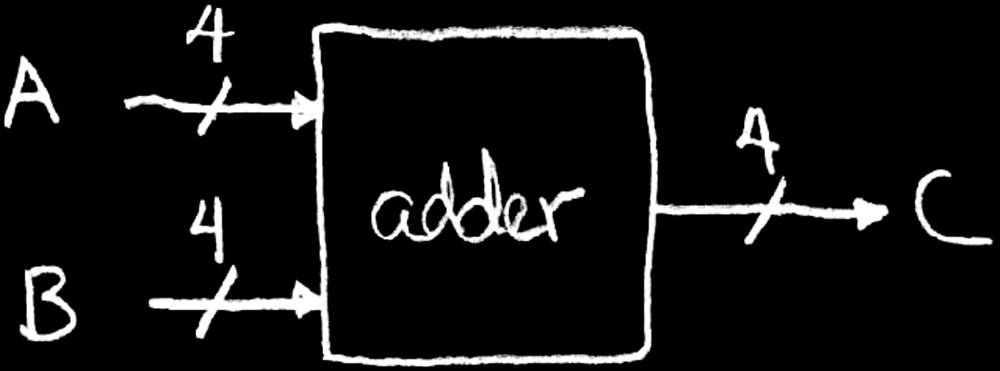

其中

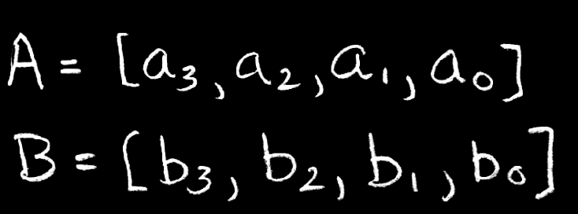

输入输出的4的含义为

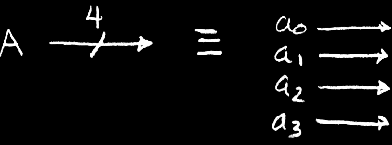

> 这里我们假设A和B比较小，不会产生overflow

产生的结果如下

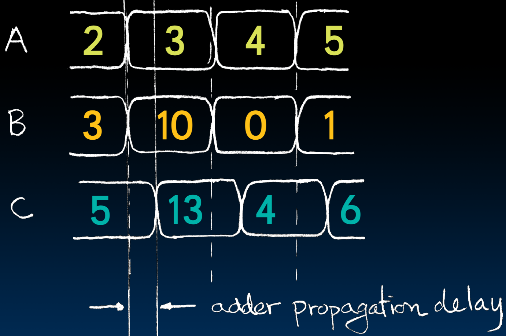

这里注意到delay的存在，C的改变和AB并不是严格同步的

我们称这个delay为`adder propagation delay`(如果是AND的话，叫做做AND propagation delay)，表示输出和输入之间的延迟

## Sample Debugging Waveform

如下是一个帮助展示波形的工具

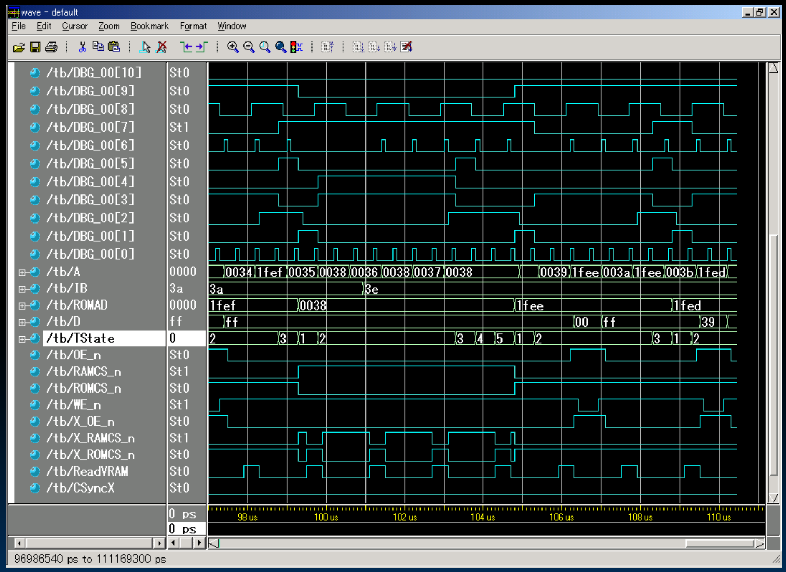

## Type of Circuits

Synchronous Digital Systems are made up of two basic types of circuits:

1. Combinational Logic (CL) circuits
    - Our previous adder circuit is an example.
    - Output is a function of the inputs only
    - Similar to a pure function in mathematics, y = f(x). (No way to store information from one invocation to the next. No side effects)

> 比如说上面的adder，只有输入对应的输出，也没有什么反馈

2. State Elements: circuits that store information.

> 典型的有memory，cache，Register

CL负责进行运算，State Elements用来保存状态

## Circuits with STATE (e.g., register)

下面是一个State的电路图

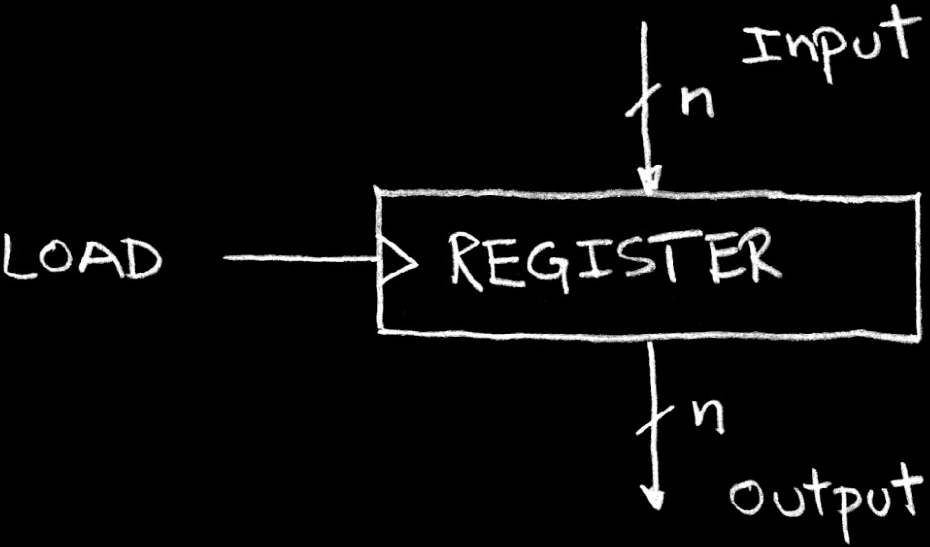

- Register中LOAD的△表示如果LOAD为high的话，会发生变化
- 这个电路的作用：output会一直保持一个状态(可能是某一个value)，别的电路可以从output中取出这个状态
- 当LOAD是high的时候，会接受input然后更新output为input，并且一直保持这个状态，直至LOAD的下一个high

---

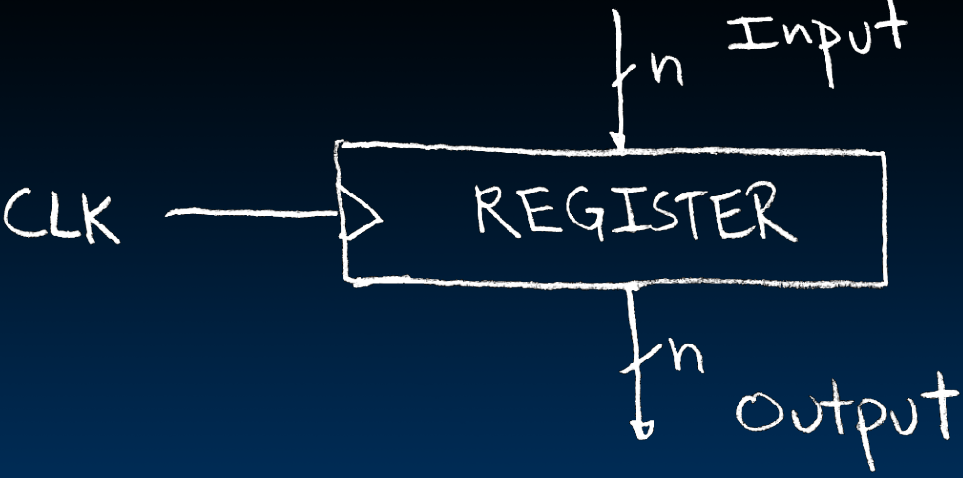

- 常见的做法是CLK作为LOAD信号
- 这样每一个clock cycle都会更新一次

## And in conclusion…

- Clocks control pulse of our circuits
- Voltages are analog, quantized to 0/1
- Circuit delays are fact of life
- Two types of circuits:
    - Stateless Combinational Logic (&,|,~)
    - State circuits (e.g., registers)

