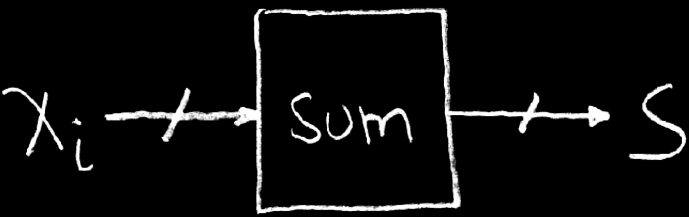
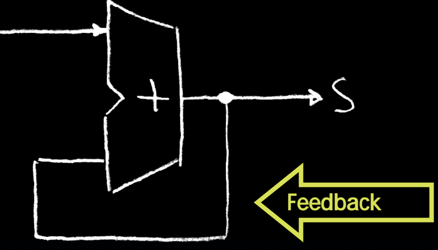
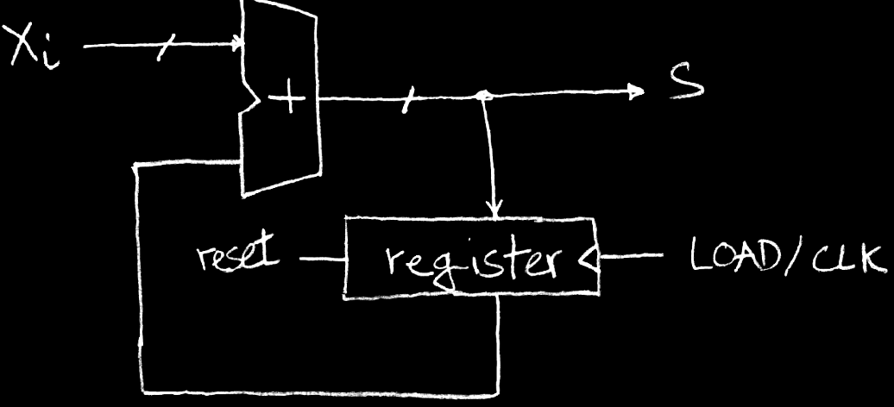
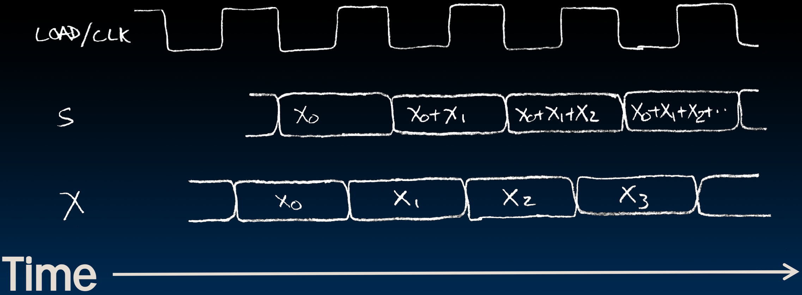

# 15.1-Accumulator


Lecture Video Address



---

> Accumulator(累加器)

lec15主要讲述State elements，lec16讲述CL

## Uses for State Elements

State Element的作用

As a place to store values for some indeterminate amount of time:

- Register files (like x0-x31 on the RISC-V)
- Memory (caches, and main memory)

Help control the flow of information between combinational logic blocks.

- State elements are used to hold up the movement of information at the inputs to combinational logic blocks and allow for orderly passage.

## Accumulator Example

Why do we need to control the flow of information?

我们来演示一下如果没有State element会怎么样



```c
S = 0;
for (i = 0; i < n; i++)
    S = S + Xi
```

Assume

- Each X~i~ value is applied in succession(连续的), one per cycle.
- After n cycles the sum is present on S.

### Feedback?

我们使用Feedback来实现Accumulator



Nope!

1. What is there to control the next iteration of the `for` loop?(就是在一次加法之后，怎么控制进行下一次累加)
2. How do we say: `S=0`?

### with Register

下面使用寄存器来实现这个逻辑

Register is used to hold up the transfer of data to adder.



1. 通过reset来初始化`S=0`
2. 计算了第一次S之后，会作为Register的input，但是并不会保存，需要CLK，然后Register才会接受上一次累加的结果并将其作为output，然后adder接受这个output作为input再次进行累加

Rough timing…



可以看到，当每次CLK下降的时候，S进行了累加
