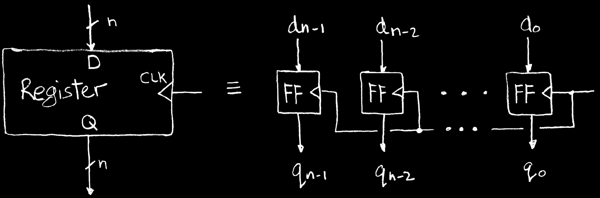
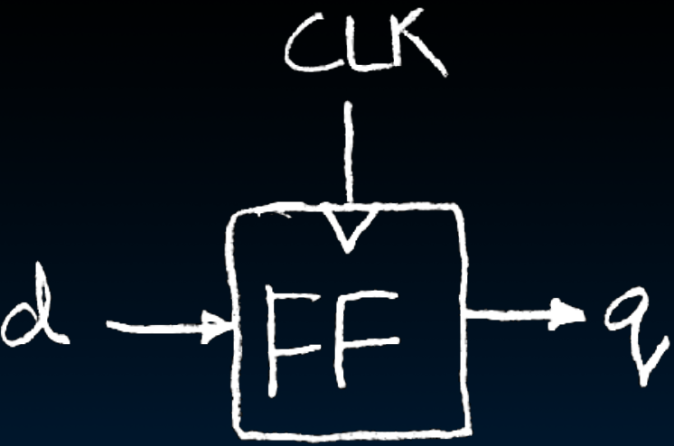
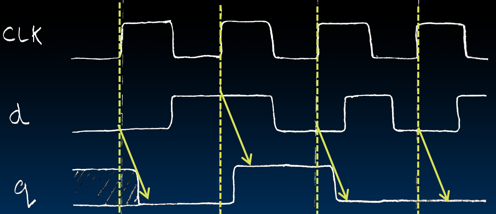
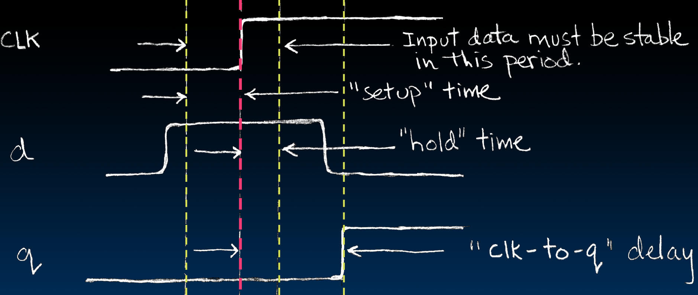

# 15.2-Register Details Flip-flops


Lecture Video Address


本节介绍怎么实现寄存器Register

## Register Details…What's inside?

寄存器的结构如下



* 左图：其中D表示data, Q表示output（实际上是quiescent，意思是静态的），CLK是LOAD信号
* 右图：
  * 在其内部，是n个flip-Flop，每个FF的输入是一个d，组合成D，输出是一个q，组合成Q。
  * CLK实际上是每一个FF的信号（如图，CLK连到了每一个FF的右侧）

> 在上图中，CLK与q~~n-2~~本应交接的地方隔开了，表明并未相交

命名为Flip-Flop的原因是因为数据一直在01之间翻转，中文翻译为触发器

Flip-Flop Also called "D-type Flip-Flop"

* There used to be other types of flip-flops

## What's the timing of a Flip-flop?

下面讨论FF的波动

### Edge-triggered d-type flip-flop


* This one is "**rising edge-triggered**"
* Also called "positive edge"

> There also exist "falling edge" FFs，也就是在下降的有效

"On the **rising** edge of the clock, the input d is sampled and transferred to the output. At all other times, the input d is ignored."

***

### Example waveforms





下面我们就一个上升沿重点说明一下在sample的各个时间（红线表示一个上升沿）



在进行sample之前，如果d不断的波动会影响q的结果，所以需要保证d是stable的

所以要在CLK上升沿之前之前先抓取一个d的值，然后锁定，在CLK上升沿之后仍然锁定一段时间用于设置q；在CLK之前的时间叫做`setup time`，之后的时间叫做`hold time`，在两个时间段内的那个Window，input data必须是stable的

在rising-edge到q设置之间的时间叫做`delay`

> setup time和hold time是由于有noisy，clk-to-q是由于有Delay

***

这些时间也是选择一个flip-flop的指标，比较昂贵的flip-flop可能delay比较小

## Q\&A

下面是在学习的时候的一些疑问，使用ChatGPT解答

> Q: flip-flop与直接一根线有什么区别，一根线不能保存状态吗
>
> Flip-flop 和一根线在数字电路中的作用有显著区别。主要区别在于它们能否保存状态和如何处理时序信号。
>
> #### Flip-flop 的特性和作用
>
> 1. **状态存储**：
>    * **Flip-flop**：能够存储一位二进制信息（0或1），并保持其状态，直到收到下一个时钟信号或触发事件。
>    * **一根线**：不能存储信息。它只能在某个时刻传递电压高低（代表0或1），但不能在时钟信号到来之前保持这个状态。
> 2. **时序控制**：
>    * **Flip-flop**：受时钟信号控制，在时钟信号的上升沿或下降沿改变状态。这使得 flip-flop 能够同步地更新其状态，适用于时序电路。
>    * **一根线**：没有时序控制功能，只是简单的传输电信号，不能实现对数据的同步控制。
> 3. **数据保持**：
>    * **Flip-flop**：可以在没有时钟信号变化的情况下保持其状态，适用于需要稳定数据存储的场景。
>    * **一根线**：数据无法保持，电信号会随着输入变化而立即变化，不能用于存储数据。
> 4. **应用场景**：
>    * **Flip-flop**：广泛用于寄存器、计数器、时序电路和状态机等需要数据存储和同步控制的地方。
>    * **一根线**：用于简单的信号传输，不适用于需要存储和时序控制的复杂应用。
>
> #### 举例说明
>
> 假设有一个需要存储二进制信息的寄存器：
>
> * 使用 flip-flop 构建的寄存器：
>   * 每个位由一个 flip-flop 存储，当时钟信号到达时，寄存器的值可以更新并保持，直到下一个时钟信号到来。
>   * 这种设计保证了数据的稳定性和时序的同步。
> * 使用一根线传递数据：
>   * 一根线只能瞬时传递数据，无法保持之前的数据状态。
>   * 当需要存储数据时，只用一根线是不可能实现的，因为没有办法在时钟信号的控制下保持和更新数据。
>
> #### 结论
>
> Flip-flop 和一根线的主要区别在于 flip-flop 能够存储和保持状态，具有时序控制功能，而一根线只能传递瞬时信号，不能存储数据。这使得 flip-flop 在数字电路和计算机系统中具有不可替代的重要作用。

> Q: flip-flop是怎么让输出一直保持一个状态而不消失的
>
> Flip-flop 通过其内部==**反馈机制**==实现对状态的存储和保持。这使得它可以在没有新的时钟信号或控制信号输入时，保持其当前的输出状态。以下是 Flip-flop 实现状态保持的基本原理和工作方式：
>
> #### 基本原理
>
> Flip-flop 主要依赖于内部的反馈结构来保持其状态。以 D 型 Flip-flop 为例，它的结构包括一个数据输入端 (D)、一个时钟输入端 (CLK)、一个输出端 (Q) 和一个反向输出端 (Q')。
>
> **工作原理**
>
> 1. **数据输入**：当时钟信号处于非触发状态时（例如在上升沿触发的情况下，当时钟信号为低电平时），D 输入端的数据不会影响输出端 Q。此时，Flip-flop 保持之前的状态。
> 2. **时钟信号触发**：当时钟信号的上升沿到达时，D 输入端的数据被捕获并传输到输出端 Q。这一瞬间的数据传输确保了输出状态的更新。
> 3. **状态保持**：在时钟信号的上升沿之后，尽管 D 输入端的数据可能变化，但由于时钟信号没有再次触发，Flip-flop 的输出端 Q 将保持在捕获的状态。Flip-flop 的内部反馈机制将输出端 Q 的状态反馈回输入端，使其能够维持当前状态。
>
> #### D 型 Flip-flop 的电路示例
>
> 一个典型的 D 型 Flip-flop 的电路示例如下：
>
> ```plaintext
>        +-------+
> D ---->|       |
>        | D-FF  |----> Q
> CLK --->|       |
>        +-------+
> ```
>
> 在这个电路中：
>
> * **D 输入端**：用于接收数据。
> * **CLK 输入端**：接收时钟信号，用于控制数据的捕获。
> * **Q 输出端**：输出当前存储的数据。
>
> 当时钟信号的上升沿到达时，D 端的数据被捕获并传输到 Q 端；在时钟信号的其他时间段，Q 端保持其状态。
>
> #### 反馈机制
>
> Flip-flop 的反馈机制是其能够保持状态的关键：
>
> * **内部反馈**：Flip-flop 内部电路将输出状态反馈回输入，使其在没有新的时钟信号到达时保持当前状态。
> * **锁存功能**：由于反馈机制的存在，Flip-flop 类似于一个锁存器，可以锁定并保持数据，直到下一个时钟信号到来。
>
> #### 举例说明
>
> 考虑一个 D 型 Flip-flop 处于某一时刻：
>
> 1. **初始状态**：假设 Q 输出为 0。
> 2. **输入变化**：D 输入变化为 1，但 CLK 仍为低电平（未触发），Q 保持为 0。
> 3. **时钟触发**：CLK 上升沿到达，D 的数据（1）被捕获，Q 变为 1。
> 4. **状态保持**：即使 D 输入随后变化为 0，由于没有新的时钟上升沿，Q 仍保持为 1。
>
> #### 结论
>
> 通过上述内部反馈机制和时钟信号的控制，Flip-flop 实现了对状态的存储和保持。这使得 Flip-flop 在时序电路和存储单元中广泛应用，能够可靠地保存数据直到新的时钟信号到达。

也就是说，FF通过内部的反馈机制来保持状态
