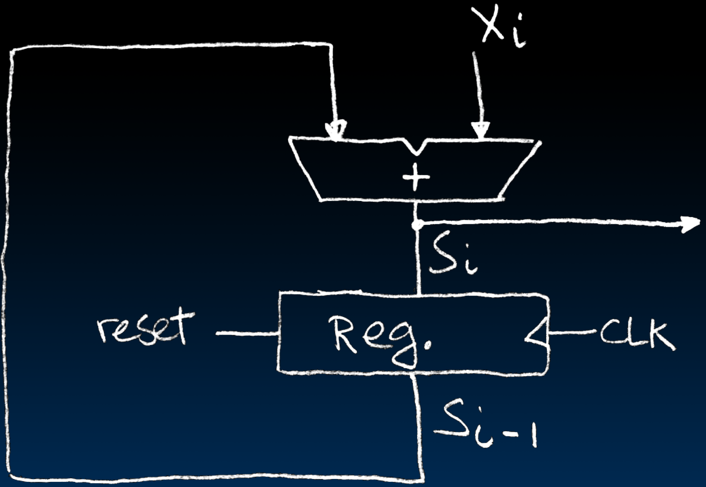
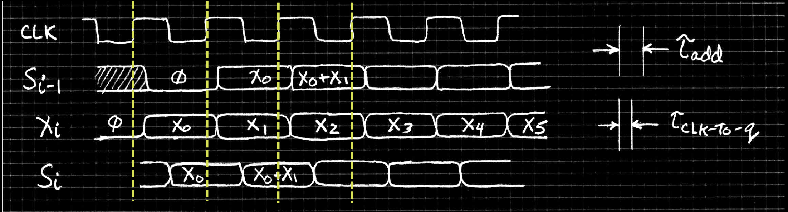
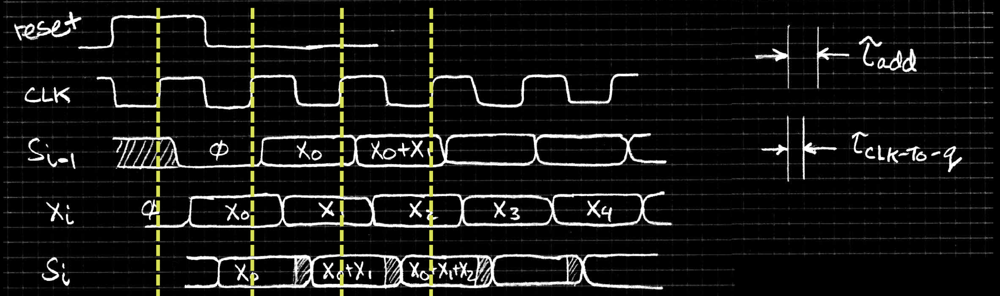
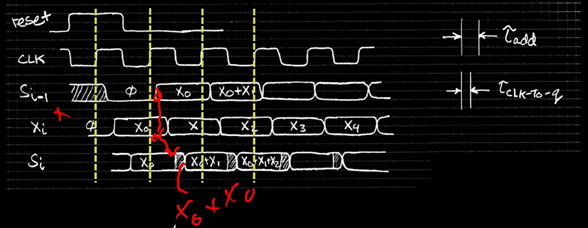
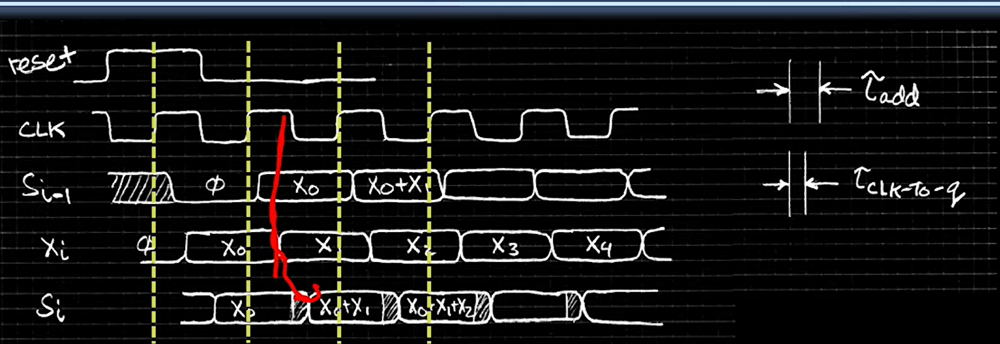
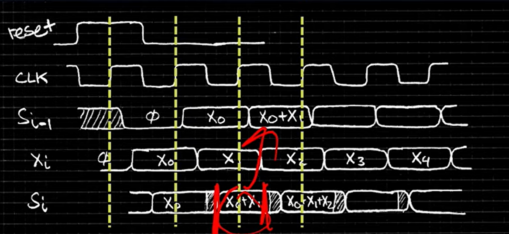

# 15.3-Accumulator revisited


Lecture Video Address


### Circuit & waveform

- Reset input to register is used to force it to all zeros (takes priority over D input).
- S~i-1~ holds the result of the i~th~-1 iteration.
- Analyze circuit timing starting at the **output of the register**.

解释波动图

1. ∅表示0
2. X~i~连续的变换，X~0~, X~1~, X~2~...
3. S~i-1~一开始reset为0
4. 在CLK的上升沿，S~i-1~更新为上一次累加的结果S~i~，但是有一定的延迟
5. 再经过一定的延迟之后，S~i~更新为S~i-1~ + X~i~
6. X~i~一定要在S~i~之前，例如S~i~ = X~0~  + X~1~之前，一定要有X~i~ = X~1~

一些时间段 

- S~i-1~和X~i~更新的速度是一致的，可以看到几乎都是在同一时间更新。
- 在S~i-1~更新之后，S~i~的更新还有一段时间，这中间的延迟是t~add~

### more detailed

下面我们展示更加详细的内容

波形图过程

- 这里加入了reset指令，在S~i-1~的∅之前，是未知的信息，在reset为high的时候，CLK来到一个上升沿，此时S~i-1~才会真正的reset
- 在设置S~i-1~的时候，S~i~在前后都会有一段稳定短时间，为setup time和hold time
- 在CLK上升沿之后一段时间S~i-1~才会更新为S~i~，这段时间就是delay: t~CLK-To-q~

出现的问题

- Also, in practice X might not arrive to the adder at the same time as S~i-1~
- S~i~ temporarily is wrong, but register always captures correct value.

如上图，S~i-1~更新为x~0~之后，X~i~并不一定能够立即更新为X~1~，这个时候会进行加法，得到S~i~ = X~0~ + X~0~，如图中的阴影部分

然后X~i~更新之后，又会恢复到正确的结果，X~0~ + X~1~

然后下一个CLK上升沿，用这个值来更新S~i-1~

### Why not overclock

在上面的情况下，如果采用超频系统会发生什么。

> 超频系统会增加时钟频率，缩短周期，也就是让图中黄线的间隔缩小。

本身信号是需要一定的稳定时间的(setup time, hold time等)，待系统稳定之后再进行变换，变换的信号就是CLK的上升沿信号。

如果CLK的频率过快，周期过短，那么就不能保证在变化的时候信号保持稳定。

也就是说，超频系统是不稳定的。

- In good circuits, instability(不稳定) never happens around rising edge of clk.（但是中间有一段错误的值是允许的，只要最后的结果正确即可）

这也是不能让频率过快的原因之一，在现实中，noisy和delay是必须要面对的问题。

