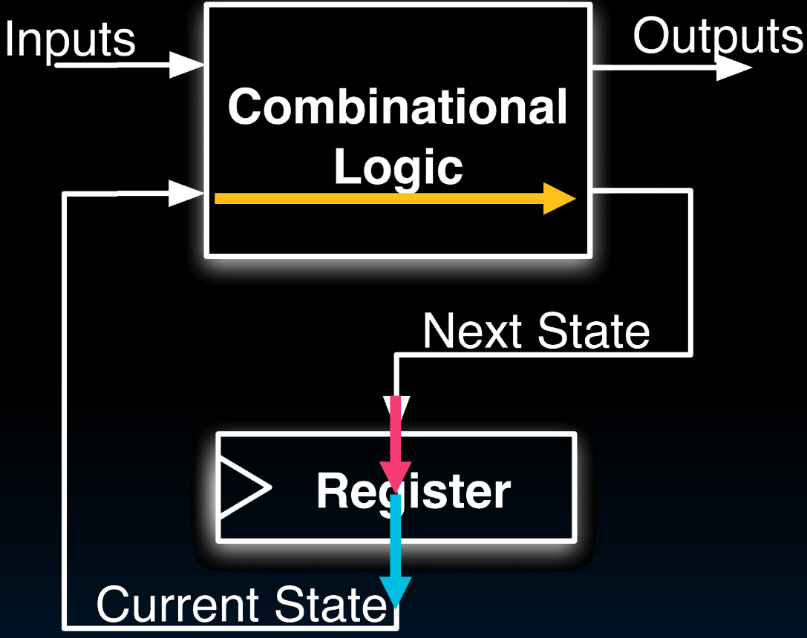
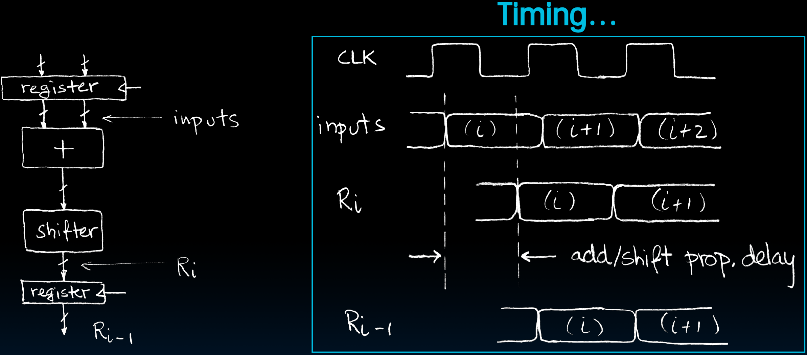
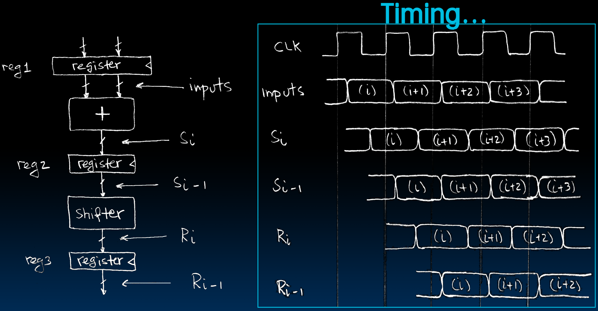
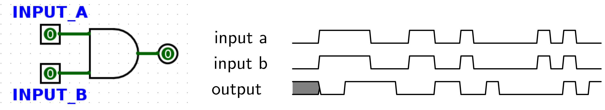
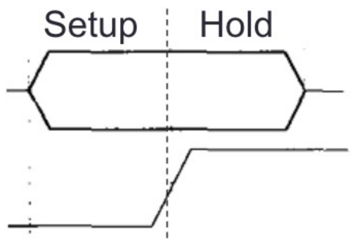
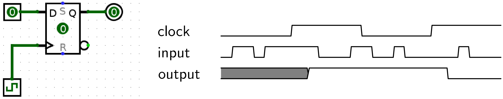

# 15.4-Pipelining for Performance


Lecture Video Address


> pipeline(流水线)

本节讨论如何使用流水线提高系统的性能

## Maximum Clock Frequency

What is the maximum clock frequency of this circuit? (Hint: Frequency = 1 / Period )

* 黄色箭头是CL Delay
* 蓝色箭头是CLK-to-Q Delay
* 红色箭头是setup Time
* 假设：Register→CL的过程中没有Delay，input的更新不一定能与Current State同步，导致一定的Delay，这里也忽略

Max Delay = CLK-to-Q Delay + CL Delay + Setup Time

> setup-time在上升沿之前，clock-to-q delay是指上升沿到输出q稳定的时间段

## Pipelining to improve performance

**Extra Registers** are often added to help speed up the clock rate.

### Without pipelining

先来看没有流水线的情况

如左图：

* 有两个寄存器，上面的存储输入，下面的存储输出
* 中间有两个操作，加法器和shifter

input先进入加法器之后再进入shifter，操作完之后再输入到Register

这好像装配线，装完一个部件之后才能装下一个，不能同时装，在同一时间只能完成一个任务

可以看到，每次操作中间都有一个比较大的add/shift prop. delay。时钟周期也被这么长的delay限制了

* Note: Delay of 1 clock cycle from input to output.
* Clock period limited by propagation delay of adder/shifter.

> propagation delay就是指某个操作的延迟

### pipelining

> 上面延迟这么大的原因是，add和shift必须一口气进行，二者看做了一个操作；再根本的原因是add的结果直接通过线送给了shifter，而shifter的操作也是需要时间的，这段时间add的结果需要保存(保持稳定)的，只能让adder不断计算来维持这个结果。
>
> 也就是说，在shifter的时候，adder不能开始新的add，只能维持旧的add结果

Insertion of register allows higher clock frequenc

More outputs per second.

在这样的情况下，adder执行结束后，就可以开始下一次的add了

> 流水线的视线就是在不同的CL之间提那家寄存器来保持中间变量。

## Recap of Timing Terms

| term             | desc                                                                                          |
| ---------------- | --------------------------------------------------------------------------------------------- |
| Clock (CLK)      | steady square wave that synchronizes system                                                   |
| Setup Time       | when the input must be stable before the rising edge of the CLK                               |
| Hold Time        | when the input must be stable after the rising edge of the CLK                                |
| "CLK-to-Q" Delay | how long it takes the output to change, measured from the rising edge of the CLK              |
| Flip-flop        | one bit of state that samples every rising edge of the CLK (positive edge-triggered)          |
| Register         | several bits of state that samples on rising edge of CLK or on LOAD (positive edge-triggered) |

---

在做discussion的时候，相关的题目将有关延迟的内容表述的很好，这里copy过来了

There are two basic types of circuits: 

**combinational logic** circuits and state elements. Combinational logic circuits simply change based on their inputs after whatever **propagation delay** is associated with them. For example, if an AND gate (pictured below) has an associated propagation delay of 2ps, its output will change based on its input as follows:

You should notice that the output of this AND gate always changes 2ps after its inputs change.

> CL的延迟叫做propagation delay，就是输入到输出稳定的延迟

**State elements**, on the other hand, can remember their inputs even after the inputs change. State elements change value based on a clock signal. A rising edge-triggered register, for example, samples its input at the rising edge of the clock (when the clock signal goes from 0 to 1).

The input to the register samples has to be stable for a certain amount of time around the rising edge of the clock for the input to be sampled accurately. The amount of time before the rising edge the input must be stable is called the **setup** time, and the time after the rising edge the input must be stable is called the **hold** time. 

**Hold time is generally included in clk-to-q delay**, so clk-to-q time will usually be greater than or equal to hold time. Logically, the fact that clk-to-q ≥ hold time makes sense since it only takes clk-to-q seconds to copy the value over, so there’s no need to have the value fed into the register for any longer.

For the following register circuit, assume setup of 2.5ps, hold time of 1.5ps, and a clk-to-q time of 1.5ps. The clock signal has a period of 13ps.

You’ll notice that the value of the output in the diagram above doesn’t change immediately after the rising edge of the clock. 

**Clock cycle time must be small enough that inputs to registers don’t change within the hold time and large enough to account for clk-to-q times, setup times, and combinational logic delays.**

$$hold\space time < Clock cycle time < t_{CLK-to-q} + setup\space time + CL\space delays$$
