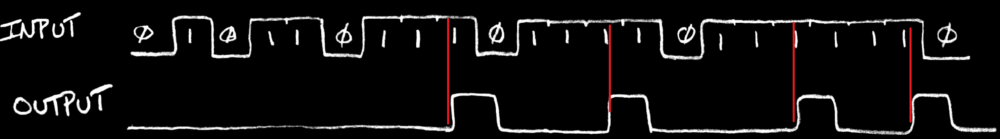
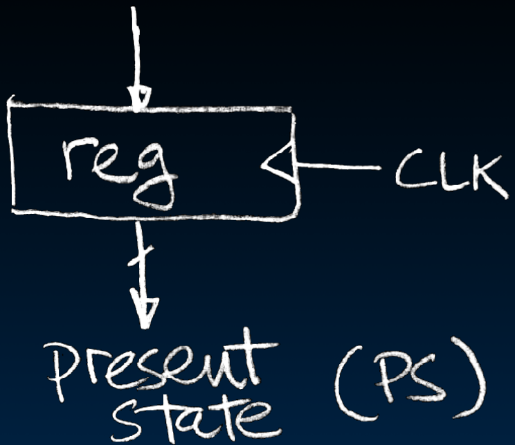

# 15.5-Finite State Machines


Lecture Video Address


本节讲述FSM是什么以及怎样用register实现FSM

> register的作用仍然是保存CL计算之间的信息

## Finite State Machines (FSM) Introduction

> FSM不仅仅能用在SDS的State Element，在很多领域都可以使用

The function can be represented with a "state transition diagram"

With combinational logic and registers, any FSM can be implemented in hardware.

> ChatGPT-FSM
>
> 有限状态机（Finite State Machine, FSM）是一种数学计算模型，用于表示有限数量的状态和状态之间的转移。FSM广泛应用于计算机科学和工程领域，尤其是在设计硬件电路、软件系统和通信协议时。FSM可以分为两类：确定性有限状态机（Deterministic Finite Automaton, DFA）和非确定性有限状态机（Nondeterministic Finite Automaton, NFA）。
>
> ## 确定性有限状态机 (DFA)
>
> ### 组成部分
> 1. **状态集合（States）**：FSM可以处于的所有状态的集合。
> 2. **输入符号集（Input Alphabet）**：FSM可以接收的所有输入符号的集合。
> 3. **转移函数（Transition Function）**：定义了从一个状态在接收某个输入符号后转移到另一个状态的规则。
> 4. **初始状态（Initial State）**：FSM开始时所在的状态。
> 5. **接受状态集合（Accept States）**：FSM接收输入并最终停留在这些状态之一时，认为输入被接受。
>
> ### 工作原理
> - FSM从初始状态开始，依次读取输入符号，根据转移函数转移到下一个状态。
> - 如果所有输入符号读取完毕后FSM处于接受状态之一，则认为输入被接受，否则不被接受。
>
> ## 非确定性有限状态机 (NFA)
>
> ### 组成部分
> NFA与DFA类似，也由状态集合、输入符号集、转移函数、初始状态和接受状态集合组成。但NFA的转移函数允许从一个状态在接收某个输入符号后转移到多个状态（甚至没有状态），并且允许使用空输入（ε）进行状态转移。
>
> ### 工作原理
> - NFA从初始状态开始，依次读取输入符号，可以有多条路径同时进行。
> - 如果某条路径在所有输入符号读取完毕后处于接受状态之一，则认为输入被接受。
>
> ## 比较
>
> 1. **确定性**：DFA在每个状态接收一个输入符号后只有唯一的转移路径，而NFA可能有多条路径。
> 2. **等价性**：每个NFA都可以转换为等价的DFA，尽管转换后DFA的状态数可能是指数级增长。
> 3. **实现复杂度**：DFA实现较为简单，因为每次状态转移都是确定的；NFA实现复杂，因为需要处理多条可能的路径。
>
> ## 应用
>
> 1. **词法分析器**：在编译器中用于词法分析，将输入的字符流分割成标记（tokens）。
> 2. **正则表达式**：正则表达式可以转换为NFA，用于字符串匹配。
> 3. **协议设计**：在通信协议中用于描述各个状态和状态间的转移。
> 4. **控制系统**：在自动化和控制系统中用于描述不同状态及其之间的转移条件。
>
> 有限状态机提供了一种有效的模型来描述和实现系统中的顺序逻辑，通过定义明确的状态和转移规则，可以简化复杂系统的设计和分析。

## Finite State Machine Example: consecutive 3 ones

FSM to **detect** the occurrence of 3 consecutive 1's in the input.

如上图，当连续有连续的3个1的时候，output上升一次

Draw the FSM…

Assume state transitions are controlled by the clock: on each clock cycle the machine checks the inputs and moves to a new state and produces a new output…

1. 假设有3个状态，遇到0个1(S∅)，1个1(S1), 2个1(S2)，其中S∅初始状态（当然可以有更多的冗余的State，不过这样假设是最小的）
2. 一般会将初始状态外面再围一圈，或者用一个没有源头的箭头指向初始状态
3. S∅，S1，S2哪一个做初始状态都可以，这里使用S∅作为初始状态
4. 每一个状态都有遇到0和1的情况，所以都会有2个向外的箭头
5. 1/0意思是输入为1的情况下，输出为0
6. S∅，S1，S2在遇到0的时候都重新返回S∅，S2再次遇到1，说明遇到了3个连续的1，再次返回S∅(这是由给出的时序图决定的)

---

如果希望在遇到连续3个1之后，后面遇到1能够一直保持输出为1，而不是重新开始计数，怎么调整这个FSM diagram呢？

可以修改S2遇到1后的箭头的指向

## Hardware Implementation of FSM

### CL + register

要构建上图，有两个关键的部件：

1. 保存状态，S∅，S1，S2。Therefore a register is needed to hold the representation of which state the machine is in. 
2. 如何实现从previous state + input bit到next state + output之间的**mapping**，这个需要用CL实现

---

Combinational logic circuit is used to implement a function ==**mapping the input and present state (PS) input to the next state (NS) and output**==

如下图

- 输入：previous state + input bite
- 输出：next state + output bit

使用寄存器来存储状态

最终得到的Circuit如下

### Hardware for FSM: Combinational Logic

下面就是这个CL的真值表，用来实现ps + input到ns + output 的映射

> PS和NS记录的是状态，可以理解为状态的序号，比如S∅，S1，S2的序号分别为00, 01, 10

Next lecture we will discuss the detailed implementation, but for now can look at its functional specification, truth table form.

## General Model for Synchronous Systems

一般来说，同步系统的模型就是如下的

- Collection of CL blocks separated by registers.（用于实现pipelining，或者说每一个CL+reg都是一个FSM）
- Registers may be back-to-back and CL blocks may be back-to-back.（每一个reg的输出都可能进行Feedback）
- Feedback is optional.
- Clock signal(s) connects only to clock input of registers.（CL是不需要Clock的）

## Design Hierarchy

在本单元，我们主要讨论control部分，Datapath在未来会学习，最终会整合成为system

## In conclusion

lec15课程的总结

State elements are used to:

- Build memories
- Control the flow of information between other state elements and combinational logic

D-flip-flops used to build registers

Clocks tell us when D-flip-flops change

- setup and hold times are important

We pipeline long-delay CL for faster clock

Finite state machines extremely useful

- You'll see them again 151A, 152, 164, 172...(FSM可以用在很多很多地方)
